# Application Navigation — FactSet

> ## Excerpt
> The fds.fpe.applications module allows you to quickly jump into an application and opens the specified
document, OFDB, screen or path passed as a parameter into the function.

---
The _fds.fpe.applications_ module allows you to quickly jump into an application and opens the specified document, OFDB, screen or path passed as a parameter into the function.

## File Manager[#](https://fpe.factset.com/docs/applications.html#file-manager "Link to this heading")

[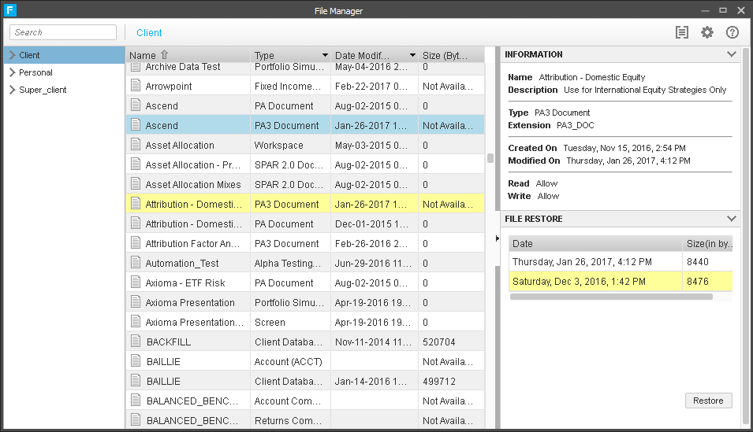](https://fpe.factset.com/docs/_images/file_manager.png)

fds.fpe.applications.file\_manager(_\*\*kwargs_)[#](https://fpe.factset.com/docs/applications.html#fds.fpe.applications.file_manager "Link to this definition")

Jump to File Manager.

## Data Central[#](https://fpe.factset.com/docs/applications.html#data-central "Link to this heading")

[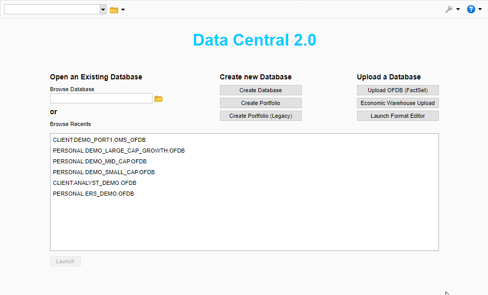](https://fpe.factset.com/docs/_images/data_central.png)

fds.fpe.applications.data\_central(_ofdb\_path\=None_, _\*\*kwargs_)[#](https://fpe.factset.com/docs/applications.html#fds.fpe.applications.data_central "Link to this definition")

Jump to Data Central.

Parameters:

-   **ofdb\_path** (_str__,_ _optional_) – The path of the OFDB to jump to, by default None
    
-   **\*\*kwargs** – Optional keyword arguments. Supports `clear` (bool): whether to clear output first.
    

## Portfolio List Manager[#](https://fpe.factset.com/docs/applications.html#portfolio-list-manager "Link to this heading")

[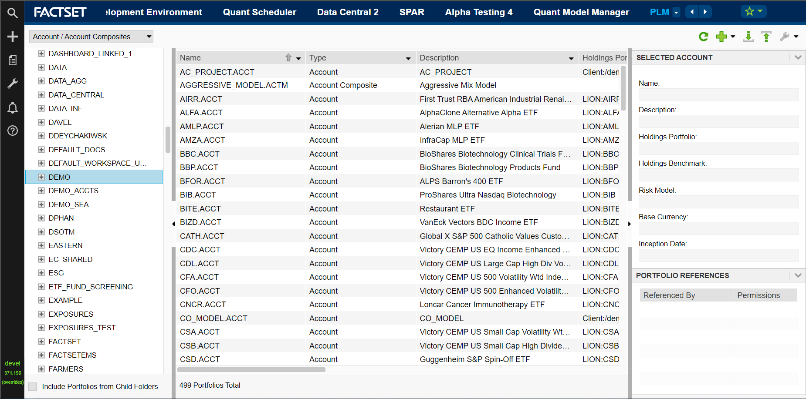](https://fpe.factset.com/docs/_images/portfolio_list_manager.png)

fds.fpe.applications.portfolio\_list\_manager(_account\_path\=None_, _\*\*kwargs_)[#](https://fpe.factset.com/docs/applications.html#fds.fpe.applications.portfolio_list_manager "Link to this definition")

Jump to Portfolio List Manager.

Parameters:

-   **account\_path** (_str__,_ _optional_) – Path to an account, by default None
    
-   **\*\*kwargs** – Optional keyword arguments. Supports `clear` (bool): whether to clear output first.
    

## Universal Screening[#](https://fpe.factset.com/docs/applications.html#universal-screening "Link to this heading")

[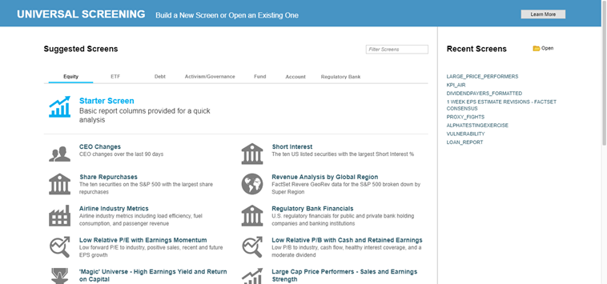](https://fpe.factset.com/docs/_images/screening.png)

fds.fpe.applications.screening(_screen\_path\=None_, _\*\*kwargs_)[#](https://fpe.factset.com/docs/applications.html#fds.fpe.applications.screening "Link to this definition")

Jump to Universal Screening.

Parameters:

-   **screen\_path** (_str__,_ _optional_) – The path of the Screening document to jump to, by default None
    
-   **\*\*kwargs** – Optional keyword arguments. Supports `clear` (bool): whether to clear output first.
    

## Alpha Testing[#](https://fpe.factset.com/docs/applications.html#alpha-testing "Link to this heading")

[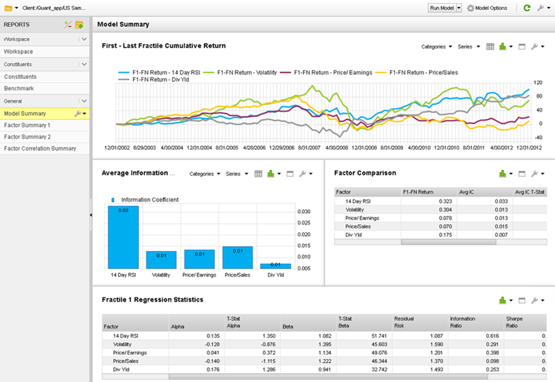](https://fpe.factset.com/docs/_images/alpha_testing.png)

fds.fpe.applications.alpha\_testing(_doc\=None_, _report\=None_, _\*\*kwargs_)[#](https://fpe.factset.com/docs/applications.html#fds.fpe.applications.alpha_testing "Link to this definition")

Jump to Alpha Testing.

Parameters:

-   **doc** (_str__,_ _optional_) – The path of the AT document to jump to, by default None
    
-   **report** (_str__,_ _optional_) – The name of the report within the AT document to jump to, by default None
    
-   **\*\*kwargs** – Optional keyword arguments. Supports `clear` (bool): whether to clear output first.
    

## Quant Model Manager[#](https://fpe.factset.com/docs/applications.html#quant-model-manager "Link to this heading")

[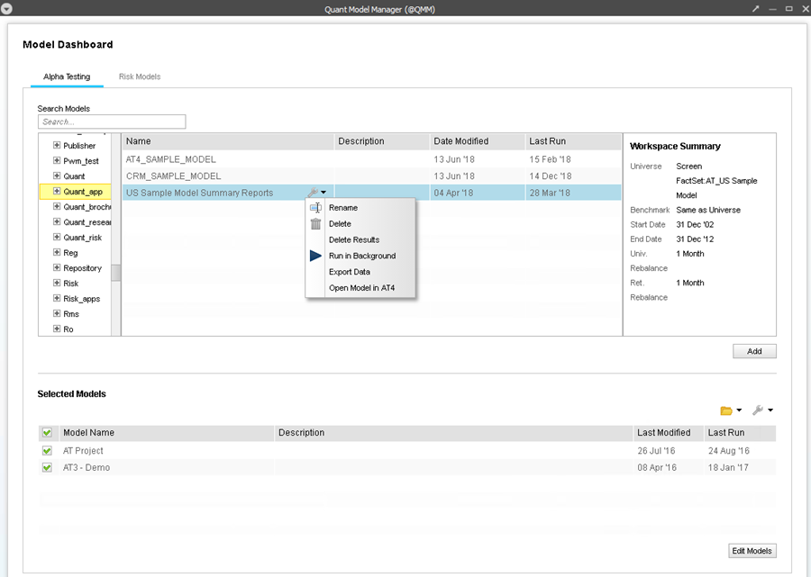](https://fpe.factset.com/docs/_images/quant_model_manager.png)

fds.fpe.applications.quant\_model\_manager(_\*\*kwargs_)[#](https://fpe.factset.com/docs/applications.html#fds.fpe.applications.quant_model_manager "Link to this definition")

Jump to Quant Model Manager.

## Formula Development Environment[#](https://fpe.factset.com/docs/applications.html#formula-development-environment "Link to this heading")

[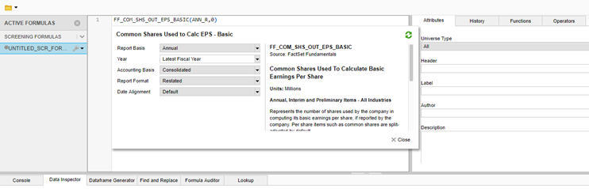](https://fpe.factset.com/docs/_images/formula_development_environment.png)

fds.fpe.applications.formula\_development\_environment(_\*\*kwargs_)[#](https://fpe.factset.com/docs/applications.html#fds.fpe.applications.formula_development_environment "Link to this definition")

Jump to Formula Development Environment.

See also

-   [https://my.apps.factset.com/oa/pages/21300](https://my.apps.factset.com/oa/pages/21300)
    
-   [https://my.apps.factset.com/oa/pages/21358](https://my.apps.factset.com/oa/pages/21358)
    

## Portfolio Analysis[#](https://fpe.factset.com/docs/applications.html#portfolio-analysis "Link to this heading")

[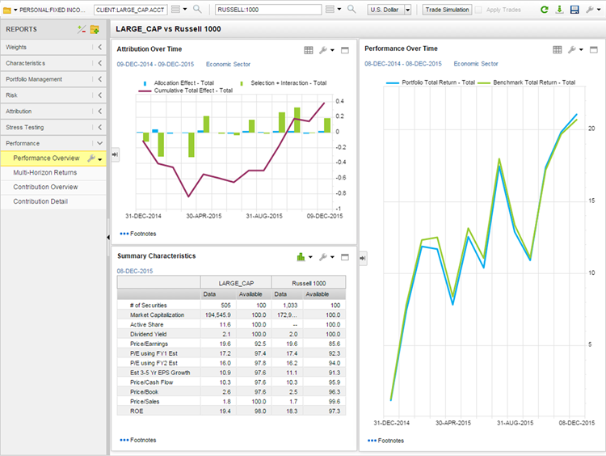](https://fpe.factset.com/docs/_images/portfolio_analysis.png)

fds.fpe.applications.portfolio\_analysis(_doc\=None_, _report\=None_, _\*\*kwargs_)[#](https://fpe.factset.com/docs/applications.html#fds.fpe.applications.portfolio_analysis "Link to this definition")

Jump to Portfolio Analysis.

Parameters:

-   **doc** (_str__,_ _optional_) – The path of the PA document to jump to, by default None
    
-   **report** (_str__,_ _optional_) – The name of the report within the PA document to jump to, by default None
    
-   **\*\*kwargs** – Optional keyword arguments. Supports `clear` (bool): whether to clear output first.
    

## SPAR[#](https://fpe.factset.com/docs/applications.html#spar "Link to this heading")

[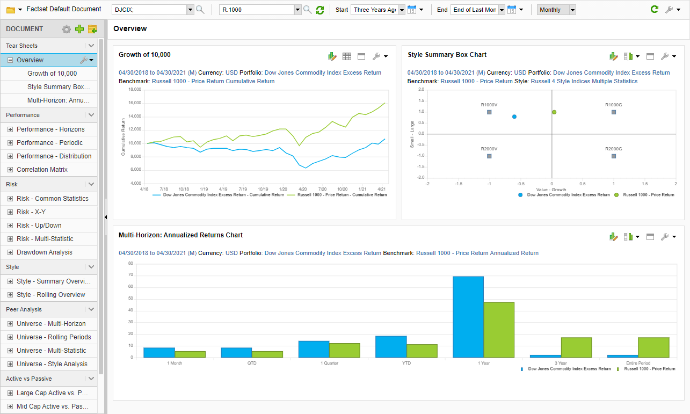](https://fpe.factset.com/docs/_images/spar.png)

fds.fpe.applications.spar(_doc\=None_, _\*\*kwargs_)[#](https://fpe.factset.com/docs/applications.html#fds.fpe.applications.spar "Link to this definition")

Jump to SPAR.

Parameters:

-   **doc** (_str__,_ _optional_) – The path of the SPAR document to jump to, by default None
    
-   **\*\*kwargs** – Optional keyword arguments. Supports `clear` (bool): whether to clear output first.
    

## FactSet Optimizer[#](https://fpe.factset.com/docs/applications.html#factset-optimizer "Link to this heading")

[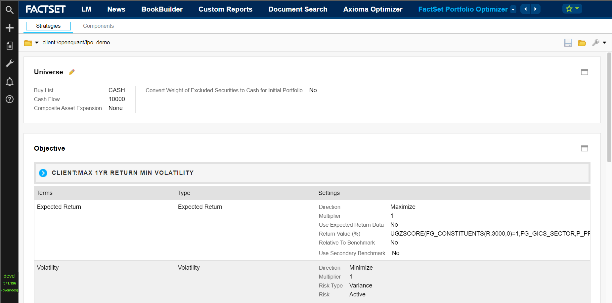](https://fpe.factset.com/docs/_images/factset_optimizer.png)

fds.fpe.applications.factset\_optimizer(_strategy\_path\=None_, _\*\*kwargs_)[#](https://fpe.factset.com/docs/applications.html#fds.fpe.applications.factset_optimizer "Link to this definition")

Jump to FactSet Optimizer.

Parameters:

-   **strategy\_path** (_str__,_ _optional_) – The path of the Strategy to jump to, by default None
    
-   **\*\*kwargs** – Optional keyword arguments. Supports `clear` (bool): whether to clear output first.
    

## Axioma Optimizer[#](https://fpe.factset.com/docs/applications.html#axioma-optimizer "Link to this heading")

[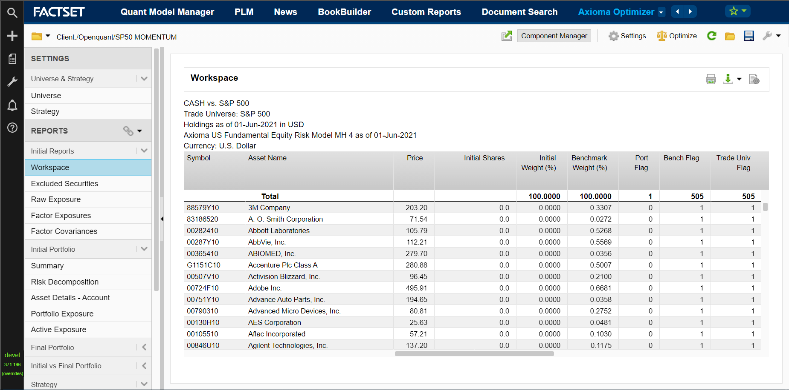](https://fpe.factset.com/docs/_images/axioma_optimizer.png)

fds.fpe.applications.axioma\_optimizer(_\*\*kwargs_)[#](https://fpe.factset.com/docs/applications.html#fds.fpe.applications.axioma_optimizer "Link to this definition")

Jump to Aximoa Optimizer.
