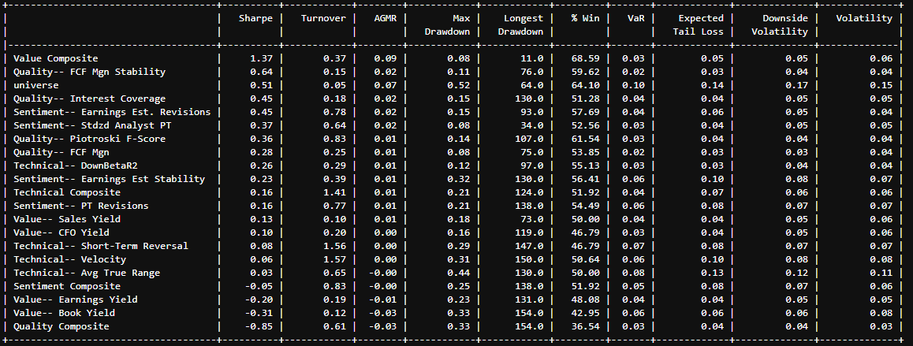
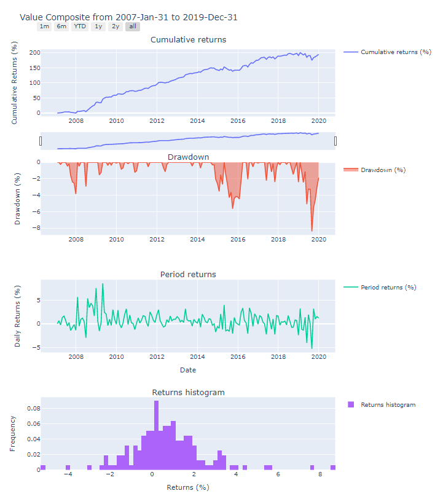
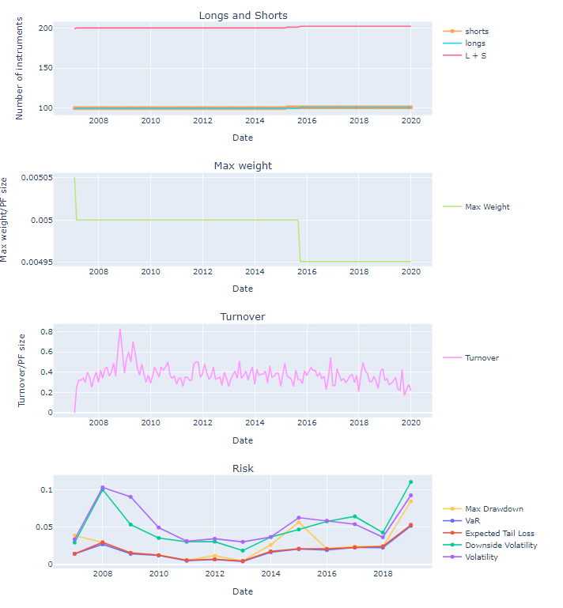

# Backtest — FactSet Programmatic

> ## Excerpt
> The Backtest class allows you to perform powerful signal backtesting using any pre-designed or custom signals to help understand drivers of performance and predictive power.

---
The _Backtest_ class allows you to perform powerful signal backtesting using any pre-designed or custom signals to help understand drivers of performance and predictive power.

Using this class in FPE, you can enter a universe and set of data\_fields (signals leveraging formulas such as from [Quant Factor Library](https://my.apps.factset.com/oa/pages/21939)) to create weighted signal composites and retrieve historical signal returns correlation data. The module is built on top of a host of statistical and data visualization tools that can be leveraged through the methods detailed below.

 [](https://fpe.factset.com/docs/_images/backtest_table.png)[ ](https://fpe.factset.com/docs/_images/backtest_plots_first.png)[](https://fpe.factset.com/docs/_images/backtest_plots_second.png)

## Backtest[#](https://fpe.factset.com/docs/backtest.html#id1 "Link to this heading")

**Creating a Backtest with time parameters**

```
from fds.fpe.quant.backtest import Backtest

bt = Backtest(
    start='-12M',
    stop='0M',
    freq='M',
    universe_expression='FG_CONSTITUENTS(R.1000,0,CLOSE)=1'  # Russell 1000
)
```

**Creating a Backtest with a TimeSeries**

```
from fds.fpe.quant.backtest import Backtest
from fds.fpe.dates import TimeSeries

ts = TimeSeries(
    start='-12M',
    stop='0M',
    freq='M',
    calendar='NAY',
)

bt = Backtest(
    time_series=ts,
    universe_expression='ISON_SP_US_INDEX(0,500,CLOSE)=1',  # S&P 500
)
```

**Creating a Backtest with a universe**

```
from fds.fpe.quant.backtest import Backtest
from fds.fpe.universe import ScreeningExpressionUniverse, UnivLimit

univ = ScreeningExpressionUniverse(
    expression=UnivLimit.ISON_DOW,
    time_series=ts,
)
bt = Backtest(univ=univ)
```

_class_ fds.fpe.quant.backtest.Backtest(_univ\=None_, _universe\_expression\=None_, _time\_series\=None_, _start\=None_, _stop\=None_, _freq\=None_, _calendar\=None_, _data\_fields\=None_, _returns\_source\='P\_TOTAL\_RETURNC({},0,USD)'_, _returns\_source\_type\='returns'_, _mcaps\_source\='FREF\_MARKET\_VALUE\_COMPANY(0,USD,0)'_, _sectors\_source\='GICS\_SECTOR'_, _volatility\_source\='QFL\_RET\_VOL(0,252D)'_, _beta\_source\='QFL\_BETA(0,,,,LEVEL,252D)'_, _ascending\=True_, _lowest\=0_, _risk\_model\_id\=None_, _benchmark\=None_, _backperiods\=None_, _univ\_type\='EQUITY'_, _name\=None_, _grouping\=None_)[#](https://fpe.factset.com/docs/backtest.html#fds.fpe.quant.backtest.Backtest "Link to this definition")

Provides utilities for signal backtesting and performance analysis.

Parameters:

-   **univ** (_{None__,_ [_ScreeningExpressionUniverse_](https://fpe.factset.com/docs/universe.html#fds.fpe.universe.ScreeningExpressionUniverse "fds.fpe.universe.ScreeningExpressionUniverse")_,_ [_IdentifierUniverse_](https://fpe.factset.com/docs/universe.html#fds.fpe.universe.IdentifierUniverse "fds.fpe.universe.IdentifierUniverse")_,_ _ScreeningDocumentUniverse}__,_ _optional__,_ _default None_) – A universe defining a time range, data frequency, and set of symbols for the backtest.
    
-   **universe\_expression** (_str__,_ _optional__,_ _default None_) – Screening code defining a universe.
    
-   **time\_series** ([_TimeSeries_](https://fpe.factset.com/docs/dates.html#fds.fpe.dates.TimeSeries "fds.fpe.dates.TimeSeries")_,_ _optional__,_ _default None_) –
    
    The time series associated with the universe. Determines the data\_start date and, in combination with backperiods (see below), the backtest start date:
    
    -   data\_start = time\_series.dates\[0\];
        
    -   start = time\_series.dates\[backperiods\].
        
    
    If time\_series=None, Backtest will use start, stop, freq, calendar, and backperiods to define a time series.
    
-   **start** (_str__,_ _optional__,_ _default None_) – Start date in YYYYMMDD format. Signal returns start at dates >= start. Universe data for a number of periods before start can be loaded by setting backperiods>0, see below.
    
-   **stop** (_str__,_ _optional__,_ _default None_) – End date in YYYYMMDD format
    
-   **freq** (_{'Y'__,_ _'Q'__,_ _'M'__,_ _'W'__,_ _'D'}__,_ _default None_) – Frequency. Either of \[‘Y’, ‘Q’, ‘M’, ‘W’, ‘D’\] Note: make sure that the frequency implied by `returns_source` (if any) matches `freq`.
    
-   **calendar** (`str` | [`Calendar`](https://fpe.factset.com/docs/dates.html#fds.fpe.dates.Calendar "fds.fpe.dates._calendar.Calendar") | `None`) – Calendar to use. Defaults to ‘NAY’ (US calendar).
    
-   **data\_fields** (_dict_ _of_ _{str:str}_) – A dictionary of {“label”: “screening\_code”} key:value pairs specifying data to load. Data will be stored to `self.data`.
    
-   **returns\_source** (_str__,_ _default 'P\_TOTAL\_RETURNC__(__{}__,__0__,__USD__)__'_) – Screening code or keyword specifying a returns source. Any curly brackets, “{}”, in `returns_source` will be replaced by a frequency-dependent string (‘-1’ for daily frequency, ‘ABS\_DATE(-1W)’ for weekly, -1M’ for monthly, ‘-3M’ for quarterly, ‘-12M’ for yearly). This may not be appropriate for returns sources other than the default P\_TOTAL\_RETURNC. For a list of keyword options (FI only), see `fds.fpe.quant.fi_sources.FiReturnsSources`. A note on convention: Except where explicitly noted, returns associated with a backtest class instance (security returns, signal returns, signal returns by sector or quantile, etc.) are backward looking, i.e. the return value for a given date t refers to returns realized over the preceding period (t-1, t), where the length of the period is determined by the frequency (e.g. one month if frequency is monthly, one day if frequency is daily, etc.). Consequently, if `returns_source_type` is returns, `returns_source` should yield backward looking returns in the sense described above. If `returns_source_type` is price, backward looking returns are calculated internally from the time series of prices (see below).
    
-   **returns\_source\_type** (_{'returns'__,_ _'price'}__,_ _default 'returns'_) – The type of returns\_source when `univ_type` is EQUITY. Should match returns\_source. If ‘price’, will calculate returns from the price series specified by returns\_source as If ‘returns’, will use returns\_source/100. No special treatment of dividends provided.
    
-   **mcaps\_source** (_str__,_ _default 'FREF\_MARKET\_VALUE\_COMPANY__(__0__,_ _USD__,_ _0__)__'_) – Screening code or keyword specifying a source of market capitalization data. For a list of keyword options (FI only), see `fds.fpe.quant.fi_sources.FiMcapSources`.
    
-   **sectors\_source** (_str__,_ _default 'GICS\_SECTOR'_) – Screening code specifying a source of sector assignment data.
    
-   **volatility\_source** (_str__,_ _default 'QFL\_RET\_VOL__(__0__,_ _252D__)__'_) – Screening code specifying a source of volatility data.
    
-   **beta\_source** (_str__,_ _default 'QFL\_BETA__(__0__,__,__,__,__LEVEL__,__252D__)__'_) – Screening code specifying a source of market sensitivity data.
    
-   **ascending** (_bool__,_ _optional__,_ _default True_) – Higher signal scores ranked in the lower quantiles, by default True.
    
-   **lowest** (_int__,_ _optional__,_ _default 0_) – Determines the lowest quantile label. Quantile labels will run from lowest through lowest + q - 1, where q is the number of quantiles.
    
-   **risk\_model\_id** (_str__,_ _default None_) – Risk model ID specifying the source model for risk factor exposures, covariances and specific risk that could be used in return, risk adjusted IC and other calculations requiring a risk model. Use RiskModel.search() to find the desired model ID. If `None` ‘FDS:GLOBAL\_EQUITY\_D\_V1’ (FactSet Global Equity - Daily Model) is used if `freq='D'` or `freq='W'` and ‘FDS:GLOBAL\_EQUITY\_M\_V1’ (FactSet Global Equity - Monthly Model) for all other frequencies.
    
-   **benchmark** (_{'universe'__,_ _'universe\_eq'__,_ _'cash'__,_ _ticker__,_ _series}__,_ _default None_) –
    
    Specifies the benchmark:
    
    > -   ’universe’ : uses the market cap-weighted universe as benchmark.
    >     
    > -   ’universe\_eq’ : uses the equal-weighted universe as benchmark.
    >     
    > -   ’cash’ : zero benchmark.
    >     
    > -   ticker : a valid ticker or symbol. The return is obtained from the index value as Where returns cannot be calculated due to NA values in the price series, missing returns are replaced with 0.
    >     
    > -   series : a pandas Series of returns, indexed by date.
    >     
    
-   **backperiods** (_int__,_ _default None_) – Allows users to load universe (asset-level) data for a number of periods before start. backperiods determines by how many periods data\_start precedes start. data\_start indicates at what date the universe related data items (e.g. asset level returns, market caps etc.) start, whereas start indicates when signal returns series start. When initializing a Backtest instance by passing start, stop, freq, and calendar data\_start will be determined so that it precedes start by at least backperiods dates. The first date in the time\_series associated with the Backtest instance will be data\_start. When initializing a Backtest by passing a TimeSeries or Universe data\_start will be the first date in the TimeSeries passed (TimeSeries.dates\[0\]), and start will be TimeSeries.dates\[backperiods\]. NOTE: due to the way time-related screening codes are resolved, if start is in the middle of a period, the data\_start date may precede start by a fraction of a period even if backperiods=0.
    
-   **univ\_type** (_'EQUITY'_) – The universe type.
    
-   **name** (_str__,_ _optional__,_ _default None_) – An optional name for the Backtest object.
    
-   **grouping** (_{pandas.Series__,_ _str__,_ _'sector'}__,_ _optional__,_ _default None_) – Categorical data for grouping assets. ‘sector’ means `Backtest.sectors` will be used. If a string is provided, it should match a column in `Backtest.data`.
    

_classmethod_ from\_hdf(_h5filename_, _skip\_ids\=None_)[#](https://fpe.factset.com/docs/backtest.html#fds.fpe.quant.backtest.Backtest.from_hdf "Link to this definition")

Initialize a backtest instance from HDF5.

Parameters:

**h5filename** (_str_) – The path to the HDF5 file to use

Returns:

Backtest

Return type:

instance

_property_ time\_series[#](https://fpe.factset.com/docs/backtest.html#fds.fpe.quant.backtest.Backtest.time_series "Link to this definition")

Retrieves time\_series data.

initialize\_universe(_univ\=None_)[#](https://fpe.factset.com/docs/backtest.html#fds.fpe.quant.backtest.Backtest.initialize_universe "Link to this definition")

Initializes the backtest universe.

Parameters:

**univ** (_{None__,_ [_ScreeningExpressionUniverse_](https://fpe.factset.com/docs/universe.html#fds.fpe.universe.ScreeningExpressionUniverse "fds.fpe.universe.ScreeningExpressionUniverse")_,_ [_IdentifierUniverse_](https://fpe.factset.com/docs/universe.html#fds.fpe.universe.IdentifierUniverse "fds.fpe.universe.IdentifierUniverse")_,_ _ScreeningDocumentUniverse}__,_ _optional__,_ _default None_) – A universe to initialize from.

_property_ ison\_screen[#](https://fpe.factset.com/docs/backtest.html#fds.fpe.quant.backtest.Backtest.ison_screen "Link to this definition")

Retrieves data indicating which security is part of the backtest universe.

Returns:

multiindex (date,symbol) data series A series with boolean values indicating the ison status of each security.

Return type:

ison\_screen

_property_ universe[#](https://fpe.factset.com/docs/backtest.html#fds.fpe.quant.backtest.Backtest.universe "Link to this definition")

Retrieves the backtest universe.

Returns:

~fds.fpe.universe.ScreeningExpressionUniverse, ~fds.fpe.universe.IdentifierUniverse or ~fds.fpe.universe.ScreeningDocumentUniverse

Return type:

universe

initialize\_returns()[#](https://fpe.factset.com/docs/backtest.html#fds.fpe.quant.backtest.Backtest.initialize_returns "Link to this definition")

Initializes returns based on the specified returns\_source and returns\_source\_type. Data can be accessed via self.returns.

initialize\_mcaps()[#](https://fpe.factset.com/docs/backtest.html#fds.fpe.quant.backtest.Backtest.initialize_mcaps "Link to this definition")

Loads market capitalization data using the specified mcaps\_source. Data can be accessed via self.mcaps.

initialize\_sectors()[#](https://fpe.factset.com/docs/backtest.html#fds.fpe.quant.backtest.Backtest.initialize_sectors "Link to this definition")

Loads sector data using the specified sectors\_source. Data can be accessed via self.sectors.

initialize\_vol(_vol\=None_)[#](https://fpe.factset.com/docs/backtest.html#fds.fpe.quant.backtest.Backtest.initialize_vol "Link to this definition")

Loads volatility data using the specified volatility\_source or vol. Data can be accessed via self.vol.

Parameters:

**vol** (_series__,_ _optional__,_ _default None_) – Volatility data indexed by date and symbol. Index should match self.ison\_screen.

initialize\_beta(_beta\=None_)[#](https://fpe.factset.com/docs/backtest.html#fds.fpe.quant.backtest.Backtest.initialize_beta "Link to this definition")

Loads beta (correlation to market) data using self.beta\_source’ or beta. Data can be accessed via \`self.beta.

Parameters:

**beta** (_series__,_ _optional__,_ _default None_) – Market correlation (beta) data indexed by date and symbol. Index should match self.ison\_screen.

_property_ data[#](https://fpe.factset.com/docs/backtest.html#fds.fpe.quant.backtest.Backtest.data "Link to this definition")

Retrieves data items specified by `data_fields`.

Returns:

multiindex (date,symbol) dataframe

Return type:

data

load\_data(_batch\_size\_limit\=1000000.0_, _subset\=None_, _save\_to\_hdf\_filename\=None_)[#](https://fpe.factset.com/docs/backtest.html#fds.fpe.quant.backtest.Backtest.load_data "Link to this definition")

Loads data specified in `self.data_fields` for the securities and date range specified by `self.universe` via call to `Screen`. Data can be accessed via `self.data`.

Parameters:

-   **batch\_size\_limit** (_int__,_ _optional__,_ _default = 1e6_) – Upper limit of number of data entries to be loaded per Screen request (number of formulae x number of dates x universe size). Screen requests are batched by formulae (rounded up) so depending on universe size and number of dates so actual batch size may exceed this limit; and there is a hard lower limit to the batch size defined by the size of a single formula. The default of 1e6 fields ensures batches of ~10MB (assuming floats) which gives a generous margin to avoid timeouts
    
-   **subset** (_list-like__,_ _optional__,_ _default = None_) – The subset of data fields to be loaded.
    
-   **save\_to\_hdf\_filename** (_str__,_ _optional__,_ _default None_) – If specified, will save the Backtest object to HDF with that name. Also saves to file after each data batch is loaded if data is big enough to require batching. Recommended when loading datasets to save progress in case of error/timeout during long loading times
    

symbols(_include\_names\=False_)[#](https://fpe.factset.com/docs/backtest.html#fds.fpe.quant.backtest.Backtest.symbols "Link to this definition")

Returns a list of all the symbols in the universe.

Parameters:

**include\_names** (_bool__,_ _default False_) – if True, will return company names in addition to symbols.

Return type:

dataframe

_property_ mcaps[#](https://fpe.factset.com/docs/backtest.html#fds.fpe.quant.backtest.Backtest.mcaps "Link to this definition")

Retrieves market capitalization data for all companies in the universe.

If market capitalization data is not loaded, will load them first.

Returns:

multiindex (date,symbol) data series

Return type:

mcaps

_property_ returns[#](https://fpe.factset.com/docs/backtest.html#fds.fpe.quant.backtest.Backtest.returns "Link to this definition")

Retrieves returns data for all companies in the universe.

If returns data is not loaded, will load them first.

Returns:

multiindex (date,symbol) data series

Return type:

returns

_property_ prices[#](https://fpe.factset.com/docs/backtest.html#fds.fpe.quant.backtest.Backtest.prices "Link to this definition")

Retrieves price data for companies in the universe.

Returns:

multiindex (date,symbol) data series or `None` Price data is only available if a `returns_source` of type ‘price’ is specified.

Return type:

prices

_property_ beta[#](https://fpe.factset.com/docs/backtest.html#fds.fpe.quant.backtest.Backtest.beta "Link to this definition")

Retrieves beta data for all companies in the universe.

If beta data is not loaded, will load them first.

Returns:

multiindex (date,symbol) data series

Return type:

beta

_property_ vol[#](https://fpe.factset.com/docs/backtest.html#fds.fpe.quant.backtest.Backtest.vol "Link to this definition")

Retrieves volatility data for all companies in the universe.

If volatility data is not loaded, will load them first.

Returns:

multiindex (date,symbol) data series

Return type:

vol

_property_ sectors[#](https://fpe.factset.com/docs/backtest.html#fds.fpe.quant.backtest.Backtest.sectors "Link to this definition")

Retrieves sector data for all companies in the universe.

If sector data is not loaded, will load them first.

Returns:

multiindex (date,symbol) data series Sector assignment by date and symbol.

Return type:

sectors

_property_ grouping[#](https://fpe.factset.com/docs/backtest.html#fds.fpe.quant.backtest.Backtest.grouping "Link to this definition")

Retrieves custom grouping data for all companies in the universe.

Returns:

multiindex (date,symbol) data series Sector assignment by date and symbol.

Return type:

sectors

append\_signal(_signal_, _signal\_id_, _mode\='quantiles'_, _weighting\_schema\=None_, _custom\_asset\_weights\=None_, _risk\_factors\=None_, _gross\_leverage\=None_, _q\=5_, _duplicates\='raise'_, _weighted\_quantiles\=False_, _target\_risk\=None_, _quantiling\_type\=None_, _favor\=None_, _tie\_resolution\=None_, _lower\_values\_rank\_better\=None_, _q\_weights\=None_, _layer\_quantiling\_on\=None_, _\*\*kwargs_)[#](https://fpe.factset.com/docs/backtest.html#fds.fpe.quant.backtest.Backtest.append_signal "Link to this definition")

Appends a signal to self.signals

Parameters:

-   **signal** (_pandas multiindex_ _(__date__,_ _symbol__)_ _series_) – Signal scores.
    
-   **signal\_id** (_str_) – A label to store the signal under
    
-   **mode** (_{'quantiles'__,_ _'basic'__,_ _'raw'__,_ _'min\_vol'__,_ _'univariate'__,_ _'light\_multivariate'__,_ _'custom'}__,_ _default 'quantiles'_) –
    
    Determines the way in which signal returns are calculated during the backtest.
    
    -   ’quantiles’: will bin symbols in quantiles depending on the signal score at each date and assign equal positive (negative) weights to stocks in the top (bottom) quantile for a long-short neutral portfolio. Stocks in middle quantiles receive no weight. The normalization is such that the sum over the absolute value of all weights equals 1 at each date, i.e. .
        
    -   ’basic’: the weight of a stock is proportional to the demeaned signal score at each date. Demeaning means that the sum of all weights is 0 at each date. The normalization is such that the sum over the absolute value of all weights equals 1 at each date, i.e. .
        
    -   ’raw’: scores will be used as weights without modification.
        
    -   ’min\_vol’: from portfolios with unit exposure to the signal will find the one with the lowest volatility and then the return of the signal will be the return of this min\_vol portfolio. The risk model specified by risk\_model\_id will be used for portfolio volatility estimation and risk\_factors will be ignored. If risk\_model\_id is not specified the default risk model will be used.
        
    -   ’univariate’: will perform a least squares regression of 1-period forward returns against signal scores. The coefficient of the regression is taken as the signal return.
        
    -   ’light\_multivariate’: will perform a “light” multiple regression of 1-period forward returns (dependent variable) vs. signal scores, beta, and volatility (independent variables). The regression coefficient of signal scores is taken to be the signal return.
        
    -   ’custom’: will perform a weighted least squares regression of 1-period forward returns against signal scores. The regression coefficient is taken to be the signal return. If the mode is set to ‘custom’, risk\_factors should be specified.
        
-   **weighting\_schema** (_{None__,_ _'equal\_weights'__,_ _'mcap'__,_ _'sqrt\_mcap'__,_ _'variance'__,_ _'custom'}__,_ _default None_) –
    
    Determines the weighting schema that will be used to weight each security in the return calculation procedures.
    
    -   ’equal\_weights’: will set equal weights for each stock.
        
    -   ’mcap’: the weight of a stock is proportional to market capitalization of the stock.
        
    -   ’sqrt\_mcap’: the weight of a stock is proportional to square root of market capitalization of the stock.
        
    -   ’variance’: the weight of a stock is proportional to the inverse of the specific variance of the stock.
        
    -   ’custom’: the weight of a stock is provided by the user by referring which column from Backtest.data will be used.
        
-   **custom\_asset\_weights** (_string__,_ _optional__,_ _default None_) – Applicable only if weighting\_schema is set to ‘custom’. String that refers to an existing column in self.data. The values in this series should be used as custom score weights in the return calculation method.
    
-   **risk\_factors** (_list_ _of_ _str_) – Applicable only if mode is set to ‘custom’. List of strings of columns available in self.data. Each column contains scores of a particular risk factor. The strings could also be the names of factors in the risk model specified by Backtest.risk\_model\_id.
    
-   **gross\_leverage** (_float__,_ _optional__,_ _default None_) –
    
    If not None, will norm signal portfolio weights so that at each date t their absolute values sum to the specified gross\_leverage: . If gross\_leverage is None and mode is either of:
    
    -   \[‘quantiles’, ‘basic’\], will default to a gross\_leverage of 1.
        
    -   \[‘min\_vol’, ‘univariate’, ‘light\_multivariate’, ‘custom’\], the default normalization is such that the signal exposure of the characteristic portfolio is 1 which generally results in a variable gross\_leverage over time.
        
-   **q** (_int__,_ _optional__,_ _default 5_) – Number of quantiles to use for signals using ‘quantiles’ mode or when calculating quantile returns (`quantile_perf=True` in `run_backtest()`).
    
-   **duplicates** (_{‘raise’__,_ _‘drop’__,_ _None}__,_ _optional__,_ _default 'raise'_) – (Only required when `quantiling_type='pd_qcut'`.) In ‘quantiles’ mode or when calculating quantile performance, if bin edges are not unique, raise `ValueError` or drop non-uniques.
    
-   **weighted\_quantiles** (_bool__,_ _default False_) – If `True`, signal weighting\_schema or custom\_asset\_weights will be used to determine weights within each quantile (affects only individual quantile returns calculated when `quantile_perf=True` in calls to run\_backtest(); signal returns in quantiles mode will always be weighted according to the selected weighting schema).
    
-   **target\_risk** (_float__,_ _optional__,_ _default None_) – Target risk (annualized standard deviation) in percent. If not None, the signal portfolio weights will be scaled such that the ex-ante risk of that portfolio according to the associated risk model is equal to the target.
    
-   **quantiling\_type** (_{'inside\_out'__,_ _'outside\_in'__,_ _'histogram'__,_ _'weighted'__,_ _'pd\_qcut'__,_ _None}__,_ _default None_) –
    
    The type of the procedure used to generate the quantiles. Allowed values:
    
    -   ’pd\_qcut’ or `None`: use pandas.qcut.
        
    -   ’inside\_out’ : distributes an equal number of securities into each quantile rank and places excess securities into the outside quantile ranks first. Then checks for cross-quantile ties and reassignments are made based on the specified `tie_resolution` policy selected.
        
    -   ’outside\_in’ : distributes an equal number of securities into each quantile rank and places excess securities into the inside quantile ranks first. Then checks for cross-fractile ties and reassignments are made based on the specified `tie_resolution` policy selected.
        
    -   ’histogram’ : Generate quantile assignments based on interval values. Assigns securities to the quantile whose range they fit into. Grouping intervals are determined by: (highest value - lowest value) / number of quantiles (q).
        
    -   ’weighted’ : Assign weights assets, then distributes equal cumulative weight to each quantile. When ‘weighted’ is selected `q_weights` must be provided.
        
-   **favor** (_{'better'__,_ _'worse'__,_ _None__)__,_ _default None_) – When placing extra securities into fractile ranks, determines which quantile get favored first, only relevant for `'inside_out'` and `'outside_in'` quantiling.
    
-   **tie\_resolution** (_{'mid\_point'__,_ _'higher'__,_ _'lower'__,_ _None}__,_ _default None_) – Assigns all the items within a cross-quantile tie group to the quantile that the middle/highest/lowest ranked item in the group belongs to.
    
-   **lower\_values\_rank\_better** (_bool__,_ _default None_) – Whether the highest value of signal is sorted in the lowest numbered (first) quantile.
    
-   **q\_weights** (_str__,_ _default None_) – Required and used only when `quantiling_type='weighted'`. Specify the name of a numerical series from `Backtest.data` which assigns weights to each asset when performing weighted quantiling.
    
-   **layer\_quantiling\_on** (_str__,_ _default None_) – Specify the name of a categorical series from `Backtest.data`. When this is provided, the assets are split into groups and each group is split into quantiles separately according to the other parameters, then these are combined into the original index. This ensures each group is equally represented in all quantiles. `'sector'` is reserved and can be specified to use the Backtest.sectors as the categorical grouping data.
    

run\_backtest(_q\=None_, _duplicates\=None_, _benchmark\=None_, _universe\_as\_benchmark\=False_, _sector\_perf\=False_, _quantile\_perf\=False_, _signal\_ids\=\[\]_, _lags\=\[0\]_, _metrics\=None_, _print\_summary\=True_, _top\=None_, _sort\_by\='IR'_, _weighted\_quantiles\=None_, _print\_info\=False_, _analyze\_by\_year\=False_, _ascending\=None_, _group\_perf\=False_, _grouping\_data\=None_, _\*\*kwargs_)[#](https://fpe.factset.com/docs/backtest.html#fds.fpe.quant.backtest.Backtest.run_backtest "Link to this definition")

Calculates returns time-series and performance statistics of attached signals.

Signal data can be accessed via:

-   self.signal\_returns - period returns
    
-   self.cumul\_signal\_returns - cumulative returns
    
-   self.signal\_performance(signal\_id) - performance data
    
-   self.signal\_portfolios\_weights\[signal\_id\] - symbol weights by date (only for certain mode settings).
    

Sector-level data can be accessed via:

-   self.sector\_returns\[signal\_id\] - period returns by sector
    
-   self.cumul\_sector\_returns\[signal\_id\] - cumulative returns by sector
    
-   self.sector\_performance(signal\_id) - performance by sector for the entire period
    
-   self.sector\_perf\[signal\_id\] - performance by year and sector
    
-   self.signal\_sector\_portfolios\_weights\[signal\_id\] - symbol weights by sector and date (only for certain mode settings).
    

Quantile-level data:

-   self.quantile\_returns\[signal\_id\] - period returns by quantile
    
-   self.cumul\_quantile\_returns\[signal\_id\] - cumulative returns by quantile
    
-   self.quantile\_performance(signal\_id) - performance by quantile for the entire period
    
-   self.qperf\[signal\_id\] - performance by year and quantile
    
-   self.signal\_quantile\_portfolios\_weights\[signal\_id\] - symbol weights by quantile and date (only for certain mode settings).
    
-   self.quantiles\[signal\_id\] - quantile assignments
    

Parameters:

-   **q** (_int__,_ _default 5__,_ _optional_) –
    
    Number of quantiles to use for signals using ‘quantiles’ mode or when calculating quantile returns (`quantile_perf=True` in `run_backtest()`).
    
    Deprecated
    
    The preferred way to specify the number of quantiles is via `append_signal()`.
    
-   **duplicates** (_{‘raise’__,_ _‘drop’}__,_ _default ‘raise’__,_ _optional_) –
    
    In ‘quantiles’ mode, if bin edges are not unique, raise ValueError or drop non-uniques.
    
    Deprecated
    
    The preferred way to specify `duplicates` is via `append_signal()`.
    
-   **benchmark** (_{'universe'__,_ _'universe\_eq'__,_ _'cash'__,_ _ticker/ID__,_ _series}__,_ _default None_) –
    
    Specifies the benchmark:
    
    > -   ’universe’ : uses the market cap-weighted universe as benchmark.
    >     
    > -   ’universe\_eq’ : uses the equal-weighted universe as benchmark.
    >     
    > -   ’cash’ : zero benchmark.
    >     
    > -   ticker : a valid ticker or symbol. The return is obtained from the index value as Where returns cannot be calculated due to NA values in the price series, missing returns are replaced with 0.
    >     
    > -   series : a pandas Series of returns, indexed by date.
    >     
    
    If the benchmark is already set, the value passed will be ignored.
    
    Deprecated
    
    Passing `benchmark` to `run_backtest()` is deprecated. The preferred way to set the benchmark is by passing a valid keyword, ticker, or series when initializing the Backtest instance or, later, by direct assingment (`Backtest.benchmark=value`).
    
-   **universe\_as\_benchmark** (_bool__,_ _default False_) –
    
    If `True`, will use the market-cap weighted universe returns as a benchmark. If the benchmark is already set, `universe_as_benchmark` will be ignored.
    
    Deprecated
    
    `universe_as_benchmark` is deprecated. The preferred way to set the benchmark is by passing a valid keyword, ticker, or series when initializing the Backtest instance or, later, by direct assingment (`Backtest.benchmark=value`).
    
-   **sector\_perf** (bool, default False) – If True, will calculate signal returns breakdown by sector.
    
-   **quantile\_perf** (bool, default False) – If True, will calculate signal returns breakdown by quantile.
    
-   **signal\_ids** (_list_) – A list of valid signal IDs to backtest. Should be a subset of `Backtest.signal_ids()`
    
-   **metrics** (_list__,_ _optional_) – List of performance metrics to calculate. See `fds.fpe.quant.metrics.Metrics` for a list of supported metrics. If None, will default to all supported metrics (if no benchmark is specified, metrics which require a benchmark, e.g. Beta, will be excluded).
    
-   **print\_summary** (bool, optional, default `True`) – If `True`, a summary table will be printed after the backtest run is complete.
    
-   **top** (_int__,_ _optional_) – Summary table will be truncated at top entries.
    
-   **sort\_by** (_str__,_ _optional__,_ _default 'IR'_) – The column label used to sort the summary table. Should be one of `metrics`.
    
-   **weighted\_quantiles** (bool, default `False`) –
    
    If `True`, signal weighting\_schema or custom\_asset\_weights will be used to determine weights within each quantile for quantile\_perf calculations.
    
    Deprecated
    
    The preferred way to specify `weighted_quanitles` is via `append_signal()`.
    
-   **print\_info** (bool, optional, default `False`) – If `True`, calculation information will be printed.
    
-   **analyze\_by\_year** (bool, default `False`) – If `True`, will also calculate yearly performance.
    
-   **ascending** (_bool__,_ _optional__,_ _default None_) –
    
    Whether the `sort_by` metric is in ascending order. By default, the order is ascending if the sorting metric is one of
    
    ```
    ['Turnover', 'Max Drawdown', 'Longest Drawdown', 'nc Max Drawdown',
    'nc Longest Drawdown', 'VaR', 'Expected Tail Loss', 'Downside Volatility',
    'Volatility', 'Tracking Error', 'Beta']  # generally 'high is bad' metrics
    ```
    
    and descending for all others
    
-   **group\_perf** (bool, default `False`) – If `True`, will calculate signal returns broken down to asset groups. When `True`, grouping\_data must be specified
    
-   **grouping\_data** (_{pandas.Series__,_ _str__,_ _'sector'}__,_ _optional__,_ _default None_) – Categorical data for grouping assets. ‘sector’ means `Backtest.sectors` will be used. If a string is provided, it should match a column in `Backtest.data`.
    

to\_hdf(_filename_, _store\_primary\_data\=True_, _store\_signal\_data\=True_)[#](https://fpe.factset.com/docs/backtest.html#fds.fpe.quant.backtest.Backtest.to_hdf "Link to this definition")

Stores backtest instance to file.

Parameters:

-   **filename** (_str_) – Name of the file to store to.
    
-   **store\_primary\_data** (_bool__,_ _default True_) – If True, will store universe-related data to file.
    
-   **store\_signal\_data** (_bool__,_ _default True_) – If True, will store signal data to file.
    

equals(_other_, _verbose\=False_)[#](https://fpe.factset.com/docs/backtest.html#fds.fpe.quant.backtest.Backtest.equals "Link to this definition")

Compare with another backtest instance.

Parameters:

-   **other** ([_Backtest_](https://fpe.factset.com/docs/backtest.html#fds.fpe.quant.backtest.Backtest "fds.fpe.quant.backtest.Backtest")) – Instance of fds.fpe.quant.backtest.Backtest to compare against.
    
-   **verbose** (_bool__,_ _default False_) – if True, will provide extra details.
    

Returns:

True if all attributes (except log, universe, and dates) match

Return type:

bool

_classmethod_ from\_df(_df_, _freq\=None_, _calendar\=None_, _ison\_col\=None_, _returns\_col\=None_, _mcaps\_col\=None_, _beta\_col\=None_, _vol\_col\=None_, _sectors\_col\=None_, _company\_name\_col\=None_, _ticker\_col\=None_, _data\_cols\=None_, _data\_map\=None_, _\*\*kwargs_)[#](https://fpe.factset.com/docs/backtest.html#fds.fpe.quant.backtest.Backtest.from_df "Link to this definition")

Create a Backtest instance from DataFrame.

Parameters:

-   **df** (_DataFrame_) – A DataFrame with a (date, symbol) multi-index. The ‘dates’ level of the index should be of type datetime.
    
-   **freq** (_{'A'__,_ _'Q'__,_ _'M'__,_ _'W'__,_ _'D'}__,_ _optional__,_ _default None_) – Frequency of the data. If not provided, it will be inferred.
    
-   **calendar** (`str` | [`Calendar`](https://fpe.factset.com/docs/dates.html#fds.fpe.dates.Calendar "fds.fpe.dates._calendar.Calendar") | `None`) – The calendar associated with the data. Defaults to None.
    
-   **ison\_col** (_str__,_ _default None_) – Specifies which column in `df` will be used to indicate securities that are on the universe at a given date. If not provided will infer the ison status from the index of `df`.
    
-   **returns\_col** (_str__,_ _default None_) – Specifies which column in `df` contains the daily return values for each security. Returns should be in decimal, backward looking.
    
-   **mcaps\_col** (_str__,_ _default None_) – Specifies which column in `df` contains the market capitalization values for each security.
    
-   **beta\_col** (_str__,_ _default None_) – Specifies which column in `df` contains the beta values for each security.
    
-   **vol\_col** (_str__,_ _default None_) – Specifies which column in `df` contains the volatility values for each security.
    
-   **sectors\_col** (_str__,_ _default None_) – Specifies which column in `df` contains the sector classification for each security.
    
-   **company\_name\_col** (_str__,_ _default None_) – Specifies which column in `df` contains the full company names for each security.
    
-   **ticker\_col** (_str__,_ _default None_) – Specifies which column in `df` contains the ticker symbols for each security.
    
-   **data\_cols** (_list__,_ _default None_) – A list of column names from `df` that should be copied to `Backtest.data`. If an empty list (`[]`), all columns from `df` will be copied to `Backtest.data`.
    
-   **data\_map** (_dict__,_ _optional_) –
    
    Determines which columns in `df` will be used. The keys of the dict can be one or more of: `['ison_univ', 'returns', 'mcaps', 'vol', 'beta', 'sectors', 'company_name', 'ticker', 'data_fields']`. The corresponding values should be names of columns in `df`, except the value of `data_map['data_fields']`, which should be a list of column names. The specified columns will be used to populate the respective `Backtest` attributes (`.ison_screen`, `.returns`, etc.). If provided, returns should be backward looking. The specified `data_fields` will be copied to `Backtest.data`. If `data_map` is empty (`{}`), only `df`’s index will be used. A fully specified `data_map` will look like this: .. code-block:: python data\_map={ ‘ison\_univ’: ‘ison\_univ’, # boolean ‘returns’: ‘returns’, # backward looking, decimal ‘mcaps’: ‘mcaps’, ‘beta’: ‘beta’, ‘vol’: ‘vol’, ‘sectors’: ‘sectors’, ‘company\_name’: ‘company\_name’, ‘ticker’: ‘ticker’, ‘data\_fields’: \[\], # empty = all columns in df are copied to .data } If `data_fields` is an empty list (`[]`), all columns from `df` will be copied to `Backtest.data`. If `data_fields` is missing from `data_map`, `Backtest.data` will be left empty.
    
    Deprecated
    
    The preferred way to map data items to columns is via the individual options. If any individual parameter is provided, `data_map` will be ignored even if specified.
    
-   **\*\*kwargs** – Keyword arguments to pass to `Backtest()`.
    

Returns:

Instance of Backtest created from the provided DataFrame.

Return type:

[Backtest](https://fpe.factset.com/docs/backtest.html#fds.fpe.quant.backtest.Backtest "fds.fpe.quant.backtest.Backtest")

Notes

-   Frequency is inferred from the index if not provided explicitly.
    
-   Supported frequencies: ‘A’ (annual), ‘Q’ (quarterly), ‘M’ (monthly), ‘W’ (weekly), ‘D’ (daily).
    

analyze\_subperiod(_signal\_ids\=None_, _metrics\=None_, _start\=None_, _stop\=None_, _benchmark\=None_, _lag\=0_, _level\='signal'_, _missing\='raise'_, _show\_pbars\=True_)[#](https://fpe.factset.com/docs/backtest.html#fds.fpe.quant.backtest.Backtest.analyze_subperiod "Link to this definition")

Calculates signal performance for selected signal IDs for a custom subperiod.

Parameters:

-   **signal\_ids** (_list__,_ _default None_) – A list of signal IDs with calculated returns to analyze. if None will analyze all appended signals with calculated returns
    
-   **start** (_str_ _or_ _datetime_ _or_ _pandas.Timestamp__,_ _default None_) – Start date of sub-period to analyze. Must be pandas.Timestamp compatible e.g. ‘YYYYMMDD’ When None, will use Backtest.start
    
-   **stop** (_str_ _or_ _datetime_ _or_ _pandas.Timestamp__,_ _default None_) – Stop date of sub-period to analyze. Must be pandas.Timestamp compatible e.g. ‘YYYYMMDD’ When None, will use Backtest.stop
    
-   **lag** (_int__,_ _default 0_) – analyze lagged returns with lag specified here. Must be calculated when running Backtest
    
-   **metrics** (_list__,_ _optional_) – List of performance metrics to calculate. See `fds.fpe.quant.metrics.Metrics` for a list of supported metrics. If None, will default to all supported metrics.
    
-   **benchmark** (_Series__,_ _default None_) – A time series of benchmark returns. Required for some metrics.
    
-   **level** (_{default 'signal'__,_ _'sector'__,_ _'quantile'}_) – The level at which to analyze performance.
    
-   **missing** (_{default 'raise'__,_ _'drop'}_) – If returns are missing for one of the selected signal IDs/levels, either ‘raise’ an exception, or ‘drop’ (ignore) the missing signal ID/level combinations and return only those that are available.
    

Returns:

pandas.dataframe A dataframe with the selected performance metrics

Return type:

perf\_df

annual\_report(_signal\_id_, _metric1\='Ann. Geometric Return'_, _metric2\='Volatility'_)[#](https://fpe.factset.com/docs/backtest.html#fds.fpe.quant.backtest.Backtest.annual_report "Link to this definition")

Produces an annual report for the selected metrics and their ratio.

Parameters:

-   **signal\_id** (_str_) – A valid signal ID.
    
-   **metric1** (_str__,_ _default 'Ann. Geometric Return'_) – A performance metric label.
    
-   **metric2** (_str__,_ _default 'Volatility'_) – A performance metric label.
    

Returns:

dataframe A dataframe with performance broken down by year. Columns: \[metric1, metric2, metric1 / metric2\]

Return type:

ann\_rep

autocorrelation\_plot(_signal\_id_, _shifts\=\[1, 3, 6\]_, _method\='spearman'_)[#](https://fpe.factset.com/docs/backtest.html#fds.fpe.quant.backtest.Backtest.autocorrelation_plot "Link to this definition")

Produces an autocorrelation report for the selected signal\_id and shifts.

Parameters:

-   **signal\_id** (_str_) – A valid signal ID.
    
-   **shifts** (_list_ _of_ _int__,_ _default_ _\[__1__,_ _3__,_ _6__\]_) – Will calculate the correlation to scores shifted by this number of periods.
    
-   **method** (_str__,_ _{'spearman'__,_ _'pearson'__,_ _'kendall'}__,_ _default 'spearman'_) – The method used to calculate the correlation.
    

available\_metrics(_signal\_id_, _level\='signal'_, _lag\=0_, _by\_year\=False_)[#](https://fpe.factset.com/docs/backtest.html#fds.fpe.quant.backtest.Backtest.available_metrics "Link to this definition")

Returns the available metrics for the specified signal\_id, level, and lag.

Parameters:

-   **signal\_id** (_str_) – A valid signal ID. To see a list of all signal IDs, use self.signal\_ids().
    
-   **level** (_{'signal'__,_ _'sector'__,_ _'quantile'__,_ _'group'}__,_ _default 'signal'_) – Will return the available metrics at the selected level.
    
-   **lag** (_int__,_ _default 0_) – Will return the available metrics for returns lagged by `lag` periods.
    
-   **by\_year** (_bool__,_ _default False_) – Check whether the metrics were calculated for each individual year as well as over the whole period
    

Returns:

list A list of metric labels.

Return type:

metrics

batch\_report(_signal\_ids\=\[\]_)[#](https://fpe.factset.com/docs/backtest.html#fds.fpe.quant.backtest.Backtest.batch_report "Link to this definition")

Produces batch report of all backtested signals.

calculate\_signal\_ics(_fwd\_periods\=1_, _method\='spearman'_, _signal\_ids\=\[\]_, _risk\_adjustment\=False_, _risk\_factor\_list\=None_)[#](https://fpe.factset.com/docs/backtest.html#fds.fpe.quant.backtest.Backtest.calculate_signal_ics "Link to this definition")

Calculates signal information coefficients and IC t-stats for the specified signal IDs.

IC values can be accessed via the `signal_ic()` method.

Parameters:

-   **fwd\_periods** (_int_) – Number of forward periods
    
-   **method** (_{'spearman'__,_ _'pearson'__,_ _'kendall'}__,_ _default 'spearman'_) – Method to use for the IC calculation.
    
-   **signal\_ids** (_list_ _of_ _str__,_ _optional__,_ _default_ _\[__\]_) – An optional list of signal IDs. If the list is emtpy (default), will use the list returned by self.signal\_ids().
    
-   **risk\_adjustment** (_bool__,_ _default False_) – indicate if we will calculate risk adjusted IC or raw IC.
    
-   **risk\_factor\_list** (_list_ _of_ _risk factors__,_ _default None_) – List of risk factors to be used in the risk adjustment calculations
    

correlation\_report(_signal\_id_, _style\_factors_, _method\='spearman'_)[#](https://fpe.factset.com/docs/backtest.html#fds.fpe.quant.backtest.Backtest.correlation_report "Link to this definition")

Produces a correlation report including median and average correlation to the selected style factors.

Parameters:

-   **signal\_id** (_str_) – A valid signal ID.
    
-   **style\_factors** (_multi-index_ _(__date__,_ _symbol__)_ _dataframe_) – Style factors scores to calculate correlation against. Columns are factor labels.
    
-   **method** (_str__,_ _{'spearman'__,_ _'pearson'__,_ _'kendall'}__,_ _default 'spearman'_) – The method used to calculate the correlation.
    

crisis\_report(_signal\_id_, _start_, _stop_, _benchmark\=None_, _metrics\=None_, _highlight\=None_, _lags\=\[0\]_)[#](https://fpe.factset.com/docs/backtest.html#fds.fpe.quant.backtest.Backtest.crisis_report "Link to this definition")

Produces a report of pre-, post-crisis, and full period performance for the specified metrics and lags.

Includes breakdown by sector.

Parameters:

-   **signal\_id** (_str_) – Signal ID.
    
-   **start** (_str_) – A crisis start date in YYYYMMDD format
    
-   **stop** (_str_) – A crisis end date in YYYYMMDD format
    
-   **benchmark** (_pandas Series__,_ _optional__,_ _default None_) – Series indexed by date with benchmark returns (relative, i.e. not %) for each period If `None`, will try and use `Backtest.benchmark`.
    
-   **metrics** (_list__,_ _optional__,_ _default_ _\[__\]_) – Metrics to include.
    
-   **highlight** (_list__,_ _optional__,_ _default_ _\[__\]_) – Metrics to highlight.
    
-   **lags** (_list_ _of_ _int__,_ _optional__,_ _default_ _\[__0__\]_) – Include lagged performance for the selected values.
    

_property_ cumul\_group\_returns[#](https://fpe.factset.com/docs/backtest.html#fds.fpe.quant.backtest.Backtest.cumul_group_returns "Link to this definition")

Retrieves cumulative group returns data vs. time.

Returns:

dict Dict of cumulative group returns. Keys are signal labels, entries are dataframes with cumulative returns by date and group.

Return type:

cumul\_sector\_returns

_property_ cumul\_qreturns[#](https://fpe.factset.com/docs/backtest.html#fds.fpe.quant.backtest.Backtest.cumul_qreturns "Link to this definition")

Retrieves cumulative quantile returns data vs. time.

Returns:

dict Dict of cumulative quantile returns. Keys are signal labels, entries are dataframes with cumulative quantile returns by date.

Return type:

cumul\_quantile\_returns

_property_ cumul\_quantile\_returns[#](https://fpe.factset.com/docs/backtest.html#fds.fpe.quant.backtest.Backtest.cumul_quantile_returns "Link to this definition")

Retrieves cumulative quantile returns data vs. time.

Returns:

dict Dict of cumulative quantile returns. Keys are signal labels, entries are dataframes with cumulative quantile returns by date.

Return type:

cumul\_quantile\_returns

_property_ cumul\_returns[#](https://fpe.factset.com/docs/backtest.html#fds.fpe.quant.backtest.Backtest.cumul_returns "Link to this definition")

Retrieves signal period returns data.

Returns:

dataframe Cumulative returns by signal and date.

Return type:

cumul\_signal\_returns

_property_ cumul\_sector\_returns[#](https://fpe.factset.com/docs/backtest.html#fds.fpe.quant.backtest.Backtest.cumul_sector_returns "Link to this definition")

Retrieves cumulative sector returns data vs. time.

Returns:

dict Dict of cumulative sector returns. Keys are signal labels, entries are dataframes with cumulative returns by date and sector.

Return type:

cumul\_sector\_returns

_property_ cumul\_signal\_returns[#](https://fpe.factset.com/docs/backtest.html#fds.fpe.quant.backtest.Backtest.cumul_signal_returns "Link to this definition")

Retrieves cumulative signal returns data.

Returns:

dataframe Cumulative returns by signal and date.

Return type:

cumul\_signal\_returns

data\_status()[#](https://fpe.factset.com/docs/backtest.html#fds.fpe.quant.backtest.Backtest.data_status "Link to this definition")

Shows which data attributes are loaded and, where applicable, to what extent.

Does not include signal data.

Return type:

dict

drop\_signals(_signal\_ids_)[#](https://fpe.factset.com/docs/backtest.html#fds.fpe.quant.backtest.Backtest.drop_signals "Link to this definition")

Drops a signal or a list of signals to self.signals

Parameters:

**signal\_ids** (_str_ _or_ _list_) – A single valid signal\_id or a list of valid signal\_ids (i.e. that are in self.signals.keys()).

forward\_returns(_fwd\_periods\=\[1\]_)[#](https://fpe.factset.com/docs/backtest.html#fds.fpe.quant.backtest.Backtest.forward_returns "Link to this definition")

Calculates and stores forward returns. The calculated forward returns (pandas multiindex (date, instrument) series) are stored to self.fwd\_returns\[fp\], where fp is the number of forward periods.

Parameters:

**fwd\_periods** (_list_ _of_ _int_) – Number of forward periods for which to calculate the forward returns. The length of the period is determined by the data frequency.

group\_matrix(_signal\_id_, _metric_, _style\=False_)[#](https://fpe.factset.com/docs/backtest.html#fds.fpe.quant.backtest.Backtest.group_matrix "Link to this definition")

Produces a table with performance by group and year. (Make sure to run backtest with `analyze_by_year=True`)

Parameters:

-   **signal\_id** (_str_) – Signal ID.
    
-   **metric** (_str_) – A valid metric label.
    
-   **style** (_bool__,_ _default False_) – If `True` will return a styled dataframe, otherwise won’t apply styling.
    

Returns:

dataframe A dataframe indexed by year and headed by sector labels.

Return type:

sector\_matrix

_property_ group\_perf[#](https://fpe.factset.com/docs/backtest.html#fds.fpe.quant.backtest.Backtest.group_perf "Link to this definition")

Retrieves group performance data.

Returns:

dict Dict of group performance data. Keys are signal labels, entries are dataframes with group performance data broken down by year.

Return type:

sector\_perf

group\_performance(_signal\_id_, _metrics\=None_, _highlight\=None_, _lag\=0_)[#](https://fpe.factset.com/docs/backtest.html#fds.fpe.quant.backtest.Backtest.group_performance "Link to this definition")

Produces a table with performance metrics broken down by asset grouping.

Parameters:

-   **signal\_id** (_str_) – Signal ID.
    
-   **metrics** (_list__,_ _optional__,_ _default_ _\[__\]_) – Metrics to include.
    
-   **highlight** (_list__,_ _optional__,_ _default_ _\[__\]_) – Metrics to highlight. Should be a subset of metrics.
    

Returns:

A styled dataframe with selected rows highlighted or `None` if `metrics` is `None`.

Return type:

dataframe or None

_property_ group\_returns[#](https://fpe.factset.com/docs/backtest.html#fds.fpe.quant.backtest.Backtest.group_returns "Link to this definition")

Retrieves group returns data per period.

Returns:

dict Dict of group returns. Keys are signal labels, entries are dataframes with group returns by date.

Return type:

sector\_returns

_static_ hdf\_info(_h5filename_)[#](https://fpe.factset.com/docs/backtest.html#fds.fpe.quant.backtest.Backtest.hdf_info "Link to this definition")

Returns a dict with the Backtest’s parameters and signal IDs.

Parameters:

**h5filename** (_str_) – The path to the HDF5 file to use

Return type:

dict

ic\_bar(_signal\_ids\=\[\]_, _method\='spearman'_, _fwd\_periods\=1_, _static\=False_)[#](https://fpe.factset.com/docs/backtest.html#fds.fpe.quant.backtest.Backtest.ic_bar "Link to this definition")

Produces an IC bar plot for the selected signal\_ids. Includes IC standard deviation and t-statistic.

Parameters:

-   **signal\_ids** (list, optional, default \[\]) – An optional list of signal IDs. If empty (default), will plot all signals.
    
-   **method** (_str__,_ _{'spearman'__,_ _'pearson'__,_ _'kendall'}__,_ _default 'spearman'_) – Method to use for the IC calculation.
    
-   **fwd\_periods** (_int__,_ _default 1_) – Number of forward periods for the IC calculation.
    
-   **static** (_bool__,_ _optional__,_ _default False_) – If True, will produce a static (non-interactive) plot
    

ic\_bubble(_signal\_ids\=\[\]_, _method\='spearman'_, _fwd\_periods\=1_, _static\=False_)[#](https://fpe.factset.com/docs/backtest.html#fds.fpe.quant.backtest.Backtest.ic_bubble "Link to this definition")

Produces an IC bubble plot for the selected signal\_ids.

Parameters:

-   **signal\_ids** (list, optional, default \[\]) – An optional list of signal IDs. If empty (default), will plot all signals.
    
-   **method** (_str__,_ _{'spearman'__,_ _'pearson'__,_ _'kendall'}__,_ _default 'spearman'_) – Method to use for the IC calculation.
    
-   **fwd\_periods** (_int__,_ _default 1_) – Number of forward periods for the IC calculation.
    
-   **static** (_bool__,_ _optional__,_ _default False_) – If True, will produce a static (non-interactive) plot
    

ic\_report(_signal\_ids\=\[\]_, _forward\_periods\=1_, _decay\_periods\=\[1, 3, 6, 12\]_, _method\='spearman'_, _static\=False_)[#](https://fpe.factset.com/docs/backtest.html#fds.fpe.quant.backtest.Backtest.ic_report "Link to this definition")

Produces two IC plots for signals in signal\_ids: 1) A sorted barplot of IC values & IC t-stat values 2) IC decay plot

Parameters:

-   **signal\_ids** (_list_ _of_ _str_) – The IDs of the signals to plot. IDs should be in self.signals. If no IDs are provided will use self.signals.keys().
    
-   **forward\_periods** (_int__,_ _default 1_) – Number of forward periods for the IC barplot.
    
-   **decay\_periods** (_list_ _of_ _int__,_ _default_ _\[__1__,_ _3__,_ _6__,_ _12__\]_) – Number of forward periods for the IC decay plot.
    
-   **method** (_str__,_ _{'spearman'__,_ _'pearson'__,_ _'kendall'}__,_ _default 'spearman'_) – Method to use for the IC calculation.
    
-   **static** (_bool__,_ _optional__,_ _default False_) – If True, will produce a static (non-interactive) plot
    

information\_ratio\_animation(_window\=12_, _window\_type\='expanding'_, _plot\_type\='line'_, _signal\_ids\=None_, _frame\_duration\=0.5_, _transition\_duration\=0.5_, _width\=1200_, _height\=650_, _\*\*kwargs_)[#](https://fpe.factset.com/docs/backtest.html#fds.fpe.quant.backtest.Backtest.information_ratio_animation "Link to this definition")

Creates an animated Information Ratio plot for a specified set of signals where each frame represents a rolling or expanding time window.

Parameters:

-   **window** (_int__,_ _default 12_) – The size of the time window in periods. If window\_type=’expanding’, it specifies only the length of the initial window.
    
-   **window\_type** (_str__,_ _{'rolling'__,_ _'expanding'}__,_ _default 'expanding'_) – If ‘rolling’, the Information Ratio displayed is calculated over a period of size determined by window shifted by one period each frame. If ‘expanding’, the Information Ratio displayed is calculated over an initial period of size determined by window expanded by one period each frame.
    
-   **plot\_type** (_str__,_ _{'line'__,_ _'scatter'}__,_ _default 'line'_) – Determines whether each frame is a line or scatter plot.
    
-   **signal\_ids** (list, default None) – List of signal names to be included in the plot. If None all appended signals are included.
    
-   **frame\_duration** (_int_ _or_ _float__,_ _default 0.5_) – Determines how long each frame is displayed in seconds.
    
-   **transition\_duration** (_int_ _or_ _float__,_ _default 0.5_) – Determines the transition time between frames in seconds.
    
-   **width** (_int__,_ _default 1200_) – Determines the width of the plot in pixels.
    
-   **height** (_int__,_ _default 650_) – Determines the height of the plot in pixels.
    

lag\_report(_signal\_id_, _lags\=\[0, 1, 2\]_, _metrics\=None_, _highlight\=None_)[#](https://fpe.factset.com/docs/backtest.html#fds.fpe.quant.backtest.Backtest.lag_report "Link to this definition")

Shows the performance of signal\_id for the selected lags and metrics.

Parameters:

-   **signal\_id** (_str_) – A valid signal ID.
    
-   **lags** (_list_ _of_ _int__,_ _optional__,_ _default_ _\[__0__,_ _1__,_ _2__\]_) – Lag values to include.
    
-   **metrics** (_list_ _of_ _str__,_ _optional__,_ _default None_) – Metrics to include. If None, will include a list of MVP metrics.
    

lagged\_returns(_signal\_id_, _lags\=None_, _cumulative\=True_)[#](https://fpe.factset.com/docs/backtest.html#fds.fpe.quant.backtest.Backtest.lagged_returns "Link to this definition")

Deprecated alias of plot\_lagged\_returns().

lastn\_report(_signal\_id_, _last\=\[1, 2, 5\]_, _benchmark\=None_, _metrics\=None_, _highlight\=None_, _lags\=\[0\]_)[#](https://fpe.factset.com/docs/backtest.html#fds.fpe.quant.backtest.Backtest.lastn_report "Link to this definition")

Produces a last N years report for N in `last`.

Includes breakdown by sector.

Parameters:

-   **signal\_id** (_str_) – A valid signal ID.
    
-   **last** (_list_ _of_ _int__,_ _default_ _\[__1__,__2__,__5__\]_) – Will calculate performance over the last N years for N in `last`.
    
-   **benchmark** (_pandas Series__,_ _optional__,_ _default None_) – Series indexed by date with benchmark returns (relative, i.e. not %) for each period. If `None`, will try and use `Backtest.benchmark`.
    
-   **metrics** (_list__,_ _default_ _\[__\]_) – Metrics to include.
    
-   **highlight** (_list__,_ _default_ _\[__\]_) – Metrics to highlight.
    
-   **lags** (_list__,_ _default_ _\[__0__\]_) – Include lagged performance for the selected values.
    

metrics\_summary(_signal\_ids\=None_, _metrics\=None_, _top\=20_, _sort\_by\='IR'_, _ascending\=None_)[#](https://fpe.factset.com/docs/backtest.html#fds.fpe.quant.backtest.Backtest.metrics_summary "Link to this definition")

Produces a summary performance table.

Parameters:

-   **signal\_ids** (_list_ _of_ _str_) – A list of valid signal IDs.
    
-   **metrics** (_list_ _of_ _str_) – A list of metric labels (default column list will be reduced based on labels included in metrics).
    
-   **top** (_int__,_ _default 20_) – Will limit the table to the top entries by `sort_by` (see below).
    
-   **sort\_by** (_str__,_ _default 'IR'_) – A metric label to sort entries by.
    
-   **ascending** (_bool__,_ _optional__,_ _default None_) –
    
    Whether the `sort_by` metric is in ascending order. By default, the order is ascending if the sorting metric is one of
    
    ```
    ['Turnover', 'Max Drawdown', 'Longest Drawdown', 'nc Max Drawdown',
    'nc Longest Drawdown', 'VaR', 'Expected Tail Loss', 'Downside Volatility',
    'Volatility', 'Tracking Error', 'Beta']  # generally 'high is bad' metrics
    ```
    
    and descending for all others
    

multi\_regression(_signal\_ids\=None_, _reg\_stats\=None_, _lag\=0_, _add\_intercept\=True_, _risk\_adjust\_scores\=False_)[#](https://fpe.factset.com/docs/backtest.html#fds.fpe.quant.backtest.Backtest.multi_regression "Link to this definition")

Asset level multiple linear regression of (lagged) signal scores against asset returns, with a wide range of regression statistics available. Cross-sectional regressions for each date are performed as well as ‘full’ regression over the whole period and universe.

Parameters:

-   **signal\_ids** (_list__,_ _default None_) – a list of signals to be used in the multiple linear regression model. If `None` will use all available signals
    
-   **reg\_stats** (_list__,_ _default None_) –
    
    A list of str, specifying the regression metrics to be returned. Available metrics:
    
    -   `'coefficients'` - the regression coefficients
        
    -   `'se'` - standard error of the regression coefficients
        
    -   `'t_stat'` - T-statistics for regression coefficient
        
    -   `'p_value'` - p-values derived from regression coefficients T-statistics
        
    -   `'cv'` - coefficients of variation (CV) of independent variables / regressors
        
    -   `'r_squared'` - R-squared of the regression
        
    -   `'r_squared_adj'` - adjusted R-squared of the regression
        
    -   `'f_stat'` - F-statistic of the regression, null-hypothesis assumes 0 regression coefficients for all independent variables
        
    -   `'f_p_value'` - p-value derived from the F-statistic of the regression
        
    -   `'aic'` - Akaike Information Criterion (AIC)
        
    -   `'bic'` - Bayesian Information Criterion (BIC)
        
    -   `'reg_dof'` - Regression degrees of freedom
        
    -   `'msr'` - Mean Square Regression (MSR)
        
    -   `'sse'` - Sum of Square Errors/Residuals (SSE)
        
    -   `'resid_dof'` - residual degrees of freedom
        
    -   `'mse'` - Mean Square Error (MSE)
        
    -   `'resid_se'` - residuals standard error
        
    -   `'sst'` - Total Sum of Squares (SST)
        
    -   `'total_dof'` - total degrees of freedom
        
    -   `'mean_response'` - mean of the response, effectively average of returns across assets
        
    
    When left as `None`, the following stats will be returned: `['coefficients', 'se', 't_stat', 'p_value', 'r_squared', 'r_squared_adj', 'f_stat']`
    
-   **lag** (_int__,_ _default 0_) – the number of periods (lag) that the scores are shifted by to match with forward returns
    
-   **add\_intercept** (bool, default `True`) – Whether to add an intercept to the regression model
    
-   **risk\_adjust\_scores** (bool, default `False`) – When `True`, the signal scores will be adjusted by using the residuals of the original signal scores regressed by their associated risk factors. This effectively runs a regression on the signal against its associated risk factors and subtracts the explained variation. This only affects signals with regression based modes that have associated risk factors: `{'light_multivariate', 'custom'}`; signals with other modes are unaffected by this option and their original scores are used.
    

Returns:

pandas Dataframe a single row dataframe containing the specified regression stats

Return type:

final\_stats\_table

multihorizon\_plot(_signal\_id_, _benchmark\_id\=None_, _measure\='return'_, _min\_len\=12_, _annualize\_periods\=12_)[#](https://fpe.factset.com/docs/backtest.html#fds.fpe.quant.backtest.Backtest.multihorizon_plot "Link to this definition")

Produces a heatmap where the pixel color represents the sign and magnitude of the specified return measure for all combinations of start and end dates, based on the provided return series. If benchmark returns are provided, the plot shows relative performance, otherwise absolute returns are displayed.

Parameters:

-   **signal\_id** (_str_) – Name of the signal to be plotted.
    
-   **benchmark\_id** (_str__,_ _default None_) – Name of the signal to be used as benchmark. If `None` Backtest.benchmark is used.
    
-   **measure** (_str__,_ _{'return'__,_ _'sharpe'}__,_ _default 'return'_) – Return measure. Either of \[‘return’, ‘sharpe’\] Determines whether to plot return or Sharpe ratio.
    
-   **min\_len** (_int__,_ _default 12_) – Determines the minimum number of periods between the start and end date required to be included in the plot.
    
-   **annualize\_periods** (_int__,_ _default 12_) – Determines the number of periods used to annualize the return statistics (e.g. 12 for monthly data).
    

_property_ perf[#](https://fpe.factset.com/docs/backtest.html#fds.fpe.quant.backtest.Backtest.perf "Link to this definition")

Retrieves signal performance data.

Returns:

dict Dict of signal performance data. Keys are signal labels, entries are dataframes with performance data broken down by year.

Return type:

signal\_perf

_property_ perf\_summary[#](https://fpe.factset.com/docs/backtest.html#fds.fpe.quant.backtest.Backtest.perf_summary "Link to this definition")

Retrieves signal performance summary.

Returns:

dataframe Signal performance data. Rows are signals, columns are performance metrics.

Return type:

signal\_perf\_summary

period\_matrix(_signal\_id_, _scaled\=True_, _orient\='rows'_)[#](https://fpe.factset.com/docs/backtest.html#fds.fpe.quant.backtest.Backtest.period_matrix "Link to this definition")

Produces a period matrix report.

Parameters:

-   **signal\_id** (_str_) – A valid signal ID.
    
-   **scaled** (_bool__,_ _default True_) – If `True`, will scale return values to the annualized returns volatility calculated over the full period.
    
-   **orient** (_{'columns'__,_ _'rows'}__,_ _default 'rows'_) – When ‘columns’ is selected years will label columns, rows otherwise.
    

Returns:

dataframe A styled dataframe with return data by month for each year.

Return type:

period\_matrix

_property_ period\_returns[#](https://fpe.factset.com/docs/backtest.html#fds.fpe.quant.backtest.Backtest.period_returns "Link to this definition")

Retrieves signal period returns data.

Returns:

dataframe Period returns by signal and date.

Return type:

signal\_returns

plot\_coverage(_field\_labels\=None_, _as\_pct\=False_, _show\_pop\=False_)[#](https://fpe.factset.com/docs/backtest.html#fds.fpe.quant.backtest.Backtest.plot_coverage "Link to this definition")

Plots data coverage.

Parameters:

-   **field\_labels** (_list_ _of_ _str_) – A list of valid data field labels. Should be subset of `self.data_fields.keys()`.
    
-   **as\_pct** (_bool__,_ _default False_) – If `True`, will show relative coverage, i.e. coverage as percent of the universe population.
    
-   **show\_pop** (_bool__,_ _default False_) – If `True`, will show the universe population.
    

plot\_drawdown(_signal\_ids\=\[\]_, _benchmark\_returns\=None_)[#](https://fpe.factset.com/docs/backtest.html#fds.fpe.quant.backtest.Backtest.plot_drawdown "Link to this definition")

Plots drawdown for selected signals.

Parameters:

-   **signal\_ids** (_list_ _of_ _str_) – The IDs of the signals to plot. IDs should be in self.cumul\_returns. If no IDs are provided will use all available in self.cumul\_returns.
    
-   **benchmark\_returns** (_series__,_ _optional__,_ _default None_) – A time series of returns to use as benchmark. If `None`, will try and use `Backtest.benchmark`.
    

plot\_ic\_decay(_signal\_ids\=\[\]_, _forward\_periods\=\[1, 3, 6, 12\]_, _method\='spearman'_)[#](https://fpe.factset.com/docs/backtest.html#fds.fpe.quant.backtest.Backtest.plot_ic_decay "Link to this definition")

Plots IC decay for different forward horizons.

Parameters:

-   **signal\_ids** (_list_ _of_ _str_) – The IDs of the signals to plot. IDs should be in self.signals. If no IDs are provided will use self.signals.keys().
    
-   **forward\_periods** (_list_ _of_ _int__,_ _default_ _\[__1__,_ _3__,_ _6__,_ _12__\]_) – Number of forward periods for the IC calculation.
    
-   **method** (_str__,_ _{'spearman'__,_ _'pearson'__,_ _'kendall'}__,_ _default 'spearman'_) – Method to use for the IC calculation.
    

plot\_ic\_ts(_signal\_ids\=\[\]_, _forward\_periods\=1_, _method\='spearman'_)[#](https://fpe.factset.com/docs/backtest.html#fds.fpe.quant.backtest.Backtest.plot_ic_ts "Link to this definition")

Plots IC vs. time.

Parameters:

-   **signal\_ids** (_list_ _of_ _str_) – The IDs of the signals to plot. IDs should be in self.signals. If no IDs are provided will use self.signals.keys().
    
-   **forward\_periods** (_int__,_ _default 1_) – Number of forward periods for the IC calculation.
    
-   **method** (_str__,_ _{'spearman'__,_ _'pearson'__,_ _'kendall'}__,_ _default 'spearman'_) – Method to use for the IC calculation.
    

plot\_ic\_tstats(_signal\_ids\=\[\]_, _method\='spearman'_, _fwd\_periods\=1_)[#](https://fpe.factset.com/docs/backtest.html#fds.fpe.quant.backtest.Backtest.plot_ic_tstats "Link to this definition")

Plots signal IC t-stat for the selected signals.

Parameters:

-   **signal\_ids** (_list_) – A list of signal IDs.
    
-   **method** (_str__,_ _{'spearman'__,_ _'pearson'__,_ _'kendall'}__,_ _default 'spearman'_) – Method to use for the IC calculation.
    
-   **fwd\_periods** (_int__,_ _default 1_) – Number of forward periods for the IC calculation.
    

plot\_ics(_signal\_ids\=\[\]_, _method\='spearman'_, _fwd\_periods\=1_)[#](https://fpe.factset.com/docs/backtest.html#fds.fpe.quant.backtest.Backtest.plot_ics "Link to this definition")

Plots signal ICs.

Parameters:

-   **method** (_str__,_ _{'spearman'__,_ _'pearson'__,_ _'kendall'}__,_ _default 'spearman'_) – Method to use for the IC calculation.
    
-   **fwd\_periods** (_int__,_ _default 1_) – Number of forward periods for the IC calculation.
    

plot\_lagged\_returns(_signal\_id_, _lags\=None_, _cumulative\=True_)[#](https://fpe.factset.com/docs/backtest.html#fds.fpe.quant.backtest.Backtest.plot_lagged_returns "Link to this definition")

Produces a plot of lagged signal returns.

Parameters:

-   **signal\_id** (_str_) – A valid signal ID.
    
-   **lags** (_list_ _of_ _int__,_ _default_ _\[__0__,_ _1__,_ _2__\]_) – Lag values in number of periods.
    
-   **cumulative** (_bool__,_ _default True_) – If `True`, will plot cumulative returns, otherwise period returns.
    

plot\_longs\_and\_shorts(_signal\_id_)[#](https://fpe.factset.com/docs/backtest.html#fds.fpe.quant.backtest.Backtest.plot_longs_and_shorts "Link to this definition")

Plots the number of long and short instruments over time.

Parameters:

**signal\_id** (_str_) – ID of signal to plot.

plot\_max\_weight(_signal\_ids\=\[\]_)[#](https://fpe.factset.com/docs/backtest.html#fds.fpe.quant.backtest.Backtest.plot_max_weight "Link to this definition")

Plots max weight on a single instrument vs. time.

Parameters:

**signal\_ids** (_list_ _of_ _str_) – IDs of signals to plot. If none provided defaults to self.signal\_portfolios\_weights.columns.

plot\_metric(_metric_, _signal\_ids\=\[\]_)[#](https://fpe.factset.com/docs/backtest.html#fds.fpe.quant.backtest.Backtest.plot_metric "Link to this definition")

Produces a sorted barplot of the specified metric and signals.

Parameters:

**metric** (_str_) – Specifies metric to plot. Should be in self.perf\_summary.columns.

plot\_metric\_by\_year(_metric_, _signal\_ids\=\[\]_)[#](https://fpe.factset.com/docs/backtest.html#fds.fpe.quant.backtest.Backtest.plot_metric_by_year "Link to this definition")

Plots signal metric by year for all backtested signals.

Parameters:

-   **metric** (_str_) – Specifies metric to plot. Must be in self.perf.
    
-   **signal\_ids** (_list__,_ _default_ _\[__\]_) – A list of signal IDs. If empty, will use self.perf.keys().
    

plot\_metric\_histogram(_metric_, _signal\_ids\=\[\]_, _nbins\=None_)[#](https://fpe.factset.com/docs/backtest.html#fds.fpe.quant.backtest.Backtest.plot_metric_histogram "Link to this definition")

Plots signal metric histogram.

Parameters:

-   **metric** (_str_) – Specifies metric to plot.
    
-   **nbins** (_int__,_ _optional__,_ _default None_) – Number of histogram bins. If None, the number of bins will be set automatically.
    

plot\_returns(_signal\_ids\=\[\]_)[#](https://fpe.factset.com/docs/backtest.html#fds.fpe.quant.backtest.Backtest.plot_returns "Link to this definition")

Plots return time series.

Parameters:

**signal\_ids** (_list_ _of_ _str_) – IDs of signals to plot. If none provided defaults to self.period\_returns.columns.

plot\_returns\_corr(_signal\_ids\=\[\]_)[#](https://fpe.factset.com/docs/backtest.html#fds.fpe.quant.backtest.Backtest.plot_returns_corr "Link to this definition")

Plots returns correlation.

Parameters:

**signal\_ids** (_list_ _of_ _str_) – IDs of signals to plot. If none provided defaults to self.period\_returns.columns.

plot\_returns\_hist(_signal\_ids\=\[\]_)[#](https://fpe.factset.com/docs/backtest.html#fds.fpe.quant.backtest.Backtest.plot_returns_hist "Link to this definition")

Plots a histogram of returns.

Parameters:

**signal\_ids** (_list_ _of_ _str_) – IDs of signals to plot. If none provided defaults to self.period\_returns.columns.

plot\_signal\_corr(_signal\_ids\=\[\]_)[#](https://fpe.factset.com/docs/backtest.html#fds.fpe.quant.backtest.Backtest.plot_signal_corr "Link to this definition")

Plots correlation between signal scores.

Parameters:

**signal\_ids** (_list_ _of_ _str_) – IDs of signals to plot. If none provided defaults to self.signals.

plot\_signal\_portfolios\_autocorr(_signal\_ids\=None_, _start\=None_, _stop\=None_, _lags\=None_, _width\=None_)[#](https://fpe.factset.com/docs/backtest.html#fds.fpe.quant.backtest.Backtest.plot_signal_portfolios_autocorr "Link to this definition")

Plots the cross-sectional autocorrelation in time between signal portfolios for each signal in signal\_ids: t->Corr(signal\_portfolio\_{t+lag}, signal\_portfolio\_t)

Parameters:

-   **signal\_ids** (_list_ _of_ _str_) – IDs of signals to plot. If none provided defaults to self.signals.
    
-   **start** (_str__,_ _defaults to self.start if None_) – Autocorrelation time series start date in YYYYMMDD format
    
-   **stop** (_str__,_ _defaults to self.stop if None_) – Autocorrelation time series end date in YYYYMMDD format
    
-   **lags** (_List_ _of_ _int__,_ _defaults to_ _\[__1__\]_) – Specifies the lags for autocorrelation to be plotted.
    

plot\_turnover(_signal\_ids\=\[\]_)[#](https://fpe.factset.com/docs/backtest.html#fds.fpe.quant.backtest.Backtest.plot_turnover "Link to this definition")

Plots turnover vs. time.

Parameters:

**signal\_ids** (_list_ _of_ _str_) – IDs of signals to plot. If none provided defaults to self.signals.keys().

plot\_universe\_returns(_weighting\='equal'_, _cumulative\=True_, _compounded\=False_, _static\=False_)[#](https://fpe.factset.com/docs/backtest.html#fds.fpe.quant.backtest.Backtest.plot_universe_returns "Link to this definition")

Plots the universe returns.

Parameters:

-   **weighting** (_str__,_ _{'equal'__,_ _'mcap'}__,_ _default 'equal'_) – Specifies how weights are determined. Either of \[‘mcap’, ‘equal’\]. ‘mcaps’: market capitalization weighted ‘equal’: equal weighted.
    
-   **cumulative** (_bool__,_ _default True_) – If True, will plot cumulative returns
    
-   **compounded** (_bool__,_ _default False_) – If True, will compound when computing the cumulative returns
    
-   **static** (_bool__,_ _default False_) – If True, the plot will be a static image (non-interactive)
    

_property_ qperf[#](https://fpe.factset.com/docs/backtest.html#fds.fpe.quant.backtest.Backtest.qperf "Link to this definition")

Retrieves quantile performance data.

Returns:

dict Dict of quantile performance data. Keys are signal labels, entries are dataframes with quantile performance data broken down by year.

Return type:

quantile\_perf

_property_ qreturns[#](https://fpe.factset.com/docs/backtest.html#fds.fpe.quant.backtest.Backtest.qreturns "Link to this definition")

Retrieves quantile returns data per period.

Returns:

dict Dict of quantile returns for each signal. Keys are signal labels, entries are dataframes with quantile returns by date.

Return type:

quantile\_returns

quantile\_count\_plot(_signal\_id_, _sector\=None_)[#](https://fpe.factset.com/docs/backtest.html#fds.fpe.quant.backtest.Backtest.quantile_count_plot "Link to this definition")

Shows the number of assets in each quantile over time, optionally constrained to a single sector.

Parameters:

-   **signal\_id** (_str_) – A valid signal ID.
    
-   **sector** (_str__,_ _default None_) – If specified, will filter out assets not in the specified sector.
    

Return type:

plotly.graph\_objects.Figure

quantile\_intersections\_analysis(_signal\_id1_, _signal\_id2_, _metric_, _start\=None_, _stop\=None_, _lag\=0_, _relative\_weights\=None_, _highlight\=False_)[#](https://fpe.factset.com/docs/backtest.html#fds.fpe.quant.backtest.Backtest.quantile_intersections_analysis "Link to this definition")

Calculates period returns and analyses performance of the quantile intersections of two signals. Quantiles for each signal are calculated according to the signal’s quantiling parameters. Returns are calculated as the long-only portfolio of assets in the respective quantile intersection; optional relative asset weights can be used.

Parameters:

-   **signal\_id1** (_str_) – id of first signal to be analysed
    
-   **signal\_id2** (_str_) – id of second signal to be analysed
    
-   **metric** (_str_) – Performance metric to calculate. Must be specified. See fds.fpe.quant.metrics.Metrics for a list of supported metrics.
    
-   **start** (_str_ _or_ _datetime_ _or_ _pd.Timestamp__,_ _default None_) – Date string in ‘YYYY-MM-DD’ or ‘YYYYMMDD’ format, or datetime.datetime, or pandas.Timestamp. The start date of the period to be analysed. Must be between `Backtest.start` and `Backtest.stop`. When `None`, will use `Backtest.start`.
    
-   **stop** (_str_ _or_ _datetime_ _or_ _pd.Timestamp__,_ _default None_) – Date string in ‘YYYY-MM-DD’ or ‘YYYYMMDD’ format, or datetime.datetime, or pandas.Timestamp. The final date of the period to be analysed. Must be between `Backtest.start` and `Backtest.stop`. When `None`, will use `Backtest.stop`.
    
-   **lag** (_int__,_ _default 0_) – number of periods of lag for using lagged returns
    
-   **relative\_weights** (_str_ _or_ _pandas.Series__,_ _default None_) –
    
    specify relative asset weights by providing a custom numerical Series or using one of the predefined string keys:
    
    -   `'equal_weight'` - use equal weights, also the default behaviour
        
    -   `'mcap'` - use weights proportional to market cap
        
    -   `'sqrt_mcap'` - use weights proportional to square root of market cap
        
    -   `'variance'` - use weights proportional to variance from the risk model
        
-   **highlight** (_bool__,_ _default False_) – when True will return a styled table (heatmap-like background coloring)
    

Returns:

a table of the performance metrics for all quantile intersections

Return type:

pandas.DataFrame

quantile\_intersections\_returns(_signal\_id1_, _signal\_id2_, _start\=None_, _stop\=None_, _lag\=0_, _relative\_weights\=None_, _\*\*kwargs_)[#](https://fpe.factset.com/docs/backtest.html#fds.fpe.quant.backtest.Backtest.quantile_intersections_returns "Link to this definition")

Calculates and returns the period returns of the quantile intersections of two signals. Quantiles for each signal are calculated according to the signal’s quantiling parameters. Returns are calculated as the long-only portfolio of assets in the respective quantile intersection; optional relative asset weights can be used.

Parameters:

-   **signal\_id1** (_str_) – id of first signal to be analysed
    
-   **signal\_id2** (_str_) – id of second signal to be analysed
    
-   **start** (_str_ _or_ _datetime_ _or_ _pd.Timestamp__,_ _default None_) – Date string in ‘YYYY-MM-DD’ or ‘YYYYMMDD’ format, or datetime.datetime, or pandas.Timestamp. The start date for the period where interquantile returns are to be calculated. Must be between `Backtest.start` and `Backtest.stop`. When `None`, will use `Backtest.start`.
    
-   **stop** (_str_ _or_ _datetime_ _or_ _pd.Timestamp__,_ _default None_) – Date string in ‘YYYY-MM-DD’ or ‘YYYYMMDD’ format, or datetime.datetime, or pandas.Timestamp. The final date for the period where interquantile returns are to be calculated. Must be between `Backtest.start` and `Backtest.stop`. When `None`, will use `Backtest.stop`.
    
-   **lag** (_int__,_ _default 0_) – number of periods of lag for calculating lagged returns
    
-   **relative\_weights** (_str_ _or_ _pandas.Series__,_ _default None_) –
    
    specify relative asset weights by providing a custom numerical Series or using one of the predefined string keys:
    
    -   `'equal_weight'` - use equal weights, also the default behaviour
        
    -   `'mcap'` - use weights proportional to market cap
        
    -   `'sqrt_mcap'` - use weights proportional to square root of market cap
        
    -   `'variance'` - use weights proportional to variance from the risk model
        

Returns:

the quantile intersection returns for each date - columns are labelled by tuples of integers (e.g. 1,1) indicating the quantile intersection

Return type:

pandas.Dataframe

quantile\_performance(_signal\_id_, _metrics\=None_, _highlight\=None_, _lag\=0_)[#](https://fpe.factset.com/docs/backtest.html#fds.fpe.quant.backtest.Backtest.quantile_performance "Link to this definition")

Produces a table with performance metrics broken down by quantile.

Parameters:

-   **signal\_id** (_str_) – Signal ID.
    
-   **metrics** (_list__,_ _optional__,_ _default_ _\[__\]_) – Metrics to include.
    
-   **highlight** (_list__,_ _optional__,_ _default_ _\[__\]_) – Metrics to highlight. Should be a subset of metrics.
    

Returns:

A styled dataframe with selected rows highlighted or `None` if `metrics` is `None`.

Return type:

dataframe or None

quantile\_plot(_metric_, _signal\_ids\=\[\]_, _static\=False_)[#](https://fpe.factset.com/docs/backtest.html#fds.fpe.quant.backtest.Backtest.quantile_plot "Link to this definition")

Produces a quantile bar plot for the selected metric and signal\_ids.

Parameters:

-   **metric** (_str_) – A valid performance metric label.
    
-   **signal\_ids** (list, optional, default \[\]) – An optional list of signal IDs. If empty (default), will plot all signals.
    
-   **static** (_bool__,_ _optional__,_ _default False_) – If True, will produce a static (non-interactive) plot
    

_property_ quantile\_returns[#](https://fpe.factset.com/docs/backtest.html#fds.fpe.quant.backtest.Backtest.quantile_returns "Link to this definition")

Retrieves quantile returns data per period.

Returns:

dict Dict of quantile returns. Keys are signal labels, entries are dataframes with quantile returns by date.

Return type:

quantile\_returns

quantile\_returns\_plot(_signal\_id_, _benchmark\=None_, _cumulative\=True_, _static\=False_)[#](https://fpe.factset.com/docs/backtest.html#fds.fpe.quant.backtest.Backtest.quantile_returns_plot "Link to this definition")

Plots quantile returns vs. time.

Parameters:

-   **signal\_id** (_str_) – ID of signal to plot
    
-   **benchmark** (_series__,_ _optional__,_ _default None_) – A benchmark returns time-series. If `None`, will try and use `Backtest.benchmark`.
    
-   **cumulative** (_bool__,_ _optional__,_ _default True_) – If True, will plot cumulative quantile returns. Does not affect benchmark.
    
-   **static** (_bool__,_ _optional__,_ _default False_) – If True, will produce a static (non-interactive) plot
    

_property_ quantiles[#](https://fpe.factset.com/docs/backtest.html#fds.fpe.quant.backtest.Backtest.quantiles "Link to this definition")

Retrieves quantiles assignment by symbol and date for each signal.

Returns:

`dict` or `None`

Return type:

quantiles

_property_ qweights[#](https://fpe.factset.com/docs/backtest.html#fds.fpe.quant.backtest.Backtest.qweights "Link to this definition")

Retrieves weights used in backtest for quantile returns evaluation.

Returns:

dict Weights for each signal by date and security within each quantile.

Return type:

weights

report\_widget(_config\_file\=None_, _run\=False_)[#](https://fpe.factset.com/docs/backtest.html#fds.fpe.quant.backtest.Backtest.report_widget "Link to this definition")

Launch a widget for building a customizable set of Backtest reports.

Parameters:

-   **config\_file** (_str__,_ _default None_) – A .json file name containing the configuration of reports and parameters. If `None`, a blank widget is started. The .json file can be generated within the widget, after a desired set of reports is built.
    
-   **run** (_bool__,_ _default False_) – If config\_file is provided, specifies whether to run all the reports upon starting the widget.
    

returns\_bar(_signal\_ids\=\[\]_, _return\_type\='Ann. Geometric Return'_, _static\=False_)[#](https://fpe.factset.com/docs/backtest.html#fds.fpe.quant.backtest.Backtest.returns_bar "Link to this definition")

Produces a returns bar plot for the selected signal\_ids. Includes returns volatility (annualized) and t-stat.

Note: all quantities should be available in self.perf\_summary.

Parameters:

-   **signal\_ids** (list, optional, default \[\]) – An optional list of signal IDs. If empty (default), will plot all signals.
    
-   **return\_type** (_{'Ann. Arithmetic Return'__,_ _'Ann. Geometric Return'}__,_ _default 'Ann. Geometric Return'_) – Type of return which will be used. Ann. Arithmetic Return - annualized arithmetic mean return. Ann. Geometric Return - annualized geometric mean return.
    
-   **static** (_bool__,_ _optional__,_ _default False_) – If True, will produce a static (non-interactive) plot
    

returns\_bubble(_signal\_ids\=\[\]_, _static\=False_)[#](https://fpe.factset.com/docs/backtest.html#fds.fpe.quant.backtest.Backtest.returns_bubble "Link to this definition")

Produces a returns bubble plot for the selected signal\_ids.

Parameters:

-   **signal\_ids** (list, optional, default \[\]) – An optional list of signal IDs. If empty (default), will plot all signals.
    
-   **static** (_bool__,_ _optional__,_ _default False_) – If True, will produce a static (non-interactive) plot
    

returns\_sma\_plot(_signal\_id_, _windows\=\[3, 6, 12\]_, _static\=False_)[#](https://fpe.factset.com/docs/backtest.html#fds.fpe.quant.backtest.Backtest.returns_sma_plot "Link to this definition")

Plots returns (bars) as well as simple moving averages (lines) vs. time for the selected signal\_id and the specified SMA windows.

Parameters:

-   **signal\_id** (_str_) – ID of signal to plot
    
-   **windows** (_list_ _of_ _int__,_ _default_ _\[__3__,_ _6__,_ _12__\]_) – Window lengths for the SMA calc.
    
-   **static** (_bool__,_ _optional__,_ _default False_) – If True, will produce a static (non-interactive) plot
    

returns\_summary\_plot(_signal\_ids\=None_, _metrics\=None_, _enable\_pdf\=None_)[#](https://fpe.factset.com/docs/backtest.html#fds.fpe.quant.backtest.Backtest.returns_summary_plot "Link to this definition")

Plots cumulative returns and displays performance statistics for the specified signals and metrics.

Cumulative returns are shown as fraction of initial portfolio size. Multiply by 100 to convert to percent.

Parameters:

-   **signal\_ids** (_list_) – A list of valid signal IDs. If empty, will plot all available.
    
-   **metrics** (_list_) – List of metric labels to show in hovertips and include in info box below the plot.
    
-   **enable\_pdf** (_bool_) – ‘True’ will disable trace highlighting and comparison to allow pdf conversion. By default None.
    

risk\_adjusted\_forward\_returns(_risk\_factors_, _fwd\_periods\=\[1\]_)[#](https://fpe.factset.com/docs/backtest.html#fds.fpe.quant.backtest.Backtest.risk_adjusted_forward_returns "Link to this definition")

Calculates and stores forward returns and risk adjusted forward returns. The calculated forward returns (pandas multiindex (date, instrument) series) are stored to self.risk\_adjusted\_fwd\_returns\[fp\], where fp is the number of forward periods.

Parameters:

-   **risk\_factors** (_list_ _of_ _signal ids_) – This will be the list of signals that will be used to calculate risk adjustment
    
-   **fwd\_periods** (_list_ _of_ _int_) – Number of forward periods for which to calculate the risk adjusted forward returns. The length of the period is determined by the data frequency.
    

risk\_adjusted\_signal\_scores(_signal\_ids\=None_, _adjust\_by\_groups\=False_, _group\_data\=None_)[#](https://fpe.factset.com/docs/backtest.html#fds.fpe.quant.backtest.Backtest.risk_adjusted_signal_scores "Link to this definition")

Get the risk adjusted signal scores for the selected signal\_ids - regress out variation explained by the risk factors associated with each signal.

Parameters:

-   **signal\_ids** (list, optional, default `None`) – List of valid signal\_ids (i.e. that are in `SignalSelector.signals.keys()`). When not specified or empty, all available signals will be returned.
    
-   **adjust\_by\_groups** (bool, default `False`) – When `True`, the adjustment is instead performed on the group level, meaning separate/more granular regressions are performed for each asset group rather than over the whole universe, and then the adjusted scores for the groups are re-concatenated into a complete universe-covering score. `group_data` must be provided when using this option.
    
-   **group\_data** (pandas.Series, default `None`) – Required when `adjust_by_group=True`. Series of categorical data separating the assets of the universe into groups (e.g. sectors). Index must match the dates-assets index of the universe.
    

Returns:

Will return signal scores in a dataframe indexed by date and symbol. Column headings are signal IDs.

Return type:

pandas.DataFrame

_property_ risk\_model[#](https://fpe.factset.com/docs/backtest.html#fds.fpe.quant.backtest.Backtest.risk_model "Link to this definition")

Upon the first call after the Backtest instance is created, the risk model object associated with the Backtest instance is initialized based on Backtest.risk\_model\_id and Backtest.universe and returned. If an externally provided RiskModel is set prior to the first call, that model is returned. Subsequent calls return the risk model object associated with the Backtest instance.

Returns:

RiskModel

Return type:

risk\_model

risk\_model\_data(_data\_item_, _dates\=None_, _risk\_factors\=None_)[#](https://fpe.factset.com/docs/backtest.html#fds.fpe.quant.backtest.Backtest.risk_model_data "Link to this definition")

Get the data for the risk model component specified by data\_item. The risk model used is determined by Backtest.risk\_model\_id.

Parameters:

**data\_item** (_str__,_ _either_ _of_ _{'specific\_risk'__,_ _'factors'__,_ _'factor\_exposures'__,_ _'factor\_covariance'}_) – Determines the data for which risk model component is returned.

Returns:

-   **If data\_item == specific\_risk** (_multiindex (date, symbol) Series_) – The specific risk of the assets in the universe
    
-   **If data\_item == risk\_factors** (_Series_) – Series of risk factor names
    
-   **If data\_item == risk\_factor\_exposures** (_multiindex (date, symbol) DataFrame_) – DataFrame with the exposures of each asset in the universe to the risk factors
    
-   **If data\_item == risk\_factor\_covariance** (_multiindex (date, risk\_factor) DataFrame_) – DataFrame with the covariance matrix of the risk factors for each date
    

_property_ risk\_model\_id[#](https://fpe.factset.com/docs/backtest.html#fds.fpe.quant.backtest.Backtest.risk_model_id "Link to this definition")

Get the ID of the risk model associated with the Backtest instance.

Returns:

str

Return type:

risk\_model\_id

risk\_report(_signal\_id_, _risk\_level_, _upper\=37.5_, _lower\=25_, _benchmark\=None_, _metrics\=None_, _highlight\=None_, _lags\=\[0\]_, _auto\=False_)[#](https://fpe.factset.com/docs/backtest.html#fds.fpe.quant.backtest.Backtest.risk_report "Link to this definition")

Produces a report of performance in low-, medium-, and high-risk market conditions for the specified metrics and lags.

Includes breakdown by sector.

Parameters:

-   **signal\_id** (_str_) – Signal ID.
    
-   **risk\_level** (_pandas Series_) – A risk level indicator, e.g. VIX.
    
-   **upper** (_float_) – Dates when the `risk_level` is above `upper` will be considered high risk.
    
-   **lower** (_float_) – Dates when the `risk_level` is below `lower` will be considered low risk.
    
-   **benchmark** (_pandas Series__,_ _optional__,_ _default None_) – Series indexed by date with benchmark returns (relative, i.e. not %) for each period. If `None`, will try and use `Backtest.benchmark`.
    
-   **metrics** (_list__,_ _optional__,_ _default_ _\[__\]_) – Metrics to include.
    
-   **highlight** (_list__,_ _optional__,_ _default_ _\[__\]_) – Metrics to highlight.
    
-   **lags** (_list__,_ _optional__,_ _default_ _\[__0__\]_) – Include lagged performance for the selected values.
    
-   **auto** (bool, default `False`) – If `True`, `upper` and `lower` are ignored and low- and high-risk periods are determined by quantiling `risk_level` into three bins.
    

risk\_return\_IR\_animation(_window\=12_, _signal\_ids\=None_, _horizontal\_orientation\=True_, _frame\_duration\=0.5_, _transition\_duration\=0.5_, _width\=1300_, _height\=600_, _\*\*kwargs_)[#](https://fpe.factset.com/docs/backtest.html#fds.fpe.quant.backtest.Backtest.risk_return_IR_animation "Link to this definition")

Creates an animated plot containing a rolling window risk vs return and an expanding window IR subplots, controlled by the same slider.

Parameters:

-   **window** (_int__,_ _default 12_) – Determines the size of the rolling time window in periods for the risk vs return plot and the size of the initial period for the expanding time window IR plot.
    
-   **signal\_ids** (list, default None) – List of signal names to be included in the plot. If None all appended signals are included.
    
-   **horizontal\_orientation** (_bool__,_ _default True_) – If True, the subplots are placed side by side. If False, they are placed one above the other.
    
-   **frame\_duration** (_int_ _or_ _float__,_ _default 0.5_) – Determines how long each frame is displayed in seconds.
    
-   **transition\_duration** (_int_ _or_ _float__,_ _default 0.5_) – Determines the transition time between frames in seconds.
    
-   **width** (_int__,_ _default 1300_) – Determines the width of the plot in pixels.
    
-   **height** (_int__,_ _default 600_) – Determines the height of the plot in pixels.
    

risk\_return\_animation(_window\=12_, _window\_type\='rolling'_, _signal\_ids\=None_, _frame\_duration\=0.5_, _transition\_duration\=0.5_, _width\=1200_, _height\=650_, _\*\*kwargs_)[#](https://fpe.factset.com/docs/backtest.html#fds.fpe.quant.backtest.Backtest.risk_return_animation "Link to this definition")

Creates an animated risk vs return plot for a specified set of signals where each frame represents a rolling or expanding time window.

Parameters:

-   **window** (_int__,_ _default 12_) – The size of the time window in periods. If window\_type=’expanding’, it specifies only the length of the initial window.
    
-   **window\_type** (_str__,_ _{'rolling'__,_ _'expanding'}__,_ _default 'rolling'_) – If ‘rolling’, the risk and return displayed are calculated over a period of size determined by window shifted by one period each frame. If ‘expanding’, the risk and return displayed are calculated over an initial period of size determined by window expanded by one period each frame.
    
-   **signal\_ids** (list, default None) – List of signal names to be included in the plot. If None all appended signals are included.
    
-   **frame\_duration** (_int_ _or_ _float__,_ _default 0.5_) – Determines how long each frame is displayed in seconds.
    
-   **transition\_duration** (_int_ _or_ _float__,_ _default 0.5_) – Determines the transition time between frames in seconds.
    
-   **width** (_int__,_ _default 1200_) – Determines the width of the plot in pixels.
    
-   **height** (_int__,_ _default 650_) – Determines the height of the plot in pixels.
    

rolling\_ic\_plot(_signal\_id_, _fwd\_periods\=1_, _method\='spearman'_, _windows\=\[3, 6, 12\]_, _static\=False_)[#](https://fpe.factset.com/docs/backtest.html#fds.fpe.quant.backtest.Backtest.rolling_ic_plot "Link to this definition")

Plots IC (bars) as well as simple moving averages (lines) vs. time for the selected signal\_id and the specified SMA windows.

Parameters:

-   **signal\_id** (_str_) – ID of signal to plot
    
-   **method** (_str__,_ _{'spearman'__,_ _'pearson'__,_ _'kendall'}__,_ _default 'spearman'_) – Method to use for the IC calculation.
    
-   **fwd\_periods** (_int__,_ _default 1_) – Number of forward periods for the IC calculation.
    
-   **windows** (_list_ _of_ _int__,_ _default_ _\[__3__,_ _6__,_ _12__\]_) – Window lengths for the SMA calculation, in number of periods.
    
-   **static** (_bool__,_ _optional__,_ _default False_) – If True, will produce a static (non-interactive) plot
    

sector\_matrix(_signal\_id_, _metric_, _style\=False_, _show\_overall\=True_, _show\_benchmark\=True_)[#](https://fpe.factset.com/docs/backtest.html#fds.fpe.quant.backtest.Backtest.sector_matrix "Link to this definition")

Produces a table with performance by sector and year. (Make sure to run backtest with `analyze_by_year=True`)

Parameters:

-   **signal\_id** (_str_) – Signal ID.
    
-   **metric** (_str_) – A valid metric label.
    
-   **style** (_bool__,_ _default False_) – If `True` will return a styled dataframe, otherwise won’t apply styling.
    
-   **show\_overall** (_bool__,_ _default True_) – If `True` will prepend a column with the overall performance of the signal on the entire universe.
    
-   **show\_benchmark** (_bool__,_ _default True_) – If `True` will prepend a column with the benchmark performance.
    

Returns:

dataframe A dataframe indexed by year and headed by sector labels.

Return type:

sector\_matrix

_property_ sector\_perf[#](https://fpe.factset.com/docs/backtest.html#fds.fpe.quant.backtest.Backtest.sector_perf "Link to this definition")

Retrieves sector performance data.

Returns:

dict Dict of sector performance data. Keys are signal labels, entries are dataframes with sector performance data broken down by year.

Return type:

sector\_perf

sector\_performance(_signal\_id_, _metrics\=None_, _highlight\=None_, _lag\=0_)[#](https://fpe.factset.com/docs/backtest.html#fds.fpe.quant.backtest.Backtest.sector_performance "Link to this definition")

Produces a table with performance metrics broken down by sector.

Parameters:

-   **signal\_id** (_str_) – Signal ID.
    
-   **metrics** (_list__,_ _optional__,_ _default_ _\[__\]_) – Metrics to include.
    
-   **highlight** (_list__,_ _optional__,_ _default_ _\[__\]_) – Metrics to highlight. Should be a subset of metrics.
    

Returns:

A styled dataframe with selected rows highlighted or `None` if `metrics` is `None`.

Return type:

dataframe or None

_property_ sector\_returns[#](https://fpe.factset.com/docs/backtest.html#fds.fpe.quant.backtest.Backtest.sector_returns "Link to this definition")

Retrieves sector returns data per period.

Returns:

dict Dict of sector returns. Keys are signal labels, entries are dataframes with sector returns by date.

Return type:

sector\_returns

_property_ sector\_weights[#](https://fpe.factset.com/docs/backtest.html#fds.fpe.quant.backtest.Backtest.sector_weights "Link to this definition")

Retrieves weights used in backtest for sector returns evaluation.

Returns:

dict Weights for each signal by date and security within each sector.

Return type:

weights

security\_beta(_symbol_)[#](https://fpe.factset.com/docs/backtest.html#fds.fpe.quant.backtest.Backtest.security_beta "Link to this definition")

Retrieves the beta (market sensitivity) of the selected security.

Parameters:

**symbol** (_str_) – Security identifier. Should be one of `self.symbols()`

Returns:

series Beta indexed by date.

Return type:

beta

security\_data(_symbol_)[#](https://fpe.factset.com/docs/backtest.html#fds.fpe.quant.backtest.Backtest.security_data "Link to this definition")

Retrieves data from `self.data` for the selected security.

Parameters:

**symbol** (_str_) – Security identifier. Should be one of `self.symbols()`

Returns:

dataframe Dataframe indexed by date. Columns are field labels.

Return type:

data

security\_ison(_symbol_)[#](https://fpe.factset.com/docs/backtest.html#fds.fpe.quant.backtest.Backtest.security_ison "Link to this definition")

Retrieves the ison\_universe status of the selected security.

Parameters:

**symbol** (_str_) – Security identifier. Should be one of `self.symbols()`

Returns:

series ison status indexed by date.

Return type:

ison

security\_mcap(_symbol_)[#](https://fpe.factset.com/docs/backtest.html#fds.fpe.quant.backtest.Backtest.security_mcap "Link to this definition")

Retrieves the market capitalization of the selected security.

Parameters:

**symbol** (_str_) – Security identifier. Should be one of `self.symbols()`

Returns:

series Market capitalization indexed by date.

Return type:

mcaps

security\_returns(_symbol_)[#](https://fpe.factset.com/docs/backtest.html#fds.fpe.quant.backtest.Backtest.security_returns "Link to this definition")

Retrieves the returns of the selected security.

Parameters:

**symbol** (_str_) – Security identifier. Should be one of `self.symbols()`

Returns:

series Returns indexed by date.

Return type:

returns

security\_sector(_symbol_)[#](https://fpe.factset.com/docs/backtest.html#fds.fpe.quant.backtest.Backtest.security_sector "Link to this definition")

Retrieves the sector assignment of the selected security.

Parameters:

**symbol** (_str_) – Security identifier. Should be one of `self.symbols()`

Returns:

series sector date.

Return type:

sector

security\_signal\_scores(_symbol_, _signal\_id_)[#](https://fpe.factset.com/docs/backtest.html#fds.fpe.quant.backtest.Backtest.security_signal_scores "Link to this definition")

Retrieves signal scores vs. time for the selected security and signal ID.

Parameters:

-   **symbol** (_str_) – Security identifier. Should be one of `self.symbols()`
    
-   **signal\_id** (_str_) – A valid signal ID. Should be one of `self.signal_ids()`
    

Returns:

series Scores indexed by date.

Return type:

scores

security\_vol(_symbol_)[#](https://fpe.factset.com/docs/backtest.html#fds.fpe.quant.backtest.Backtest.security_vol "Link to this definition")

Retrieves the volatility of the selected security.

Parameters:

**symbol** (_str_) – Security identifier. Should be one of `self.symbols()`

Returns:

series Volatility values indexed by date.

Return type:

vol

show\_summary(_signal\_ids\=None_, _metrics\=None_, _top\=20_, _sort\_by\='IR'_, _ascending\=None_, _lag\=0_)[#](https://fpe.factset.com/docs/backtest.html#fds.fpe.quant.backtest.Backtest.show_summary "Link to this definition")

Produces a summary performance table. Auxiliary function called by run\_backtest().

Parameters:

-   **signal\_ids** (_list_ _of_ _str_) – A list of valid signal IDs.
    
-   **metrics** (_list_ _of_ _str_) – A list of metric labels (default column list will be reduced based on labels included in metrics).
    
-   **top** (_int__,_ _default 20_) – Will limit the table to the top entries by `sort_by` (see below).
    
-   **sort\_by** (_str__,_ _default 'IR'_) – A metric label to sort entries by.
    
-   **ascending** (_bool__,_ _optional__,_ _default None_) –
    
    Whether the `sort_by` metric is in ascending order. By default, the order is ascending if the sorting metric is one of
    
    ```
    ['Turnover', 'Max Drawdown', 'Longest Drawdown', 'nc Max Drawdown',
    'nc Longest Drawdown', 'VaR', 'Expected Tail Loss', 'Downside Volatility',
    'Volatility', 'Tracking Error', 'Beta']  # generally 'high is bad' metrics
    ```
    
    and descending for all others
    

signal\_compare(_signal\_id1_, _signal\_id2_)[#](https://fpe.factset.com/docs/backtest.html#fds.fpe.quant.backtest.Backtest.signal_compare "Link to this definition")

Produces two signal reports side by side for comparison.

Parameters:

-   **signal\_id1** (_str_) – A valid signal ID.
    
-   **signal\_id2** (_str_) – A valid signal ID.
    

signal\_data(_signal\_id_, _level\='signal'_, _key\='returns'_, _lag\=0_, _ic\_key\=None_, _ic\_method\='spearman'_, _ic\_forward\_periods\=1_, _missing\='ignore'_, _exclude\_backperiods\=True_)[#](https://fpe.factset.com/docs/backtest.html#fds.fpe.quant.backtest.Backtest.signal_data "Link to this definition")

Provides access to signal returns/performance/weights/quantiles/IC data. Signal parameters can be accessed via `Backtest.signal_parameters()`.

Parameters:

-   **signal\_id** (_string_) – A signal ID.
    
-   **level** (_{'signal'__,_ _'sector'__,_ _'quantile'__,_ _'group'}__,_ _optional__,_ _default 'signal'_)
    
-   **key** (_{'returns'__,_ _'creturns'__,_ _'performance'__,_ _'weights'__,_ _'quantiles'}__,_ _optional__,_ _default 'returns'_)
    
-   **lag** (_int__,_ _default 0_) – Return data for the signal lagged by `lag` periods.
    
-   **ic\_key** (_{'ic'__,_ _'ic\_ts'__,_ _'ic\_tstat'__,_ _'ic\_tstat\_ts'}__,_ _optional__,_ _default None_)
    
-   **ic\_method** (_{'spearman'__,_ _'pearson'__,_ _'kendall'}__,_ _optional__,_ _default 'spearman'_)
    
-   **ic\_forward\_periods** (_int__,_ _optional__,_ _default 1_)
    
-   **missing** (_{'ignore'__,_ _'raise'}__,_ _optional__,_ _default 'ignore'_) – If ‘raise’ will raise an exception if no data is avaiable for the selected inputs.
    
-   **exclude\_backperiods** (_bool__,_ _default True_) – If `False` will return the full time series of returns or weights, including backperiods, if any. Otherwise (the default), will return a truncated time series with dates no earlier than `Backtest._actual_start`.
    

Returns:

-   `Series`, `DataFrame`, or `float` depending on inputs
    
-   `None` if no data is available for the specified inputs.
    

Raises:

**ValueError** – If missing==’raise’ and no data is available for the specified inputs.

signal\_drawdown\_plot(_signal\_id_, _compounded\=False_, _static\=False_)[#](https://fpe.factset.com/docs/backtest.html#fds.fpe.quant.backtest.Backtest.signal_drawdown_plot "Link to this definition")

Plots returns (bars) as well as F0, FN, and spread return drawdown vs. time for the selected signal\_id.

Parameters:

-   **signal\_id** (_str_) – ID of signal to plot
    
-   **compounded** (_bool__,_ _default False_) – If True, will compound returns.
    
-   **static** (_bool__,_ _optional__,_ _default False_) – If True, will produce a static (non-interactive) plot
    

_property_ signal\_group\_portfolios\_weights[#](https://fpe.factset.com/docs/backtest.html#fds.fpe.quant.backtest.Backtest.signal_group_portfolios_weights "Link to this definition")

Get weights of signal group portfolios used in backtest for group returns evaluation.

Returns:

dict Weights for each signal by date and security within each group.

Return type:

weights

signal\_ic(_signal\_id_, _fwd\_periods\=1_, _method\='spearman'_)[#](https://fpe.factset.com/docs/backtest.html#fds.fpe.quant.backtest.Backtest.signal_ic "Link to this definition")

Retrieves the information coefficient (IC) of the signal specified by signal\_id for the specified number of forward periods and correlation method.

If not already available, the IC will be calculated, as well as IC time series, IC tstat and IC tstat time series.

Parameters:

-   **signal\_id** (_str_) – A valid signal\_id. One of self.signal\_ids().
    
-   **fwd\_periods** (_int_) – Number of forward periods
    
-   **method** (_{'spearman'__,_ _'pearson'__,_ _'kendall'}__,_ _default 'spearman'_) – Method to use for the IC calculation.
    

Returns:

float The average IC for the entire period.

Return type:

ic

signal\_ic\_risk\_adjusted(_signal\_id_, _fwd\_periods\=1_, _method\='spearman'_, _risk\_factor\_list\=None_)[#](https://fpe.factset.com/docs/backtest.html#fds.fpe.quant.backtest.Backtest.signal_ic_risk_adjusted "Link to this definition")

Retrieves the risk adjusted information coefficient (IC) of the signal specified by signal\_id for the specified number of forward periods and correlation method.

If not already available, the risk adjusted IC will be calculated, as well as risk adjusted IC time series, risk adjusted IC tstat and risk adjusted IC tstat time series.

Parameters:

-   **signal\_id** (_str_) – A valid signal\_id. One of self.signal\_ids().
    
-   **fwd\_periods** (_int_) – Number of forward periods
    
-   **method** (_{'spearman'__,_ _'pearson'__,_ _'kendall'}__,_ _default 'spearman'_) – Method to use for the IC calculation.
    
-   **risk\_factor\_list** (_list_ _of_ _risk factors__,_ _default None_) – List of risk factors to be used in the risk adjustment calculations
    

Returns:

float The average risk adjusted IC for the entire period.

Return type:

ic\_risk\_adjusted

signal\_ic\_ts(_signal\_id_, _fwd\_periods\=1_, _method\='spearman'_)[#](https://fpe.factset.com/docs/backtest.html#fds.fpe.quant.backtest.Backtest.signal_ic_ts "Link to this definition")

Retrieves the information coefficient (IC) time-series of the signal specified by signal\_id for the specified number of forward periods and correlation method.

If not already available, the IC time series will be calculated, as well as IC, IC t-stat and IC t-stat time series.

Parameters:

-   **signal\_id** (_str_) – A valid signal\_id. One of self.signal\_ids().
    
-   **fwd\_periods** (_int_) – Number of forward periods
    
-   **method** (_{'spearman'__,_ _'pearson'__,_ _'kendall'}__,_ _default 'spearman'_) – Method to use for the IC calculation.
    

Returns:

float IC values by date.

Return type:

ic\_ts

signal\_ic\_ts\_risk\_adjusted(_signal\_id_, _fwd\_periods\=1_, _method\='spearman'_, _risk\_factor\_list\=None_)[#](https://fpe.factset.com/docs/backtest.html#fds.fpe.quant.backtest.Backtest.signal_ic_ts_risk_adjusted "Link to this definition")

Retrieves the risk adjusted information coefficient (IC) time-series of the signal specified by signal\_id for the specified number of forward periods and correlation method.

If not already available, the risk adjusted IC time series will be calculated, as well as risk adjusted IC, risk adjusted IC t-stat and risk adjusted IC t-stat time series.

Parameters:

-   **signal\_id** (_str_) – A valid signal\_id. One of self.signal\_ids().
    
-   **fwd\_periods** (_int_) – Number of forward periods.
    
-   **method** (_{'spearman'__,_ _'pearson'__,_ _'kendall'}__,_ _default 'spearman'_) – Method to use for the IC calculation.
    
-   **risk\_factor\_list** (_list_ _of_ _risk factors__,_ _default None_) – List of risk factors to be used in the risk adjustment calculations
    

Returns:

float Risk Adjusted IC values by date.

Return type:

ic\_ts\_risk\_adjusted

signal\_ic\_tstatistic(_signal\_id_, _fwd\_periods\=1_, _method\='spearman'_)[#](https://fpe.factset.com/docs/backtest.html#fds.fpe.quant.backtest.Backtest.signal_ic_tstatistic "Link to this definition")

Retrieves the information coefficient (IC) t-statistic of the signal specified by signal\_id for the specified number of forward periods and correlation method.

If not already available, the IC time series will be calculated, as well as average IC, IC t-stat and IC t-stat time series.

Parameters:

-   **signal\_id** (_str_) – A valid signal\_id. One of self.signal\_ids().
    
-   **fwd\_periods** (_int_) – Number of forward periods
    
-   **method** (_{'spearman'__,_ _'pearson'__,_ _'kendall'}__,_ _default 'spearman'_) – Method to use for the IC calculation.
    

Returns:

pandas series Average IC t-statistic for the entire period.

Return type:

ic\_tstat

signal\_ic\_tstatistic\_risk\_adjusted(_signal\_id_, _fwd\_periods\=1_, _method\='spearman'_, _risk\_factor\_list\=None_)[#](https://fpe.factset.com/docs/backtest.html#fds.fpe.quant.backtest.Backtest.signal_ic_tstatistic_risk_adjusted "Link to this definition")

Retrieves the risk adjusted information coefficient (IC) t-statistic of the signal specified by signal\_id for the specified number of forward periods and correlation method.

If not already available, the risk adjusted IC time series will be calculated, as well as average risk adjusted IC, Risk Adjusted IC t-stat and Risk Adjusted IC t-stat time series.

Parameters:

-   **signal\_id** (_str_) – A valid signal\_id. One of self.signal\_ids().
    
-   **fwd\_periods** (_int_) – Number of forward periods
    
-   **method** (_{'spearman'__,_ _'pearson'__,_ _'kendall'}__,_ _default 'spearman'_) – Method to use for the IC calculation.
    
-   **risk\_factor\_list** (_list_ _of_ _risk factors__,_ _default None_) – List of risk factors to be used in the risk adjustment calculations
    

Returns:

pandas series Average risk adjusted IC t-statistic for the entire period.

Return type:

ic\_tstat

signal\_ic\_tstatistic\_ts(_signal\_id_, _fwd\_periods\=1_, _method\='spearman'_)[#](https://fpe.factset.com/docs/backtest.html#fds.fpe.quant.backtest.Backtest.signal_ic_tstatistic_ts "Link to this definition")

Retrieves the information coefficient (IC) t-statistic time series of the signal specified by signal\_id for the specified number of forward periods and correlation method.

If not already available, the IC time series will be calculated, as well as average IC, IC t-stat and IC t-stat time series.

Parameters:

-   **signal\_id** (_str_) – A valid signal\_id. One of self.signal\_ids().
    
-   **fwd\_periods** (_int_) – Number of forward periods
    
-   **method** (_{'spearman'__,_ _'pearson'__,_ _'kendall'}__,_ _default 'spearman'_) – Method to use for the IC calculation.
    

Returns:

pandas series IC t-statistic by date.

Return type:

ic\_tstat\_ts

signal\_ic\_tstatistic\_ts\_risk\_adjusted(_signal\_id_, _fwd\_periods\=1_, _method\='spearman'_, _risk\_factor\_list\=None_)[#](https://fpe.factset.com/docs/backtest.html#fds.fpe.quant.backtest.Backtest.signal_ic_tstatistic_ts_risk_adjusted "Link to this definition")

Retrieves the risk adjusted information coefficient (IC) t-statistic time series of the signal specified by signal\_id for the specified number of forward periods and correlation method.

If not already available, the risk adjusted IC time series will be calculated, as well as average risk adjusted IC, risk adjusted IC t-stat and risk adjusted IC t-stat time series.

Parameters:

-   **signal\_id** (_str_) – A valid signal\_id. One of self.signal\_ids().
    
-   **fwd\_periods** (_int_) – Number of forward periods
    
-   **method** (_{'spearman'__,_ _'pearson'__,_ _'kendall'}__,_ _default 'spearman'_) – Method to use for the IC calculation.
    
-   **risk\_factor\_list** (_list_ _of_ _risk factors__,_ _default None_) – List of risk factors to be used in the risk adjustment calculations
    

Returns:

pandas series risk adjusted IC t-statistic by date.

Return type:

ic\_tstat\_ts\_risk\_adjusted

signal\_ids(_include\_universe\=False_)[#](https://fpe.factset.com/docs/backtest.html#fds.fpe.quant.backtest.Backtest.signal_ids "Link to this definition")

Fetches the IDs of appended signals.

Parameters:

**include\_universe** (_bool__,_ _default False_) – Determines if ‘universe’ is to be included in signal\_ids.

Returns:

List of all signal IDs attached to the Backtest instance (if any).

Return type:

list or None

signal\_modes(_signal\_ids\=\[\]_)[#](https://fpe.factset.com/docs/backtest.html#fds.fpe.quant.backtest.Backtest.signal_modes "Link to this definition")

Fetches the return calculation modes for the selected signal\_ids.

Parameters:

**signal\_ids** (_list__,_ _optional__,_ _default_ _\[__\]_) – List of valid signal\_ids (i.e. that are in self.signals.keys()). If empty, all available signals will be returned.

Returns:

If self.signals is not empty, will return signal modes in a dataframe indexed by signal\_id.

Return type:

dataframe or None

signal\_parameters(_signal\_ids\=\[\]_)[#](https://fpe.factset.com/docs/backtest.html#fds.fpe.quant.backtest.Backtest.signal_parameters "Link to this definition")

Fetches the return calculation parameters for the selected signal\_ids.

Parameters:

**signal\_ids** (_list__,_ _optional__,_ _default_ _\[__\]_) – List of valid signal\_ids (i.e. that are in self.signals.keys()). If empty, all available signals will be returned.

Returns:

If self.signals is not empty, will return signal parameters in a dataframe indexed by signal\_id.

Return type:

dataframe or None

signal\_performance(_signal\_id_, _metrics\=None_, _lag\=0_, _by\_year\=False_)[#](https://fpe.factset.com/docs/backtest.html#fds.fpe.quant.backtest.Backtest.signal_performance "Link to this definition")

Returns performance data for the selected signal.

Parameters:

-   **signal\_id** (_str_) – A valid signal ID. To see a list of all signal IDs, use self.signal\_ids().
    
-   **metrics** (_list_ _of_ _str__,_ _optional__,_ _default None_) – A list of metric labels. If None, will return all metrics already calculated for this signal\_id.
    
-   **lag** (_int__,_ _default 0_) – Return performance metrics for the signal lagged by `lag` periods.
    
-   **by\_year** (_bool__,_ _default False_) – If `True` will calculate performance by year. Otherwise just full period performance.
    

Returns:

Performance data for the specified metrics and signal\_id or None in case metrics are left unspecified and none were calculated previously for that signal\_id.

Return type:

pandas.DataFrame or None

_property_ signal\_portfolios\_weights[#](https://fpe.factset.com/docs/backtest.html#fds.fpe.quant.backtest.Backtest.signal_portfolios_weights "Link to this definition")

Get weights of signal portfolios used in backtest for signal returns evaluation.

Returns:

dataframe Weights data for each signal by date and security.

Return type:

weights

_property_ signal\_quantile\_portfolios\_weights[#](https://fpe.factset.com/docs/backtest.html#fds.fpe.quant.backtest.Backtest.signal_quantile_portfolios_weights "Link to this definition")

Get weights of signal quantile portfolios used in backtest for quantile returns evaluation.

Returns:

dict Weights for each signal by date and security within each quantile.

Return type:

weights

signal\_report(_signal\_id_, _static\=False_, _show\_table\=True_)[#](https://fpe.factset.com/docs/backtest.html#fds.fpe.quant.backtest.Backtest.signal_report "Link to this definition")

Produces single signal report.

Parameters:

-   **signal\_id** (_str_) – ID of signal to plot
    
-   **static** (_bool__,_ _optional__,_ _default False_) – If True, will produce a static (non-interactive) plot
    

_property_ signal\_returns[#](https://fpe.factset.com/docs/backtest.html#fds.fpe.quant.backtest.Backtest.signal_returns "Link to this definition")

Retrieves signal period returns data.

Returns:

dataframe Period returns by signal and date.

Return type:

signal\_returns

signal\_returns\_plot(_signal\_id_, _benchmark\=None_, _compounded\=False_, _static\=False_)[#](https://fpe.factset.com/docs/backtest.html#fds.fpe.quant.backtest.Backtest.signal_returns_plot "Link to this definition")

Plots signal returns (bars) as well as cumulative signal and benchmark returns (lines) vs. time for the selected signal\_id.

Parameters:

-   **signal\_id** (_str_) – ID of signal to plot.
    
-   **benchmark** (_series__,_ _optional__,_ _default None_) – Returns time series to use as benchmark. If `None`, will try and use `Backtest.benchmark`. If it is also `None`, will raise.
    
-   **compounded** (_bool__,_ _default False_) – If True, will compound returns.
    
-   **static** (_bool__,_ _optional__,_ _default False_) – If True, will produce a static (non-interactive) plot
    

Raises:

**ValueError** – If no benchmark is provided.

signal\_scores(_signal\_ids\=\[\]_)[#](https://fpe.factset.com/docs/backtest.html#fds.fpe.quant.backtest.Backtest.signal_scores "Link to this definition")

Fetches the signal scores for the selected signal\_ids.

Parameters:

**signal\_ids** (_list_ _or_ _str__,_ _optional__,_ _default_ _\[__\]_) – List of valid signal\_ids (i.e. that are in self.signals.keys()) or a single signal\_id string. If empty, all available signals will be returned.

Returns:

Will return signal scores in a dataframe indexed by date and symbol. Column headings are signal IDs.

Return type:

dataframe or None

_property_ signal\_sector\_portfolios\_weights[#](https://fpe.factset.com/docs/backtest.html#fds.fpe.quant.backtest.Backtest.signal_sector_portfolios_weights "Link to this definition")

Get weights of signal sector portfolios used in backtest for sector returns evaluation.

Returns:

dict Weights for each signal by date and security within each sector.

Return type:

weights

signal\_statistics\_plot(_signal\_id_, _static\=False_)[#](https://fpe.factset.com/docs/backtest.html#fds.fpe.quant.backtest.Backtest.signal_statistics_plot "Link to this definition")

Plots high, low, median, 5th and 95th percentile values of the selected signal vs. time.

Parameters:

-   **signal\_id** (_str_) – ID of signal to plot
    
-   **static** (_bool__,_ _default False_) – If True, will produce a static (i.e. non-interactive) plot
    

spread\_returns\_plot(_signal\_id_, _compounded\=False_, _static\=False_)[#](https://fpe.factset.com/docs/backtest.html#fds.fpe.quant.backtest.Backtest.spread_returns_plot "Link to this definition")

Plots spread-returns (bars) as well F1, FN, and benchmark returns (lines) vs. time for the selected signal\_id.

Parameters:

-   **signal\_id** (_str_) – ID of signal to plot.
    
-   **compounded** (_bool__,_ _default False_) – If True, will compound returns.
    
-   **static** (_bool__,_ _optional__,_ _default False_) – If True, will produce a static (non-interactive) plot
    

Raises:

**ValueError** – If no benchmark is provided.

universe\_returns(_weighting\='mcap'_, _exclude\_backperiods\=True_)[#](https://fpe.factset.com/docs/backtest.html#fds.fpe.quant.backtest.Backtest.universe_returns "Link to this definition")

Calculates universe returns.

Parameters:

**weighting** (_str_) – Specifies how weights are determined. Either of \[‘mcap’, ‘equal’\]. ‘mcaps’: market capitalization weighted ‘equal’: equal weighted.

_property_ weights[#](https://fpe.factset.com/docs/backtest.html#fds.fpe.quant.backtest.Backtest.weights "Link to this definition")

Retrieves weights used in backtest for signal returns evaluation.

Returns:

dataframe Weights data for each signal by date and security.

Return type:

weights

append\_data(_data_, _name\=None_, _formula\=None_, _\*\*kwargs_)[#](https://fpe.factset.com/docs/backtest.html#fds.fpe.quant.backtest.Backtest.append_data "Link to this definition")

Adds data to `Backtest.data`. If the index of `data` is not the same as the index of `Backtest.data`, dates/symbols not present in `Backtest.data.index` will be ignored.

Parameters:

-   **data** (_Series_ _or_ _dict_) – Data to add to `Backtest.data`. If a series is passed, `name` is required. If a dict is passed, it should consist of `{'label' : 'screening formula'}` pairs. Labels should not match keys already in `Backtest.data_fields`.
    
-   **name** (_str__,_ _optional__,_ _default None_) – Required if `data` is a series, otherwise ignored. Should not match names in `Backtest.data_fields`.
    
-   **formula** (_str__,_ _optional__,_ _default None_) – The formula used to fetch the data. Used for only for record keeping purposes in this method. If `None`, ‘external’ label is used instead.
    

remove\_data(_columns_)[#](https://fpe.factset.com/docs/backtest.html#fds.fpe.quant.backtest.Backtest.remove_data "Link to this definition")

Removes columns from `Backtest.data` and the respective keys in `Backtest.data_fields`.

Parameters:

**columns** (_list_ _or_ _str__,_) – Columns to remove.

_classmethod_ from\_at(_model\_path_, _reload\_model\_data\=False_, _skip\_fields\=None_, _append\_factors\=False_, _skip\_factors\=None_, _returns\_source\=None_, _benchmark\=None_, _start\=None_, _stop\=None_, _\*\*kwargs_)[#](https://fpe.factset.com/docs/backtest.html#fds.fpe.quant.backtest.Backtest.from_at "Link to this definition")

Creates a Backtest from an AT model.

Parameters:

-   **model\_path** (_str_) – A path to an AT model.
    
-   **reload\_model\_data** (_bool__,_ _default False_) – If `True`, will fetch the latest data, otherwise data from AT constituents will be used. Note, if `False`, `start`, `stop`, and other model overrides are ignored.
    
-   **skip\_fields** (_list_ _of_ _str__,_ _default None_) – Only considered if `reload_model_data` is `False`. If not `None`, columns in a model’s Constituents with names that match (in the regex sense) elements of `skip_fields` will be ignored and not added to Backtest.data.
    
-   **append\_factors** (_bool__,_ _optional__,_ _default False_) – If `False` (the default), will return a Backtest without appended factors (faster). Factors can then be appended manually (the factor scores will be in Backtest.data). If `True`, Backtest.data will be loaded and factors appended automatically (slower).
    
-   **skip\_factors** (_list_ _of_ _str__,_ _optional__,_ _default None_) – List of factors IDs to ignore. Factors IDs that match (in the regex sense) elements of `skip_factors` will not be appended to the Backtest instance.
    
-   **returns\_source** (_str__,_ _optional__,_ _default None_) – A screening code to source returns from. If `None`, Backtest’s default returns source will be used. Ignored if `reload_model_data` is `False`.
    
-   **benchmark** (_{'universe'__,_ _'universe\_eq'__,_ _'cash'__,_ _ticker__,_ _series}__,_ _default None_) – Specifies the Backtest benchmark.
    
-   **start** (_str__,_ _optional__,_ _default None_) – Optional start date in YYYY-MM-DD format. If not `None` will override the model start date. Ignored if `reload_model_data` is `False`.
    
-   **stop** (_str__,_ _optional__,_ _default None_) – Optional stop date in YYYY-MM-DD format. If not `None` will override the model stop date. Ignored if `reload_model_data` is `False`.
    
-   **\*\*kwargs** – Additional keyword arguments to pass when initializing Backtest.
    

Return type:

[Backtest](https://fpe.factset.com/docs/backtest.html#fds.fpe.quant.backtest.Backtest "fds.fpe.quant.backtest.Backtest")

_classmethod_ from\_at\_constituents(_model\_path_, _skip\_fields\=None_, _append\_factors\=False_, _skip\_factors\=None_, _benchmark\=None_, _\*\*kwargs_)[#](https://fpe.factset.com/docs/backtest.html#fds.fpe.quant.backtest.Backtest.from_at_constituents "Link to this definition")

Creates a Backtest using an AT model’s constituents to source factor and returns data.

Parameters:

-   **model\_path** (_str_) – Path to an AT model.
    
-   **skip\_fields** (_list_ _of_ _str__,_ _optional__,_ _default None_) – Any columns in AT Constituents that match (in the regex sense) elements of `skip_fields` will be ignored.
    
-   **append\_factors** (_bool__,_ _optional__,_ _default False_) – If `True` will append the model factors.
    
-   **skip\_factors** (_list_ _of_ _str__,_ _optional__,_ _default None_) – List of factors IDs to ignore. Factors whose ID matches (in the regex sense) elements of `skip_factors` will not be appended to the Backtest instance.
    
-   **benchmark** (_{'universe'__,_ _'universe\_eq'__,_ _'cash'__,_ _ticker__,_ _series}__,_ _default None_) –
    
    Specifies the benchmark:
    
    > -   ’universe’ : uses the market cap-weighted universe as benchmark.
    >     
    > -   ’universe\_eq’ : uses the equal-weighted universe as benchmark.
    >     
    > -   ’cash’ : zero benchmark.
    >     
    > -   ticker : a valid ticker or symbol. The return is obtained from the index value as Where returns cannot be calculated due to NA values in the price series, missing returns are replaced with 0.
    >     
    > -   series : a pandas Series of returns, indexed by date.
    >     
    

_classmethod_ examples(_name\='us\_large\_cap'_)[#](https://fpe.factset.com/docs/backtest.html#fds.fpe.quant.backtest.Backtest.examples "Link to this definition")

Returns one of a number of Backtest examples.

Parameters:

**name** (_{'us\_small\_cap'__,_ _'us\_large\_cap'}__,_ _default 'us\_large\_cap'_)

Return type:

[Backtest](https://fpe.factset.com/docs/backtest.html#fds.fpe.quant.backtest.Backtest "fds.fpe.quant.backtest.Backtest")
