# Company Analysis — FactSet

> ## Excerpt
> The fds.fpe.quant.company module provides a streamlined solution for performing all of your
company-level research. You can view company reports directly in your notebook or you can jump
directly to that report.

---
The _fds.fpe.quant.company_ module provides a streamlined solution for performing all of your company-level research. You can view company reports directly in your notebook or you can jump directly to that report.

## Company[#](https://fpe.factset.com/docs/company.html#company "Link to this heading")

_class_ fds.fpe.quant.company.Company(_symbol_, _benchmark\='SP50'_, _time\_series\=None_, _start\='-2AY'_, _stop\='0D'_, _freq\='D'_, _calendar\='FIVEDAY'_, _epsilon\=0.01_, _rfr\=0.0_)[#](https://fpe.factset.com/docs/company.html#fds.fpe.quant.company.Company "Link to this definition")

Initializes an instance of class company.

Parameters:

-   **symbol** (_str_) – Security identifier.
    
-   **benchmark** (pandas Series, default SP50) – Returns time series to use as benchmark.
    
-   **time\_series** (TimeSeries, optional, default `None`) – Sets the time period, calendar, and frequency. If `None`, `start`, `stop`, `freq` and `calendar` will be used to define a time series.
    
-   **start** (_str__,_ _optional__,_ _default '-2AY'_) – Start date in YYYYMMDD format
    
-   **stop** (_str__,_ _optional__,_ _default '0D'_) – End date in YYYYMMDD format
    
-   **freq** (_str__,_ _optional__,_ _default 'D'_) – Frequency. Either of \[‘Y’, ‘Q’, ‘M’, ‘D’\]
    
-   **calendar** (`str` | [`Calendar`](https://fpe.factset.com/docs/dates.html#fds.fpe.dates.Calendar "fds.fpe.dates._calendar.Calendar")) – Calendar to use. Defaults to ‘FIVEDAY’.
    
-   **epsilon** (_float__,_ _default 0.01_) – Probability (0 <= epsilon <= 1) used for the confidence level, (1 - epsilon)%
    
-   **rfr** (_float_ _or_ _pandas time series__,_ _default 0._) – Risk free rate, scaled to match returns data frequency (i.e. annual if annual returns are provided, etc.)
    

_property_ aamr[#](https://fpe.factset.com/docs/company.html#fds.fpe.quant.company.Company.aamr "Link to this definition")

Returns the annualized arithmetic mean return for a company over the object period.

Returns:

float

Return type:

aamr

_property_ aamr\_by\_year[#](https://fpe.factset.com/docs/company.html#fds.fpe.quant.company.Company.aamr_by_year "Link to this definition")

Returns the annualized arithmetic mean return for a company over the object period down by year.

Returns:

pandas Series Pandas Series with annualized arithmetic mean return broken down by year.

Return type:

aamr\_by\_year

_property_ amr[#](https://fpe.factset.com/docs/company.html#fds.fpe.quant.company.Company.amr "Link to this definition")

Returns the arithmetic mean return for a company over the object period.

Returns:

float

Return type:

amr

_property_ amr\_by\_year[#](https://fpe.factset.com/docs/company.html#fds.fpe.quant.company.Company.amr_by_year "Link to this definition")

Returns the arithmetic mean return for a company over the object period down by year.

Returns:

pandas Series Pandas Series with arithmetic mean return broken down by year.

Return type:

amr\_by\_year

_property_ beta[#](https://fpe.factset.com/docs/company.html#fds.fpe.quant.company.Company.beta "Link to this definition")

Returns Beta relative to the market for a company over the object period.

Returns:

float

Return type:

beta

_property_ cagr[#](https://fpe.factset.com/docs/company.html#fds.fpe.quant.company.Company.cagr "Link to this definition")

Returns the compound annual growth rate for a company over the object period.

Returns:

float

Return type:

cagr

_property_ cagr\_by\_year[#](https://fpe.factset.com/docs/company.html#fds.fpe.quant.company.Company.cagr_by_year "Link to this definition")

Returns the compounded annual growth rate for a company over the object period down by year.

Returns:

pandas Series Pandas Series with compounded annual growth rate broken down by year.

Return type:

cagr\_by\_year

_property_ cgr[#](https://fpe.factset.com/docs/company.html#fds.fpe.quant.company.Company.cgr "Link to this definition")

Returns the compound growth rate for a company over the object period.

Returns:

float

Return type:

cgr

_property_ company\_perf[#](https://fpe.factset.com/docs/company.html#fds.fpe.quant.company.Company.company_perf "Link to this definition")

Returns company’s performance over the object period.

cumulative\_return(_symbol\=None_)[#](https://fpe.factset.com/docs/company.html#fds.fpe.quant.company.Company.cumulative_return "Link to this definition")

Returns cumulative returns for a company over the object period.

Parameters:

**symbol** (_string__,_ _default None_) – Security identifier. If None is provided, defaults to self.symbol.

Returns:

float

Return type:

cumulative\_return

_property_ downside\_volatility[#](https://fpe.factset.com/docs/company.html#fds.fpe.quant.company.Company.downside_volatility "Link to this definition")

Returns the downside volatility (square root of the semi-variance) of returns for a company over the object period.

Returns:

float

Return type:

downside\_volatility

_property_ etl[#](https://fpe.factset.com/docs/company.html#fds.fpe.quant.company.Company.etl "Link to this definition")

Alias of expected\_tail\_loss.

_property_ expected\_tail\_loss[#](https://fpe.factset.com/docs/company.html#fds.fpe.quant.company.Company.expected_tail_loss "Link to this definition")

Returns expected tail loss (ETL) a.k.a. expected shortfall, or conditional VaR (cVaR) for a company over the object period.

Returns:

float

Return type:

expected\_tail\_loss

_property_ gmr\_by\_year[#](https://fpe.factset.com/docs/company.html#fds.fpe.quant.company.Company.gmr_by_year "Link to this definition")

Returns the geometric mean return for a company over the object period down by year.

Returns:

pandas Series Pandas Series with geometric mean return broken down by year.

Return type:

amr\_by\_year

_property_ longest\_drawdown[#](https://fpe.factset.com/docs/company.html#fds.fpe.quant.company.Company.longest_drawdown "Link to this definition")

Returns the longest drawdown for a company over the object period.

Returns:

int

Return type:

max\_drawdown

_property_ max\_drawdown[#](https://fpe.factset.com/docs/company.html#fds.fpe.quant.company.Company.max_drawdown "Link to this definition")

Returns the maximum drawdown for a company over the object period.

Returns:

float

Return type:

max\_drawdown

_property_ pct\_win[#](https://fpe.factset.com/docs/company.html#fds.fpe.quant.company.Company.pct_win "Link to this definition")

Returns the percentage of trading periods that are profitable for a company over the object period.

Returns:

float

Return type:

pct\_win

_property_ perf[#](https://fpe.factset.com/docs/company.html#fds.fpe.quant.company.Company.perf "Link to this definition")

Returns company’s performance over the object period.

plot\_cumulative\_returns(_symbol\=None_, _static\=False_)[#](https://fpe.factset.com/docs/company.html#fds.fpe.quant.company.Company.plot_cumulative_returns "Link to this definition")

Plots cumulative returns (%) vs. time.

Parameters:

-   **symbol** (_string__,_ _default None_) – Security identifier. If None is provided, defaults to self.symbol.
    
-   **static** (_bool__,_ _default False_) – If True will return the image in SVG format.
    

plot\_drawdown(_symbol\=None_, _static\=False_)[#](https://fpe.factset.com/docs/company.html#fds.fpe.quant.company.Company.plot_drawdown "Link to this definition")

Plots drawdown (%) vs. time.

Parameters:

-   **symbol** (_string__,_ _default None_) – Security identifier. If None is provided, defaults to self.symbol.
    
-   **static** (_bool__,_ _default False_) – If True will return the image in SVG format.
    

plot\_price(_symbol\=None_, _static\=False_)[#](https://fpe.factset.com/docs/company.html#fds.fpe.quant.company.Company.plot_price "Link to this definition")

Plots prices vs. time.

Parameters:

-   **symbol** (_string__,_ _default None_) – Security identifier. If None is provided, defaults to self.symbol.
    
-   **static** (_bool__,_ _default False_) – If True will return the image in SVG format.
    

plot\_returns(_symbol\=None_, _static\=False_)[#](https://fpe.factset.com/docs/company.html#fds.fpe.quant.company.Company.plot_returns "Link to this definition")

Plots period returns (%) vs. time.

Parameters:

-   **symbol** (_string__,_ _default None_) – Security identifier. If None is provided, defaults to self.symbol.
    
-   **static** (_bool__,_ _default False_) – If True will return the image in SVG format.
    

plot\_risk(_symbol\=None_, _metrics\=\['Max Drawdown', 'VaR', 'Expected Tail Loss', 'Downside Volatility', 'Volatility'\]_, _static\=False_)[#](https://fpe.factset.com/docs/company.html#fds.fpe.quant.company.Company.plot_risk "Link to this definition")

Plots risk metrics vs. time for the selected security.

Parameters:

-   **symbol** (_string__,_ _default None_) – Security identifier. If None is provided, defaults to self.symbol.
    
-   **metrics** (_list__,_ _optional__,_ _default '__\[__'Max Drawdown'__,_ _'VaR'__,_ _'Expected Tail Loss'__,_ _'Downside Volatility'__,_ _'Volatility'__\]__'._) – An optional list of metrics. If none provided (default), will plot ‘Max Drawdown’, ‘VaR’, ‘Expected Tail Loss’, ‘Downside Volatility’ and ‘Volatility’
    
-   **static** (_bool__,_ _default False_) – If True will return the image in SVG format.
    

plot\_rolling\_beta(_static\=False_)[#](https://fpe.factset.com/docs/company.html#fds.fpe.quant.company.Company.plot_rolling_beta "Link to this definition")

Plots rolling beta vs. time.

Parameters:

**static** (_bool__,_ _default False_) – If True will return the image in SVG format.

plot\_rolling\_sharpe(_static\=False_)[#](https://fpe.factset.com/docs/company.html#fds.fpe.quant.company.Company.plot_rolling_sharpe "Link to this definition")

Plots rolling Sharpe ratio vs. time.

Parameters:

**static** (_bool__,_ _default False_) – If True will return the image in SVG format.

plot\_rolling\_volatility(_static\=False_)[#](https://fpe.factset.com/docs/company.html#fds.fpe.quant.company.Company.plot_rolling_volatility "Link to this definition")

Plots rolling volatility vs. time.

Parameters:

**static** (_bool__,_ _default False_) – If True will return the image in SVG format.

report(_static\=False_)[#](https://fpe.factset.com/docs/company.html#fds.fpe.quant.company.Company.report "Link to this definition")

Returns report for a company’s performance vs. the benchmark over the object period.

Parameters:

**static** (_bool__,_ _default False_) – If True will return the image in SVG format.

report\_table()[#](https://fpe.factset.com/docs/company.html#fds.fpe.quant.company.Company.report_table "Link to this definition")

Returns the metrics of a company and the benchmark in a table.

returns\_hist(_symbol\=None_, _show\_mean\=True_, _show\_etl\=True_, _show\_var\=True_, _epsilon\=None_, _static\=False_)[#](https://fpe.factset.com/docs/company.html#fds.fpe.quant.company.Company.returns_hist "Link to this definition")

Plots returns histogram for the selected security.

Parameters:

-   **symbol** (_string__,_ _default None_) – Security identifier. If None is provided, defaults to self.symbol.
    
-   **show\_mean** (_bool__,_ _default True_) – If True will show the mean as vertical line.
    
-   **show\_etl** (_bool__,_ _default True_) – If True will show the expected tail loss.
    
-   **show\_var** (_bool__,_ _default True_) – If True will show the Value at Risk as vertical line.
    
-   **epsilon** (_float__,_ _default None_) – Probability (0 <= epsilon <= 1) used for the confidence level, (1 - epsilon)%. If None is provided, defaults to self.epsilon.
    
-   **static** (_bool__,_ _default False_) – If True will return the image in SVG format.
    

risk\_report(_static\=False_)[#](https://fpe.factset.com/docs/company.html#fds.fpe.quant.company.Company.risk_report "Link to this definition")

Returns risk report for a company over the object period.

Parameters:

**static** (_bool__,_ _default False_) – If True will return the image in SVG format.

_property_ sharpe[#](https://fpe.factset.com/docs/company.html#fds.fpe.quant.company.Company.sharpe "Link to this definition")

Returns the annualized Sharpe ratio for a company over the object period.

Returns:

float

Return type:

sharpe

_property_ sharpe\_by\_year[#](https://fpe.factset.com/docs/company.html#fds.fpe.quant.company.Company.sharpe_by_year "Link to this definition")

Returns the annualized Sharpe ratio for a company over the object period broken down by year.

Returns:

pandas Series Pandas Series with Sharpe ratio broken down by year.

Return type:

sharpe\_by\_year

snapshot(_static\=False_)[#](https://fpe.factset.com/docs/company.html#fds.fpe.quant.company.Company.snapshot "Link to this definition")

Returns snapshot of a company’s performance over the object period.

Parameters:

**static** (_bool__,_ _default False_) – If True will return the image in SVG format.

_property_ value\_at\_risk[#](https://fpe.factset.com/docs/company.html#fds.fpe.quant.company.Company.value_at_risk "Link to this definition")

Returns the Value-at-Risk (VaR) for a company over the object period.

Returns:

float

Return type:

value\_at\_risk

_property_ var[#](https://fpe.factset.com/docs/company.html#fds.fpe.quant.company.Company.var "Link to this definition")

Alias of value\_at\_risk.

_property_ volatility[#](https://fpe.factset.com/docs/company.html#fds.fpe.quant.company.Company.volatility "Link to this definition")

Returns the volatility (standard deviation) of returns for a company over the object period.

Returns:

float

Return type:

volatility

## Capital Structure[#](https://fpe.factset.com/docs/company.html#capital-structure "Link to this heading")

[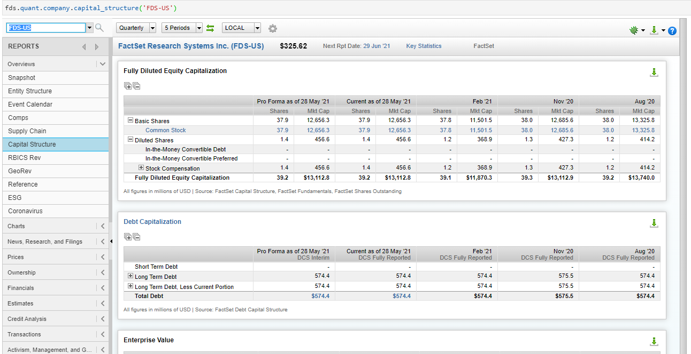](https://fpe.factset.com/docs/_images/capital_structure.png)

fds.fpe.quant.company.capital\_structure(_symbol_, _\*\*kwargs_)[#](https://fpe.factset.com/docs/company.html#fds.fpe.quant.company.capital_structure "Link to this definition")

The Capital Structure report uses a company’s debt and equity capital structure to calculate an enterprise value based on a fully diluted shares analysis.

Parameters:

**symbol** (_str_) – Ticker symbol + region (example: AAPL-US)

References

-   [https://my.apps.factset.com/oa/pages/20533](https://my.apps.factset.com/oa/pages/20533)
    

## Competitors[#](https://fpe.factset.com/docs/company.html#competitors "Link to this heading")

[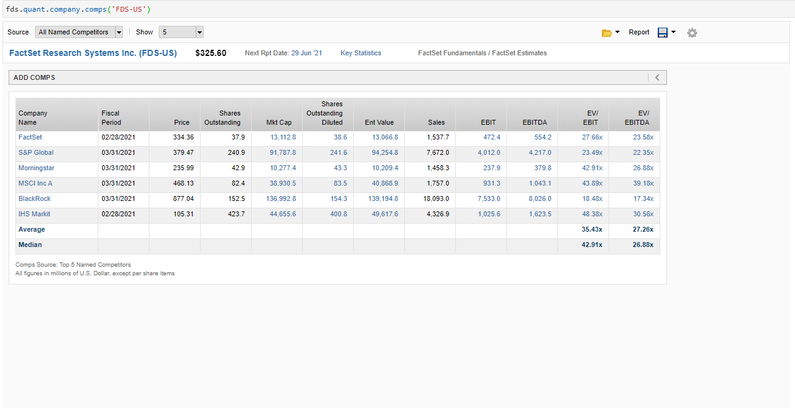](https://fpe.factset.com/docs/_images/competitors.png)

fds.fpe.quant.company.comps(_symbol_, _\*\*kwargs_)[#](https://fpe.factset.com/docs/company.html#fds.fpe.quant.company.comps "Link to this definition")

The Competitors report allows you to find and screen for comparable companies for any public equity.

Parameters:

**symbol** (_str_) – Ticker symbol + region (example: AAPL-US)

References

-   [https://my.apps.factset.com/oa/pages/17446](https://my.apps.factset.com/oa/pages/17446)
    

## Corporate Actions[#](https://fpe.factset.com/docs/company.html#corporate-actions "Link to this heading")

[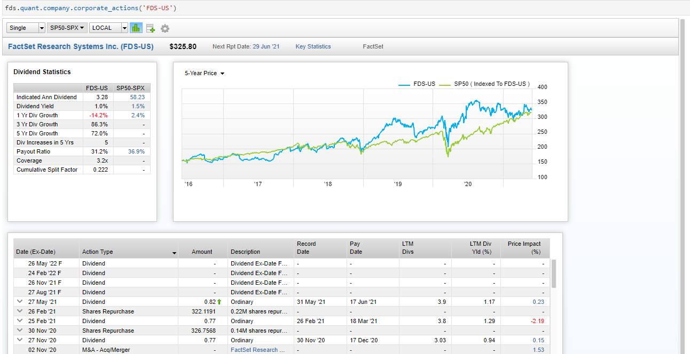](https://fpe.factset.com/docs/_images/corporate_actions.png)

fds.fpe.quant.company.corporate\_actions(_symbol_, _\*\*kwargs_)[#](https://fpe.factset.com/docs/company.html#fds.fpe.quant.company.corporate_actions "Link to this definition")

Display information on stock splits, dividends, special dividends, optional distributions, spinoffs, rights issues, bonus issues, and symbol changes by ex-date.

Parameters:

**symbol** (_str_) – Ticker symbol + region (example: AAPL-US)

References

-   [https://my.apps.factset.com/oa/pages/16572](https://my.apps.factset.com/oa/pages/16572)
    

## Debt Summary[#](https://fpe.factset.com/docs/company.html#debt-summary "Link to this heading")

fds.fpe.quant.company.debt\_summary(_symbol_, _\*\*kwargs_)[#](https://fpe.factset.com/docs/company.html#fds.fpe.quant.company.debt_summary "Link to this definition")

Provides a broad and comprehensive view of the instruments associated with a debt issuer.

Parameters:

**symbol** (_str_) – Ticker symbol + region (example: AAPL-US)

References

-   [https://my.apps.factset.com/oa/pages/16102](https://my.apps.factset.com/oa/pages/16102)
    

## Entity Structure[#](https://fpe.factset.com/docs/company.html#entity-structure "Link to this heading")

[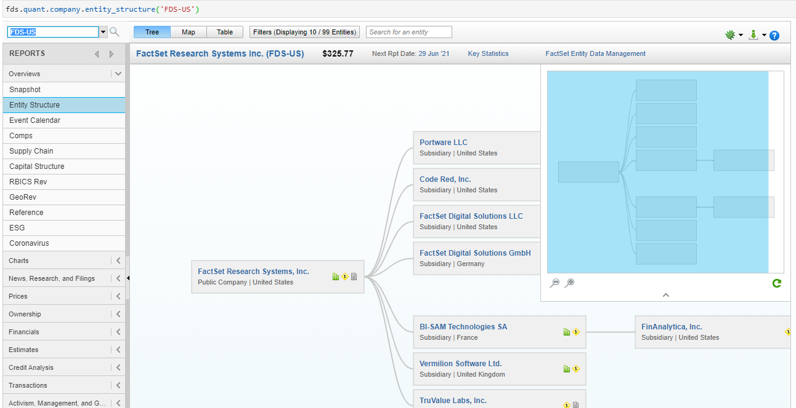](https://fpe.factset.com/docs/_images/entity_structure.png)

fds.fpe.quant.company.entity\_structure(_symbol_, _\*\*kwargs_)[#](https://fpe.factset.com/docs/company.html#fds.fpe.quant.company.entity_structure "Link to this definition")

Provides an extensive entity structure breakout for any company or country. You can quickly navigate through an entity’s entire legal/operating structure and examine complex connections between securities.

Parameters:

**symbol** (_str_) – Ticker symbol + region (example: AAPL-US)

References

-   [https://my.apps.factset.com/oa/pages/16991](https://my.apps.factset.com/oa/pages/16991)
    

## ESG[#](https://fpe.factset.com/docs/company.html#esg "Link to this heading")

[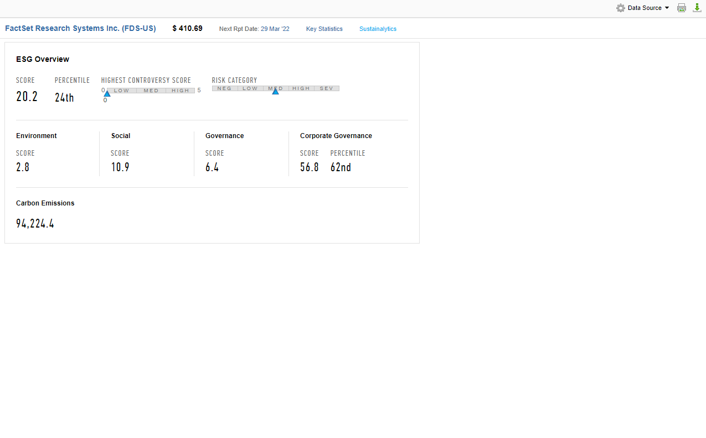](https://fpe.factset.com/docs/_images/esg.png)

fds.fpe.quant.company.esg(_symbol_, _\*\*kwargs_)[#](https://fpe.factset.com/docs/company.html#fds.fpe.quant.company.esg "Link to this definition")

The ESG report provides a a high-level overview of a company’s social responsibility.

Parameters:

**symbol** (_str_) – Ticker symbol + region (example: AAPL-US)

References

-   [https://my.apps.factset.com/oa/pages/21419](https://my.apps.factset.com/oa/pages/21419)
    

## Estimates Summary[#](https://fpe.factset.com/docs/company.html#estimates-summary "Link to this heading")

[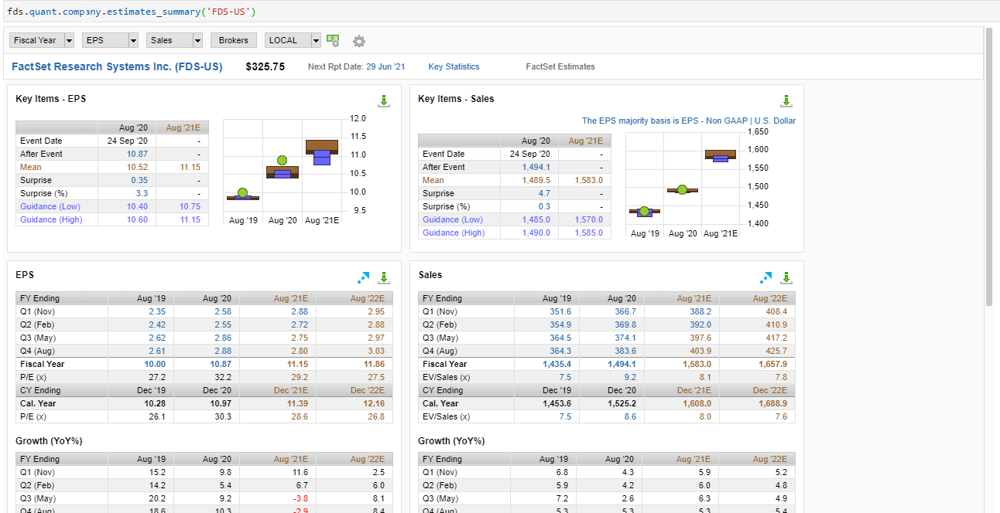](https://fpe.factset.com/docs/_images/estimates_summary.png)

fds.fpe.quant.company.estimates\_summary(_symbol_, _\*\*kwargs_)[#](https://fpe.factset.com/docs/company.html#fds.fpe.quant.company.estimates_summary "Link to this definition")

View a variety of estimate data for a given company to find the most relevant estimates information quickly and easily.

Parameters:

**symbol** (_str_) – Ticker symbol + region (example: AAPL-US)

References

-   [https://my.apps.factset.com/oa/pages/14902](https://my.apps.factset.com/oa/pages/14902)
    

## Event Calendar[#](https://fpe.factset.com/docs/company.html#event-calendar "Link to this heading")

[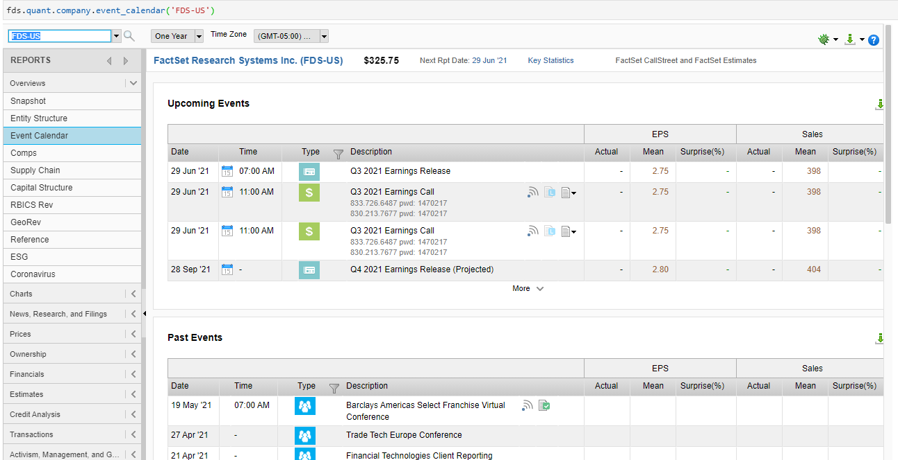](https://fpe.factset.com/docs/_images/event_calendar.png)

fds.fpe.quant.company.event\_calendar(_symbol_, _\*\*kwargs_)[#](https://fpe.factset.com/docs/company.html#fds.fpe.quant.company.event_calendar "Link to this definition")

Analyze conference call transcripts and research important details about public companies’ corporate events using Event Calendar.

Parameters:

**symbol** (_str_) – Ticker symbol + region (example: AAPL-US)

References

-   [https://my.apps.factset.com/oa/pages/15308](https://my.apps.factset.com/oa/pages/15308)
    

## Filings[#](https://fpe.factset.com/docs/company.html#filings "Link to this heading")

fds.fpe.quant.company.filings(_symbol_, _\*\*kwargs_)[#](https://fpe.factset.com/docs/company.html#fds.fpe.quant.company.filings "Link to this definition")

Allows you to quickly and efficiently find relevant filings and exhibits for a company and download tables quickly.

Parameters:

**symbol** (_str_) – Ticker symbol + region (example: AAPL-US)

References

-   [https://my.apps.factset.com/oa/pages/21065](https://my.apps.factset.com/oa/pages/21065)
    

## GeoRev Exposure[#](https://fpe.factset.com/docs/company.html#georev-exposure "Link to this heading")

[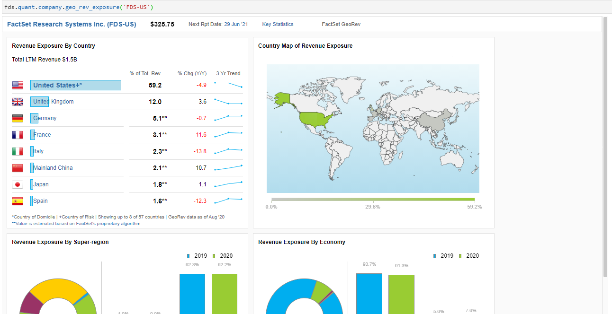](https://fpe.factset.com/docs/_images/geo_rev_exposure.png)

fds.fpe.quant.company.geo\_rev\_exposure(_symbol_, _\*\*kwargs_)[#](https://fpe.factset.com/docs/company.html#fds.fpe.quant.company.geo_rev_exposure "Link to this definition")

Understand the geographic footprint of a given company, exchange-traded fund (ETF), index, or industry.

Parameters:

**symbol** (_str_) – Ticker symbol + region (example: AAPL-US)

References

-   [https://my.apps.factset.com/oa/pages/17686](https://my.apps.factset.com/oa/pages/17686)
    

## Interactive Chart[#](https://fpe.factset.com/docs/company.html#interactive-chart "Link to this heading")

[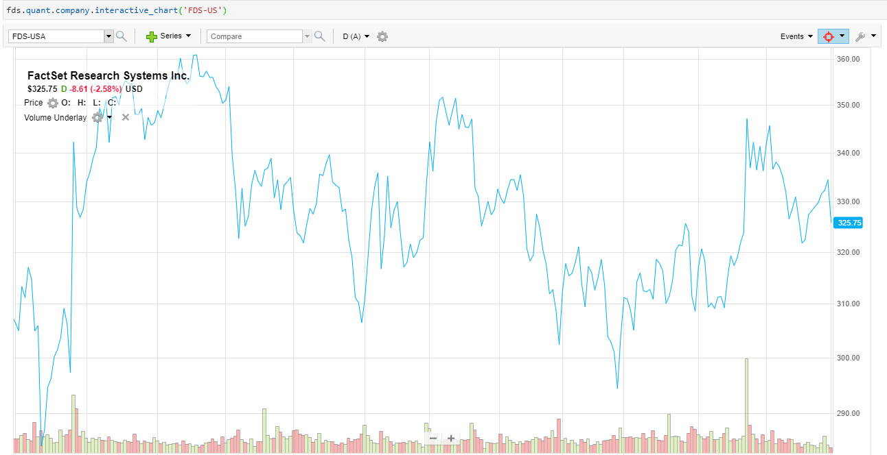](https://fpe.factset.com/docs/_images/interactive_chart.png)

fds.fpe.quant.company.interactive\_chart(_symbol_, _\*\*kwargs_)[#](https://fpe.factset.com/docs/company.html#fds.fpe.quant.company.interactive_chart "Link to this definition")

Display a flexible charts depicting company and non-company data.

Parameters:

**symbol** (_str_) – Ticker symbol + region (example: AAPL-US)

## Internal Research Notes[#](https://fpe.factset.com/docs/company.html#internal-research-notes "Link to this heading")

fds.fpe.quant.company.internal\_research\_notes(_\*args_, _\*\*kwargs_)[#](https://fpe.factset.com/docs/company.html#fds.fpe.quant.company.internal_research_notes "Link to this definition")

Seamlessly combines your firm’s proprietary content with FactSet’s company, market, and portfolio data to provide a complete research solution.

References

-   [https://my.apps.factset.com/oa/pages/17459](https://my.apps.factset.com/oa/pages/17459)
    

## News[#](https://fpe.factset.com/docs/company.html#news "Link to this heading")

fds.fpe.quant.company.news(_symbol_, _\*\*kwargs_)[#](https://fpe.factset.com/docs/company.html#fds.fpe.quant.company.news "Link to this definition")

Real-time news headlines from all news sources with options to customize your results and search historical news.

Parameters:

**symbol** (_str_) – Ticker symbol + region (example: AAPL-US)

References

-   [https://my.apps.factset.com/oa/pages/21201](https://my.apps.factset.com/oa/pages/21201)
    

## Ownership[#](https://fpe.factset.com/docs/company.html#ownership "Link to this heading")

[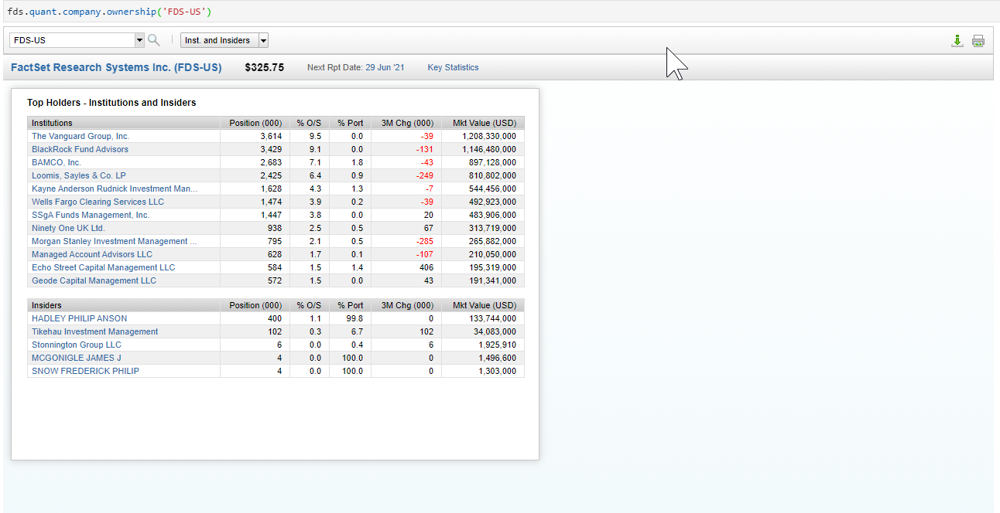](https://fpe.factset.com/docs/_images/ownership.png)

fds.fpe.quant.company.ownership(_symbol_, _\*\*kwargs_)[#](https://fpe.factset.com/docs/company.html#fds.fpe.quant.company.ownership "Link to this definition")

Allows you to see which institutions, insiders, exchange-traded funds (ETFs), and mutual funds have invested in a company or security.

Parameters:

**symbol** (_str_) – Ticker symbol + region (example: AAPL-US)

References

-   [https://my.apps.factset.com/oa/pages/17451](https://my.apps.factset.com/oa/pages/17451)
    

## Ownership Activity[#](https://fpe.factset.com/docs/company.html#ownership-activity "Link to this heading")

[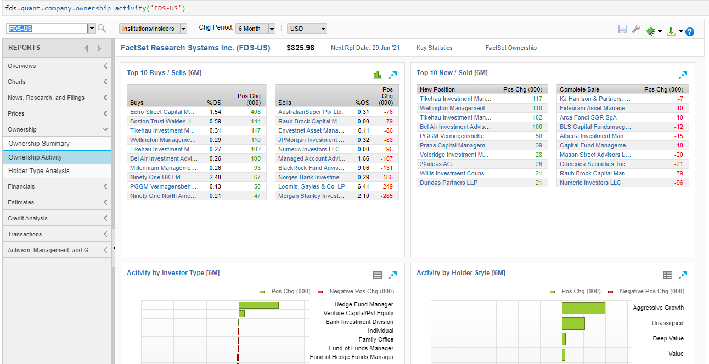](https://fpe.factset.com/docs/_images/ownership_activity.png)

fds.fpe.quant.company.ownership\_activity(_symbol_, _\*\*kwargs_)[#](https://fpe.factset.com/docs/company.html#fds.fpe.quant.company.ownership_activity "Link to this definition")

View top buys and sells and monitor investor activity in the Ownership Activity report.

Parameters:

**symbol** (_str_) – Ticker symbol + region (example: AAPL-US)

References

-   [https://my.apps.factset.com/oa/pages/17451](https://my.apps.factset.com/oa/pages/17451)
    

## Ownership Summary[#](https://fpe.factset.com/docs/company.html#ownership-summary "Link to this heading")

[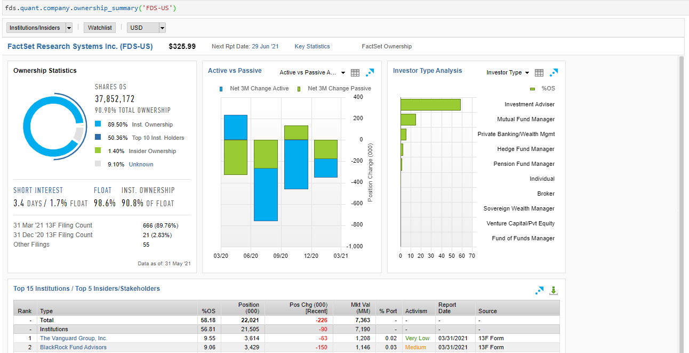](https://fpe.factset.com/docs/_images/ownership_summary.png)

fds.fpe.quant.company.ownership\_summary(_symbol_, _\*\*kwargs_)[#](https://fpe.factset.com/docs/company.html#fds.fpe.quant.company.ownership_summary "Link to this definition")

Provides an overview of share ownership by highlighting recent activism, percent of shares, and positive and negative ownership change.

Parameters:

**symbol** (_str_) – Ticker symbol + region (example: AAPL-US)

References

-   [https://my.apps.factset.com/oa/pages/17830](https://my.apps.factset.com/oa/pages/17830)
    

## Price Chart[#](https://fpe.factset.com/docs/company.html#price-chart "Link to this heading")

fds.fpe.quant.company.price\_chart(_symbol_, _\*\*kwargs_)[#](https://fpe.factset.com/docs/company.html#fds.fpe.quant.company.price_chart "Link to this definition")

The Price chart allows you to quickly switch between historical and intraday time periods for a number of various series. The Price series include Price, Volume, and Sentiment Indicators, along with over 30 Technical Indicators, including Ichimoku Cloud, STARC Bands and Average True Range.

Parameters:

**symbol** (_str_) – Ticker symbol + region (example: AAPL-US)

References

-   [https://my.apps.factset.com/oa/pages/21461](https://my.apps.factset.com/oa/pages/21461)
    

## RBICS Revenue Exposure[#](https://fpe.factset.com/docs/company.html#rbics-revenue-exposure "Link to this heading")

[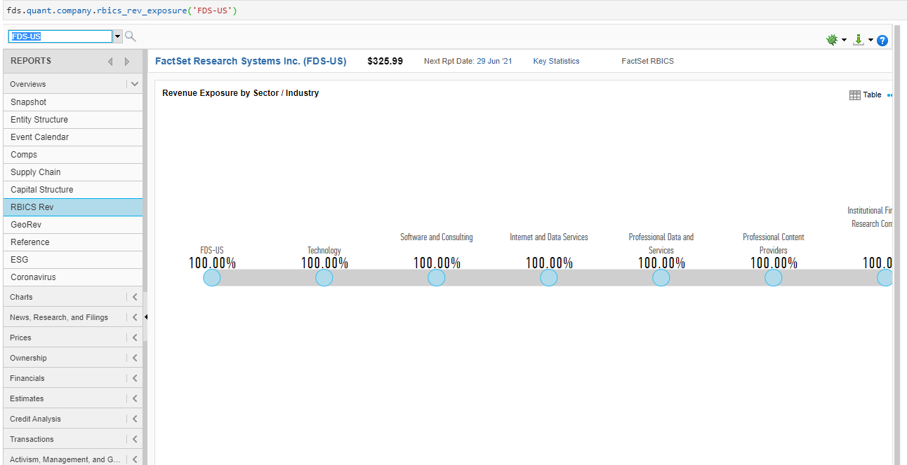](https://fpe.factset.com/docs/_images/rbics_rev_exposure.png)

fds.fpe.quant.company.rbics\_rev\_exposure(_symbol_, _\*\*kwargs_)[#](https://fpe.factset.com/docs/company.html#fds.fpe.quant.company.rbics_rev_exposure "Link to this definition")

RBICS with Revenue normalizes non-standardized business segment reports by aligning segment revenues to the granular RBICS taxonomy, resulting in a multi-sector classification for each company.

Parameters:

**symbol** (_str_) – Ticker symbol + region (example: AAPL-US)

## Reference[#](https://fpe.factset.com/docs/company.html#reference "Link to this heading")

[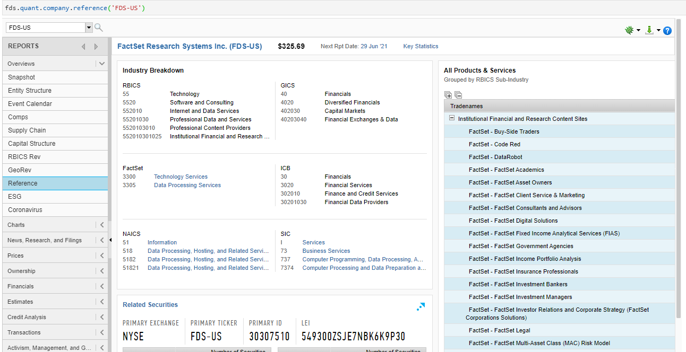](https://fpe.factset.com/docs/_images/reference.png)

fds.fpe.quant.company.reference(_symbol_, _\*\*kwargs_)[#](https://fpe.factset.com/docs/company.html#fds.fpe.quant.company.reference "Link to this definition")

Streamlined solution to gaining dynamic, comprehensive insight into the various business sectors that companies compete in.

Parameters:

**symbol** (_str_) – Ticker symbol + region (example: AAPL-US)

References

-   [https://my.apps.factset.com/oa/pages/17743](https://my.apps.factset.com/oa/pages/17743)
    

## Snapshot[#](https://fpe.factset.com/docs/company.html#snapshot "Link to this heading")

[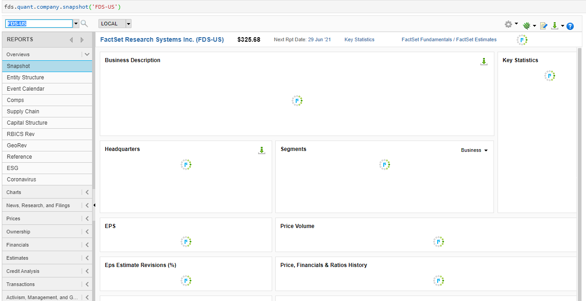](https://fpe.factset.com/docs/_images/snapshot.png)

fds.fpe.quant.company.snapshot(_symbol_, _option\='im'_, _\*\*kwargs_)[#](https://fpe.factset.com/docs/company.html#fds.fpe.quant.company.snapshot "Link to this definition")

The Snapshot report displays differentiating information depending on the security and choice of snapshot. options and their “option” values are - IM snapshot (im) - IB snapshot (ib) - Index snapshot (index) - PEVC snapshot (pevc) - PE/VC firm snapshot (pevc-firm) - Private company snapshot (private-company)

Parameters:

-   **symbol** (_str_) – Ticker symbol + region (example: AAPL-US)
    
-   **option** (_str_) – Name of the type of snapshot. Default value is IM Snapshot
    

References

-   [https://my.apps.factset.com/oa/pages/17878](https://my.apps.factset.com/oa/pages/17878)
    

## Supply Chain[#](https://fpe.factset.com/docs/company.html#supply-chain "Link to this heading")

[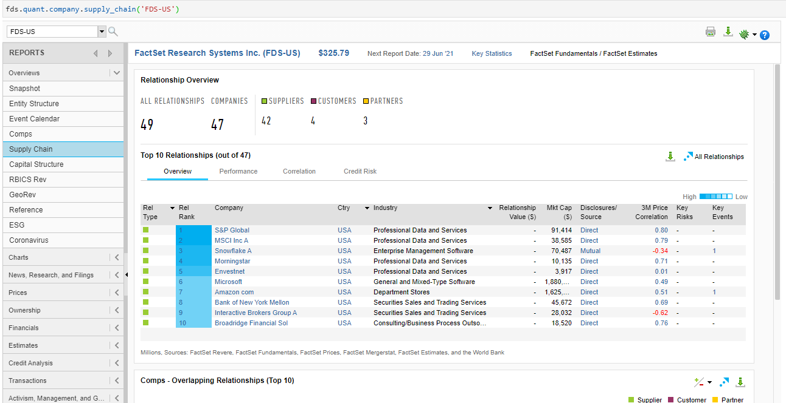](https://fpe.factset.com/docs/_images/supply_chain.png)

fds.fpe.quant.company.supply\_chain(_symbol_, _\*\*kwargs_)[#](https://fpe.factset.com/docs/company.html#fds.fpe.quant.company.supply_chain "Link to this definition")

The Supply Chain report provides unparalleled visibility into one of the core risk factors affecting the operating performance of a company: its supply chain.

Parameters:

**symbol** (_str_) – Ticker symbol + region (example: AAPL-US)

References

-   [https://my.apps.factset.com/oa/pages/17447](https://my.apps.factset.com/oa/pages/17447)
    

## Valuation Chart[#](https://fpe.factset.com/docs/company.html#valuation-chart "Link to this heading")

fds.fpe.quant.company.valuation\_chart(_symbol_, _\*\*kwargs_)[#](https://fpe.factset.com/docs/company.html#fds.fpe.quant.company.valuation_chart "Link to this definition")

The Valuation chart helps you determine the true measure for what a company is worth. You can use it to mix and match valuation metrics in absolute or relative mode.

Parameters:

**symbol** (_str_) – Ticker symbol + region (example: AAPL-US)

References

-   [https://my.apps.factset.com/oa/pages/21462](https://my.apps.factset.com/oa/pages/21462)
