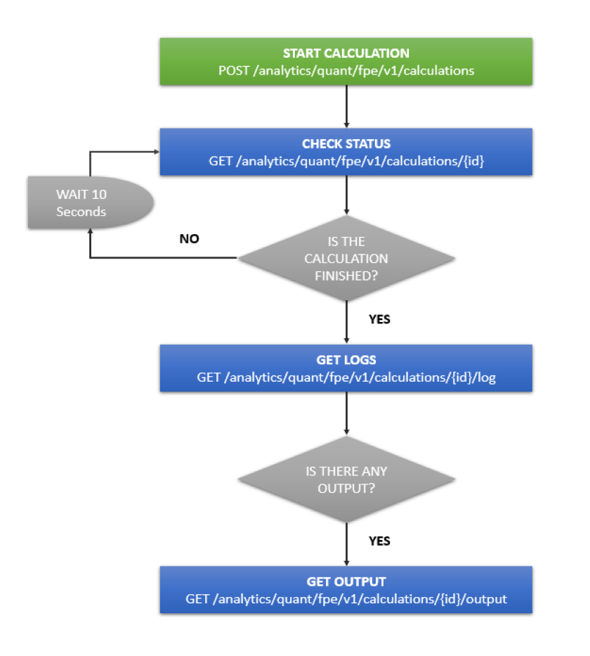

# FPE API and Scheduling — FactSet

> ## Excerpt
> In addition to the interactive environment, FPE has an API interface. This allows you to interact
with FPE programmatically, streamlining the path from research to production.

---
In addition to the interactive environment, FPE has an API interface. This allows you to interact with FPE programmatically, streamlining the path from research to production.

The FPE API provides endpoints to run python scripts developed in FPE remotely. This allows you to import data and export data programmatically.

For more details you can visit the [FPE API documentation](https://developer.factset.com/api-catalog/factset-programmatic-environment-api)

## Running a Notebook via API[#](https://fpe.factset.com/docs/fpe_api.html#running-a-notebook-via-api "Link to this heading")

The FPE API accepts python code as its input. If you have a notebook in FPE that you would like to run programmatically, you can export the notebook as an “Executable Script”. This will convert the notebook to a python script which can be executed via the API.

See [Exporting Notebooks](https://fpe.factset.com/docs/external_data.html#exporting-notebooks) for more details.

## Export Data via API[#](https://fpe.factset.com/docs/fpe_api.html#export-data-via-api "Link to this heading")

To export data using the FPE API, you can use the following python modules to specify your output format.

If you are [Running a Notebook via API](https://fpe.factset.com/docs/fpe_api.html#running-a-notebook-via-api), you might want to add an output at the end of your python script.

### fds.fpe.output.dataframe[#](https://fpe.factset.com/docs/fpe_api.html#fds-fpe-output-dataframe "Link to this heading")

The _fds.fpe.output.dataframe_ module allows you to easily output a pandas DataFrame to any of the following formats using the FPE API.

For example, to export a pandas DataFrame to Feather format, add the following to your script:

```
fds.fpe.output.dataframe.to_feather(df)
```

fds.fpe.output.dataframe.to\_clipboard(_df_, _excel\=True_, _sep\='\\\\t'_, _\*\*kwargs_)[#](https://fpe.factset.com/docs/fpe_api.html#fds.fpe.output.dataframe.to_clipboard "Link to this definition")

Copying dataframe to your clipboard.

This output function is not working under FPE API - it will not raise any error, but copying to the clipboard will also not be successful.

Parameters:

-   **df** (`DataFrame`) – The DataFrame you want to copy.
    
-   **excel** (`bool`) – If True it uses pandas’ to\_csv method, otherwise write a string representation of the dataframe.
    
-   **sep** (`str`) – Delimeter to be used. By default tab delimited.
    
-   **\*\*kwargs** (`Any`) – All kwargs will be passed to pandas.DataFrame.to\_csv method
    

Return type:

`HTML`

fds.fpe.output.dataframe.to\_csv(_df_, _\*\*kwargs_)[#](https://fpe.factset.com/docs/fpe_api.html#fds.fpe.output.dataframe.to_csv "Link to this definition")

Sets the script output to the passed DataFrame as CSV.

Content-Type will be set to text/csv.

Parameters:

-   **df** (_DataFrame_) – The DataFrame containing the values to output.
    
-   **sep** (_str__,_ _default '__,__'_) – String of length 1. Field delimiter for the output file.
    
-   **na\_rep** (_str__,_ _default ''_) – Missing data representation.
    
-   **float\_format** (_str__,_ _default None_) – Format string for floating point numbers.
    
-   **columns** (_sequence__,_ _optional_) – Columns to write.
    
-   **header** (_bool_ _or_ _list_ _of_ _str__,_ _default True_) – Write out the column names. If a list of strings is given it is assumed to be aliases for the column names.
    
-   **index** (_bool__,_ _default True_) – Write row names (index).
    
-   **index\_label** (_str_ _or_ _sequence__, or_ _False__,_ _default None_) – Column label for index column(s) if desired. If None is given, and header and index are True, then the index names are used. A sequence should be given if the object uses MultiIndex. If False do not print fields for index names. Use index\_label=False for easier importing in R.
    
-   **compression** (_str__,_ _default 'None'_) – Represents compression mode. Compression mode may be any of the following possible values: {{‘gzip’, ‘bz2’, ‘zip’, ‘xz’, None}}.
    
-   **quoting** (_optional constant from csv module_) – Defaults to csv.QUOTE\_MINIMAL. If you have set a float\_format then floats are converted to strings and thus csv.QUOTE\_NONNUMERIC will treat them as non-numeric.
    
-   **quotechar** (_str__,_ _default '\\"'_) – String of length 1. Character used to quote fields.
    
-   **line\_terminator** (_str__,_ _optional_) – The newline character or character sequence to use in the output file. Defaults to os.linesep, which depends on the OS in which this method is called (’\\\\n’ for linux, ‘\\\\r\\\\n’ for Windows, i.e.).
    
-   **date\_format** (_str_) – Format string for datetime objects. Default none.
    
-   **doublequote** (_bool__,_ _default True_) – Control quoting of quotechar inside a field.
    
-   **escapechar** (_str__,_ _default None_) – String of length 1. Character used to escape sep and quotechar when appropriate.
    
-   **decimal** (_str__,_ _default '.'_) – Character recognized as decimal separator. E.g. use ‘,’ for European data.
    
-   **errors** (_str__,_ _default 'strict'_) – Specifies how encoding and decoding errors are to be handled. See the errors argument for `open()` for a full list of options.
    
-   **\*\*kwargs** (`Any`) – Additional keyword arguments forwarded to `pandas.DataFrame.to_csv()`.
    

Return type:

`None`

fds.fpe.output.dataframe.to\_excel(_df_, _\*\*kwargs_)[#](https://fpe.factset.com/docs/fpe_api.html#fds.fpe.output.dataframe.to_excel "Link to this definition")

Sets the script output to the passed DataFrame as an Excel file.

Content-Type will be set to application/vnd.ms-excel.

Parameters:

-   **df** (_DataFrame_) – The DataFrame containing the values to output.
    
-   **sheet\_name** (_str__,_ _default 'Sheet1'_) – Name of sheet which will contain DataFrame.
    
-   **na\_rep** (_str__,_ _default ''_) – Missing data representation.
    
-   **float\_format** (_str__,_ _optional_) – Format string for floating point numbers. For example `float_format="%.2f"` will format 0.1234 to 0.12.
    
-   **columns** (_sequence_ _or_ _list_ _of_ _str__,_ _optional_) – Columns to write.
    
-   **header** (_bool_ _or_ _list_ _of_ _str__,_ _default True_) – Write out the column names. If a list of string is given it is assumed to be aliases for the column names.
    
-   **index** (_bool__,_ _default True_) – Write row names (index).
    
-   **index\_label** (_str_ _or_ _sequence__,_ _optional_) – Column label for index column(s) if desired. If not specified, and header and index are True, then the index names are used. A sequence should be given if the DataFrame uses MultiIndex.
    
-   **startrow** (_int__,_ _default 0_) – Upper left cell row to dump data frame.
    
-   **startcol** (_int__,_ _default 0_) – Upper left cell column to dump data frame.
    
-   **merge\_cells** (_bool__,_ _default True_) – Write MultiIndex and Hierarchical Rows as merged cells.
    
-   **inf\_rep** (_str__,_ _default 'inf'_) – Representation for infinity (there is no native representation for infinity in Excel).
    
-   **verbose** (_bool__,_ _default True_) – Display more information in the error logs.
    
-   **freeze\_panes** (_tuple_ _of_ _int_ _(__length 2__)__,_ _optional_) – Specifies the one-based bottommost row and rightmost column that is to be frozen.
    
-   **\*\*kwargs** (`Any`) – Additional keyword arguments forwarded to `pandas.DataFrame.to_excel()`.
    

Return type:

`None`

fds.fpe.output.dataframe.to\_feather(_df_, _\*\*kwargs_)[#](https://fpe.factset.com/docs/fpe_api.html#fds.fpe.output.dataframe.to_feather "Link to this definition")

Sets the script output to the passed DataFrame as Feather.

Content-Type will be set to application/feather.

Parameters:

-   **df** (_DataFrame_) – The DataFrame containing the values to output.
    
-   **compression** (_string__,_ _default None_) – Can be one of {“zstd”, “lz4”, “uncompressed”}. The default of None uses LZ4 for V2 files if it is available, otherwise uncompressed.
    
-   **compression\_level** (_int__,_ _default None_) – Use a compression level particular to the chosen compressor. If None use the default compression level
    
-   **version** (_int__,_ _default 2_) – Feather file version. Version 2 is the current. Version 1 is the more limited legacy format
    
-   **\*\*kwargs** (`Any`) – Additional keyword arguments forwarded to `pandas.DataFrame.to_feather()`.
    

Return type:

`None`

fds.fpe.output.dataframe.to\_json(_df_, _\*\*kwargs_)[#](https://fpe.factset.com/docs/fpe_api.html#fds.fpe.output.dataframe.to_json "Link to this definition")

Sets the script output to the passed DataFrame as JSON.

Content-Type will be set to application/json.

Note NaN’s and None will be converted to null and datetime objects will be converted to UNIX timestamps.

Parameters:

-   **df** (_DataFrame_) – The DataFrame containing the values to output.
    
-   **orient** (_str_) –
    
    Indication of expected JSON string format.
    
    -   Series:
        
        > -   default is ‘index’
        >     
        > -   allowed values are: {{‘split’, ‘records’, ‘index’, ‘table’}}.
        >     
        
    -   DataFrame:
        
        > -   default is ‘columns’
        >     
        > -   allowed values are: {{‘split’, ‘records’, ‘index’, ‘columns’, ‘values’, ‘table’}}.
        >     
        
    -   The format of the JSON string:
        
        > -   ’split’ : dict like {{‘index’ -> \[index\], ‘columns’ -> \[columns\], ‘data’ -> \[values\]}}
        >     
        > -   ’records’ : list like \[{{column -> value}}, … , {{column -> value}}\]
        >     
        > -   ’index’ : dict like {{index -> {{column -> value}}}}
        >     
        > -   ’columns’ : dict like {{column -> {{index -> value}}}}
        >     
        > -   ’values’ : just the values array
        >     
        > -   ’table’ : dict like {{‘schema’: {{schema}}, ‘data’: {{data}}}} Describing the data, where data component is like `orient='records'`.
        >     
        
-   **date\_format** (_{{None__,_ _'epoch'__,_ _'iso'}}_) – Type of date conversion. ‘epoch’ = epoch milliseconds, ‘iso’ = ISO8601. The default depends on the orient. For `orient='table'`, the default is ‘iso’. For all other orients, the default is ‘epoch’.
    
-   **double\_precision** (_int__,_ _default 10_) – The number of decimal places to use when encoding floating point values.
    
-   **force\_ascii** (_bool__,_ _default True_) – Force encoded string to be ASCII.
    
-   **date\_unit** (_str__,_ _default 'ms'_ _(__milliseconds__)_) – The time unit to encode to, governs timestamp and ISO8601 precision. One of ‘s’, ‘ms’, ‘us’, ‘ns’ for second, millisecond, microsecond, and nanosecond respectively.
    
-   **default\_handler** (_callable__,_ _default None_) – Handler to call if object cannot otherwise be converted to a suitable format for JSON. Should receive a single argument which is the object to convert and return a serialisable object.
    
-   **lines** (_bool__,_ _default False_) – If ‘orient’ is ‘records’ write out line delimited json format. Will throw ValueError if incorrect ‘orient’ since others are not list like.
    
-   **compression** (_{{'gzip'__,_ _'bz2'__,_ _'zip'__,_ _'xz'__,_ _None}}_) – Represents compression mode. Compression mode may be any of the following possible values: {{‘gzip’, ‘bz2’, ‘zip’, ‘xz’, None}}.
    
-   **index** (_bool__,_ _default True_) – Whether to include the index values in the JSON string. Not including the index (`index=False`) is only supported when orient is ‘split’ or ‘table’.
    
-   **indent** (_int__,_ _optional_) – Length of whitespace used to indent each record.
    
-   **\*\*kwargs** (`Any`) – Additional keyword arguments forwarded to `pandas.DataFrame.to_json()`.
    

Return type:

`None`

fds.fpe.output.dataframe.to\_parquet(_df_, _\*\*kwargs_)[#](https://fpe.factset.com/docs/fpe_api.html#fds.fpe.output.dataframe.to_parquet "Link to this definition")

Sets the script output to the passed DataFrame as Parquet.

Content-Type will be set to application/parquet.

Parameters:

-   **df** (_DataFrame_) – The DataFrame containing the values to output.
    
-   **compression** (_{{'snappy'__,_ _'gzip'__,_ _'brotli'__,_ _None}}__,_ _default 'snappy'_) – Name of the compression to use. Use `None` for no compression.
    
-   **index** (_bool__,_ _default None_) – If `True`, include the dataframe’s index(es) in the file output. If `False`, they will not be written to the file. If `None`, similar to `True` the dataframe’s index(es) will be saved. However, instead of being saved as values, the RangeIndex will be stored as a range in the metadata so it doesn’t require much space and is faster. Other indexes will be included as columns in the file output.
    
-   **\*\*kwargs** (`Any`) – Additional keyword arguments forwarded to `pandas.DataFrame.to_parquet()`.
    

Return type:

`None`

fds.fpe.output.dataframe.to\_snowflake(_df_, _conn_, _table\_name_, _database_, _schema_, _\*\*kwargs_)[#](https://fpe.factset.com/docs/fpe_api.html#fds.fpe.output.dataframe.to_snowflake "Link to this definition")

Output the DataFrame to a specified Snowflake database.

Parameters:

-   **df** (`DataFrame`) – The DataFrame containing the values to output.
    
-   **conn** (`Any`) – The Snowflake Connection object
    
-   **table\_name** (`str`) – Name of the table where the data should be copied.
    
-   **database** (`str`) – Name of the database containing the table.
    
-   **schema** (`str`) – Name of the scheme containing the table.
    
-   **\*\*kwargs** (`Any`) – Additional keyword arguments forwarded to `snowflake.connector.pandas_tools.write_pandas()`.
    

Return type:

`None`

### fds.fpe.output.raw[#](https://fpe.factset.com/docs/fpe_api.html#fds-fpe-output-raw "Link to this heading")

The _fds.fpe.output.raw_ module allows you to output raw data and specify the content type manually.

fds.fpe.output.raw.raw\_bytes(_data_, _content\_type_)[#](https://fpe.factset.com/docs/fpe_api.html#fds.fpe.output.raw.raw_bytes "Link to this definition")

Sets the script output to the passed bytes.

Content-Type will be set to what is passed.

Parameters:

-   **data** (`bytes`) – The raw bytes to output, subject to a limit of 25 MB.
    
-   **content\_type** (`str`) – The content-type of the output.
    

Return type:

`None`

## Authenticaton[#](https://fpe.factset.com/docs/fpe_api.html#authenticaton "Link to this heading")

Authentication works the same as any other FactSet API, see [API Authentication](https://developer.factset.com/authentication) for more details.

## Scheduling[#](https://fpe.factset.com/docs/fpe_api.html#scheduling "Link to this heading")

Requests to the FPE API typically use the following workflow.

[](https://fpe.factset.com/docs/_images/fpe_api_workflow.png)

### Example Script[#](https://fpe.factset.com/docs/fpe_api.html#example-script "Link to this heading")

As an example, you can use [`fpe_api_request.py`](https://fpe.factset.com/docs/_downloads/3b7dabd1689789587d882c1120d36188/fpe_api_request.py) to make requests to FPE API. This script follows the workflow described above.

#### Usage[#](https://fpe.factset.com/docs/fpe_api.html#usage "Link to this heading")

```
$ python fpe_api_request.py --help
usage: fpe_api_request.py [-h] --input INPUT [--output OUTPUT] [--logfile LOGFILE]

Example python script for making requests to FPE API. The logs for this script will be stored in fpe_api_request.log. The
logs for the FPE API request can be stored in a separate file if you provide the --logfile argument.

optional arguments:
  -h, --help         show this help message and exit
  --input INPUT      File name of the FPE Python script to execute
  --output OUTPUT    File name to store FPE output (.csv or .xlsx), if applicable
  --logfile LOGFILE  File name to store FPE logs
```

### Example Cron Job[#](https://fpe.factset.com/docs/fpe_api.html#example-cron-job "Link to this heading")

[Cron](https://en.wikipedia.org/wiki/Cron) is a utility program that lets users input commands for scheduling tasks repeatedly at a specific time. Tasks scheduled in cron are called cron jobs. Cron jobs are stored as entries in a crontab file. Each entry in the crontab file uses the following format.

```
# ┌───────────── minute (0 - 59)
# │ ┌───────────── hour (0 - 23)
# │ │ ┌───────────── day of the month (1 - 31)
# │ │ │ ┌───────────── month (1 - 12)
# │ │ │ │ ┌───────────── day of the week (0 - 6) (Sunday to Saturday;
# │ │ │ │ │                                   7 is also Sunday on some systems)
# │ │ │ │ │
# │ │ │ │ │
# * * * * * <command to execute>
```

#### Create the Cron Job[#](https://fpe.factset.com/docs/fpe_api.html#create-the-cron-job "Link to this heading")

First, run the following command to open the crontab file for editing.

```
crontab -e
```

Next, add the following entry to create a cron job that schedules FPE API requests using [`fpe_api_request.py`](https://fpe.factset.com/docs/_downloads/3b7dabd1689789587d882c1120d36188/fpe_api_request.py) to run every weekday at 9am.

_Note: In this example, we are using absolute paths._

```
0 9 * * 1-5 /usr/bin/python3 /home/USER/fpe_api_request.py --input /home/USER/example_fpe_script.py --logfile /home/USER/fpe.log
```
