# FPO Widget — FactSet Programmatic

> ## Excerpt
> The FPO Widget is designed to streamline portfolio construction and analysis by combining no-code configuration (Holdings, Strategy, Store/Load) with FactSet’s Portfolio Optimization (FPO) engine. Users can run:

---
## Overview[#](https://fpe.factset.com/docs/fpo_widget.html#overview "Link to this heading")

The **FPO Widget** is designed to streamline portfolio construction and analysis by combining no-code configuration (Holdings, Strategy, Store/Load) with FactSet’s Portfolio Optimization (FPO) engine. Users can run:

**Portfolio optimization**

**Efficient frontier**

**Portfolio simulation**

All results and reports are consolidated in a single interface.

[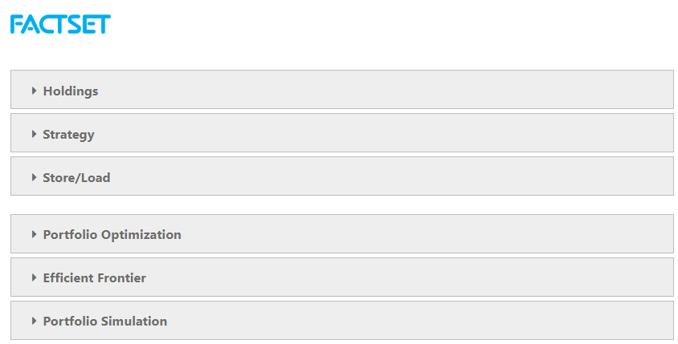](https://fpe.factset.com/docs/_images/fpo_widget_sections1.png)

## Holdings[#](https://fpe.factset.com/docs/fpo_widget.html#holdings "Link to this heading")

In the **Holdings** panel, you define the initial portfolio, benchmark, asset class, currency, risk model, and other key parameters, such as a buy list. Additionally, you can link a PA document, whose settings (e.g., pricing sources) will be applied during the optimization.

[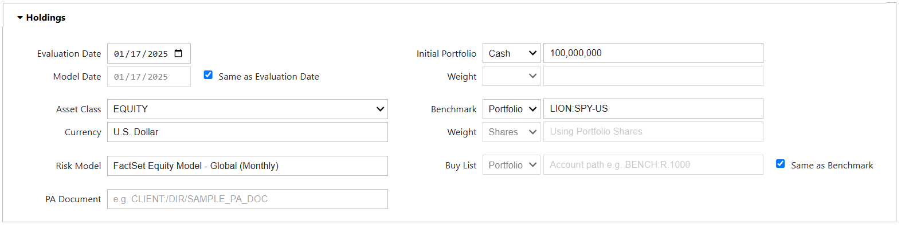](https://fpe.factset.com/docs/_images/fpo_widget_holdings1.png)

**Evaluation Date**: The date of the analyses. It determines the time point at which holdings and other data inputs are taken.

**Model Date**: The date used by the risk model. By default, it is the same as the Evaluation Date (the “Same as Evaluation Date” box is checked). Uncheck it if you need a separate risk model date.

**Asset Class**: Specifies the primary asset class (e.g., _EQUITY_, _DEBT_, _MAC_) that your portfolio and benchmark belong to. This helps the system determine the appropriate list of risk models.

**Currency**: Select the currency (e.g., _U.S. Dollar_) in which cash positions will be denominated. When using multi-currency models, changing this setting will update variances and correlations for the associated cash factors.

**Risk Model**: Start typing to look up and select one of the available risk models (e.g., _FactSet Equity Model - Global (Monthly)_). This risk model underpins calculations for optimization, frontier analysis, and simulation.

**PA Document**: Optionally link to a PA document (e.g., CLIENT:/SAMPLE\_PA\_DOC), if you need to override some settings (e.g. pricing sources) within the optimizer.

**Initial Portfolio**: Defines what you are starting with before the optimizer makes any trades. Possible settings:

> [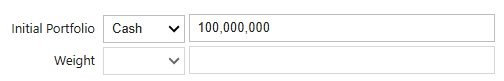](https://fpe.factset.com/docs/_images/fpo_widget_initial_port1.png)
> 
> **Cash**: Enter a cash amount (e.g., 100,000,000) in the specified Currency. Use this if you want the optimizer to build a portfolio entirely from cash.
> 
> **Portfolio**: Select an existing benchmark or account (.ACCT) by specifying its path (e.g., ‘LION:SPY-US’ or Personal:Port.ACCT ).
> 
> **Formula**: Provide a formula that returns a list of securities. For example, you can define a formula that retrieves all constituents of a given index (e.g., FG\_CONSTITUENTS(index\_name, 0, COSE)). Each security that meets the formula criteria is included in the initial portfolio. Using the _Weight_ field, the user can choose between two options: **Equal** or **Formula**.
> 
> > **Equal**: Creates an equally weighted portfolio, where each selected security receives the same allocation.
> > 
> > **Formula**: Allows the user to specify a formula that determines the weight of each security in the portfolio.
> 
> Note
> 
> If the formula returns values that do not sum to one, the system will automatically scale them so that their total equals one.
> 
> **Screen** : Select a Universal Screen (e.g., _Screen_ or _Screen 2.0_) that filters securities based on user-defined criteria. The resulting list of securities becomes your initial portfolio, using the same two options **Equal** or **Formula**. for the weights.

**Benchmark**: Like the Initial Portfolio, the benchmark can also be set to **Cash**, **Portfolio**, **Formula**, or **Screen**:

**Buy List**: (Optional) The Buy List can be set to **Cash**, **Portfolio**, **Formula**, **Screen**, or **Strategy**. The first four options function similarly to the **Initial Portfolio** and **Benchmark** settings.

The **Strategy** option uses the Buy List defined in the strategy document specified in the **Strategy** panel below. If **Same as Benchmark** is selected, the Buy List will automatically match the Benchmark.

## Strategy[#](https://fpe.factset.com/docs/fpo_widget.html#strategy "Link to this heading")

Use the **Strategy** panel to provide the path to your FPO strategy. This strategy file contains constraints and objectives for the optimizer. You can also override the default alpha if you want to test different alpha assumptions without editing the original strategy.

[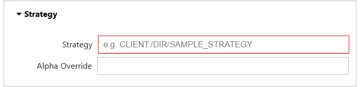](https://fpe.factset.com/docs/_images/fpo_widget_strategy1.png)

Note

Fields outlined in **red** (e.g., **Strategy**) are mandatory.

**Strategy**

Enter the path to the FPO strategy file (e.g., CLIENT:/FPO/FPO\_WIDGET). It enables you to define optimization settings, including the **universe, objective, constraints, expected returns, and transaction costs**. For more details, see: [FactSet Portfolio Optimizer](https://my.apps.factset.com/oa/pages/21541).

The FPO strategy file can be opened in **FPO**, which is accessible in **FPE** via the **FactSet menu**.

[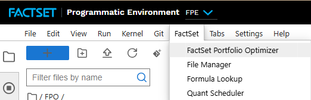](https://fpe.factset.com/docs/_images/fpo_widget_fpo_in_fpe1.png)

**Alpha Override**

Enter a path or identifier to override the alpha model used in the strategy. This allows you to test different alpha forecasts without altering the original strategy file.

## Store/Load[#](https://fpe.factset.com/docs/fpo_widget.html#store-load "Link to this heading")

The **Store/Load** panel manages data caching and widget state:

[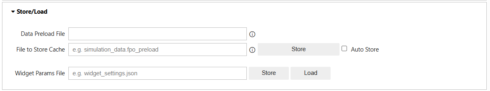](https://fpe.factset.com/docs/_images/fpo_widget_store_load1.png)

**Data Preload File**

Load a previously saved data cache file to speed up repeated runs (e.g., simulation\_data).

**File to Store Cache**

Enter a filename (e.g., simulation\_data) and click **Store** to save the current data cache.

**Auto Store** If Auto Store is enabled, the preloaded data will be automatically saved to the file specified in the **File to Store Cache** field. To use the auto-stored file later, you must provide its name in the **Data Preload File** field.

**Widget Params File**

Save the widget’s configuration (holdings, strategy, dates, etc.) to a file. You can **Load** this file later to restore settings quickly.

## Portfolio Optimization[#](https://fpe.factset.com/docs/fpo_widget.html#portfolio-optimization "Link to this heading")

In **Portfolio Optimization**, you run a single-step optimization based on the configured Holdings and Strategy. **OFDB Path** allows you to store the resulting portfolio for future reference. Click **Calculate** to see the progress in the **Status** tab. Review the final results—trade lists, factor exposures, risk summary, and more—on the **Reports** tab. Use the **Trade Adjustments** tab to manually modify trades and recalculate portfolio statistics accordingly.

[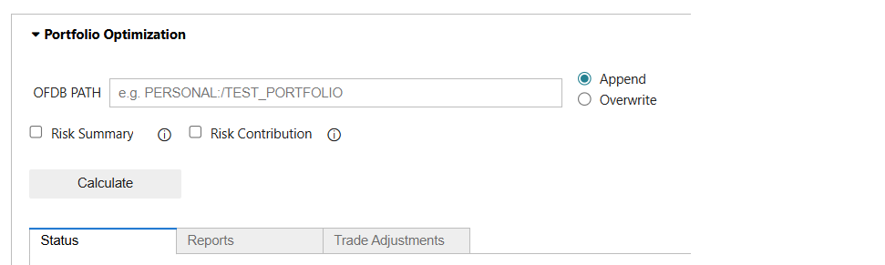](https://fpe.factset.com/docs/_images/fpo_widget_po1.png)

**OFDB Path** (Optional) Specify a path like PERSONAL:/TEST\_PORTFOLIO to store your optimized result in an OFDB or account file. Use **Append** to add results or **Overwrite** to replace an existing object.

**Risk Summary** Check this box to get a risk report post-optimization.

**Risk Contribution**: Enable this option to generate a risk contributions report.

**Calculate** Click Calculate to start the optimization. The **Status** tab will show progress bars (e.g., “Loading Data,” “Preloading risk model,” etc.).

**Status Tab**

> Displays progress and lists final parameters (e.g., “Initial Portfolio: CASH,” “Benchmark: LION:SPY-US,” etc.).
> 
> [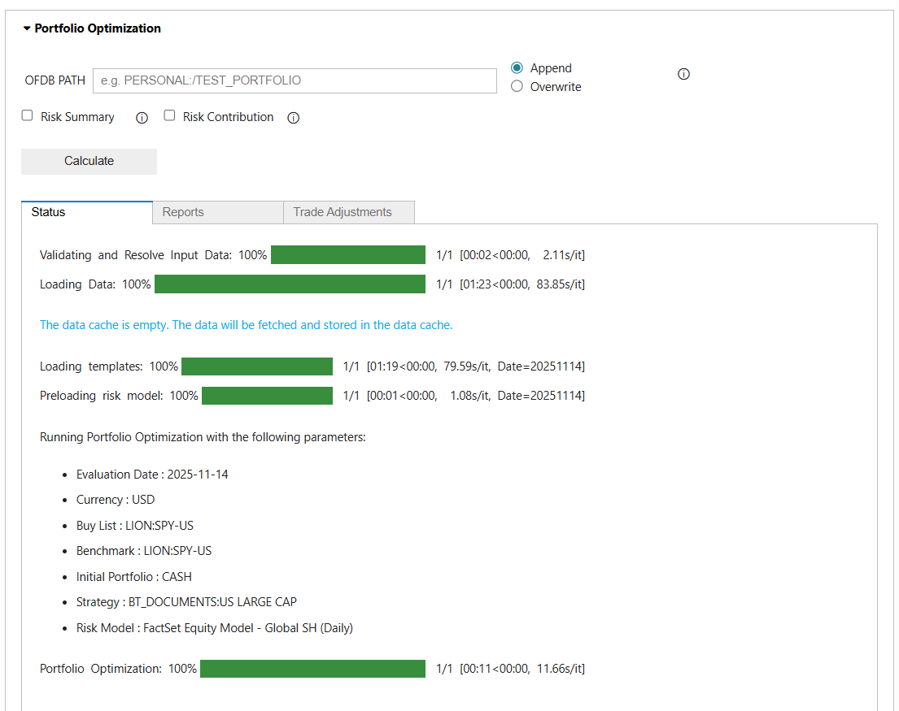](https://fpe.factset.com/docs/_images/fpo_widget_po_status1.png)

**Reports Tab**

> [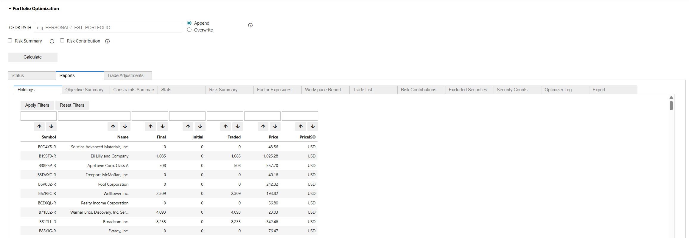](https://fpe.factset.com/docs/_images/fpo_widget_po_reports1.png)
> 
> **Holdings**: Displays the final optimized portfolio holdings, including symbol, company name, initial weight, final weight, price, etc.
> 
> **Objective Summary**: Summarizes the optimization objective function details from the chosen strategy.
> 
> **Constraints Summary**: Lists the constraints applied during optimization, such as sector or exposure limits.
> 
> **Stats**: Provides key performance and risk statistics of the initial and optimized portfolio.
> 
> **Risk Summary**: Highlights total portfolio risk, factor risk, and other risk metrics.
> 
> **Factor Exposure**: Shows the exposure of the optimized portfolio to different risk factors (e.g., Beta, Size, Volatility, Momentum, Liquidity, Leverage), comparing final portfolio exposure vs. benchmark exposure.
> 
> [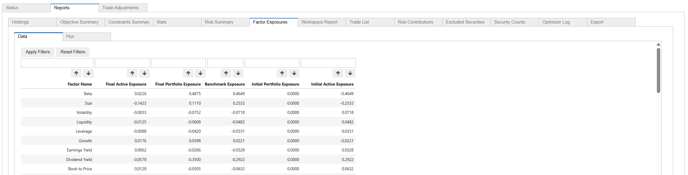](https://fpe.factset.com/docs/_images/fpo_widget_po_reports_fe1.png)
> 
> [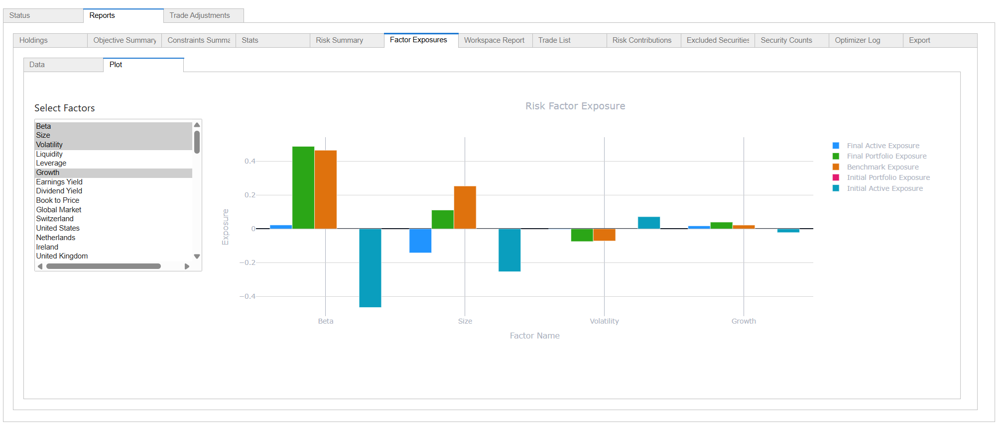](https://fpe.factset.com/docs/_images/fpo_widget_po_reports_fe_plot1.png)
> 
> **Workspace Report**: Displays detailed analytics about portfolio composition, factor exposures, and constraints.
> 
> **Trade List**: Provides a breakdown of trades executed to transition from the initial portfolio to the optimized portfolio. Includes details such as final shares, initial shares, traded shares, transaction cost, price, and trade type (e.g., Buy New, Sell).
> 
> **Risk Contributions**: Analyzes the contribution of individual securities to total risk before and after optimization. Includes metrics like initial total risk contribution, final total risk contribution, initial active risk contribution, and final active risk contribution.
> 
> **Excluded Securities**: Lists securities that were excluded from the optimization process, along with the reason for exclusion (e.g., no model coverage).
> 
> **Optimizer Log**: Provides a detailed log of the optimization process, including job execution details, investment universe information, exclusions, and buy list coverage.
> 
> For more details, see: [FPO Optimizer Reports](https://my.apps.factset.com/oa/pages/22018).
> 
> **Export**: Allow exporting results.

**Trade Adjustments Tab**

> The **Trade Adjustments** panel allows users to review and manually modify trades generated by the optimizer. It consists of three sub-tabs: **Trade List**, **Status**, and **Reports**.
> 
> **Trade List**
> 
> Displays a detailed breakdown of trades executed by the optimizer to transition from the **initial portfolio** to the **optimized portfolio**.
> 
> [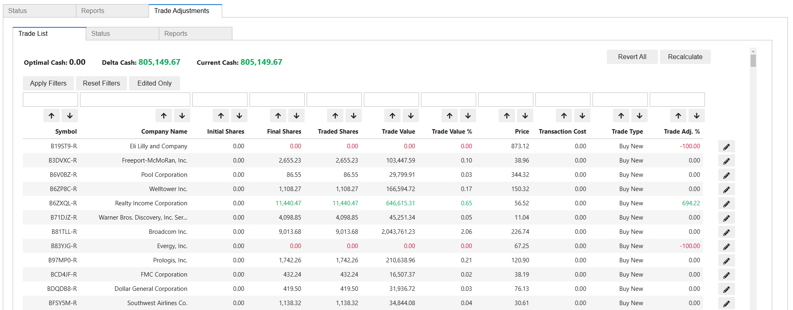](https://fpe.factset.com/docs/_images/fpo_widget_po_ta1.png)
> 
> Edit trades manually **edit icon** (✎) and click **Recalculate** to see the impact. **Revert All** discards manual edits and reverts to the optimizer’s original solution.
> 
> -   **Symbol**: Unique identifier of the traded security.
>     
> -   **Company Name**: Full name of the company.
>     
> -   **Initial Shares**: Number of shares held before optimization.
>     
> -   **Final Shares**: Number of shares in the optimized portfolio.
>     
> -   **Traded Shares**: Number of shares bought or sold during rebalancing.
>     
> -   **Trade Value**: Dollar value of the traded securities.
>     
> -   **Trade Value %**: Trade value as a percentage of the total portfolio.
>     
> -   **Price**: Security price at the time of trade.
>     
> -   **Transaction Cost**: Cost associated with executing the trade.
>     
> -   **Trade Type**: Indicates whether the trade is a **Buy New**, **Sell**, or other type.
>     
> -   **Trade Adj. %**: Adjustment made to the trade (manual modifications are highlighted in **green** for increases and **red** for reductions).
>     
> 
> Users can manually adjust trades using the **edit icon** (✎) and then **Recalculate** the portfolio to reflect the modifications. The **Revert All** button resets all edits.
> 
> **Status**
> 
> Tracks the recalculation progress when manual trade adjustments are made.
> 
> [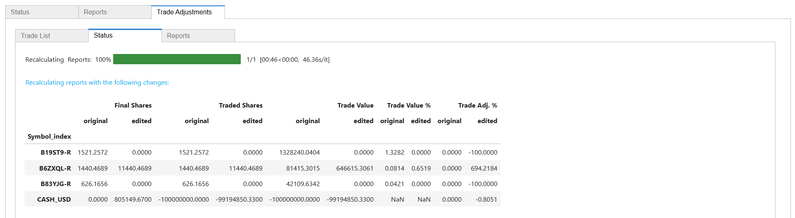](https://fpe.factset.com/docs/_images/fpo_widget_po_ta_status1.png)
> 
> -   Displays a **progress bar** indicating the recalculation completion percentage.
>     
> -   Lists **modified securities**, showing their original vs. edited **shares, trade values, and trade adjustments**.
>     
> -   Helps users monitor changes made through manual trade modifications.
>     
> 
> **Reports**
> 
> Summarizes key performance, risk, and constraint metrics after manual trade modifications.
> 
> [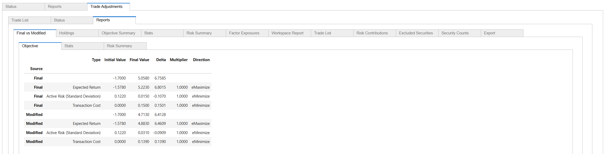](https://fpe.factset.com/docs/_images/fpo_widget_po_ta_reports1.png)
> 
> **Final vs. Modified**: Compares portfolio objectives, statistics, and risk metrics before and after trade modifications.
> 
> Plus all optimization reports (**Holdings, Objective Summary, Constraints Summary, Stats**, etc.) recalculated for the modified portfolio.
> 
> Users can analyze the **impact of manual trade modifications** and ensure compliance with portfolio objectives before finalizing trades.

## Efficient Frontier[#](https://fpe.factset.com/docs/fpo_widget.html#efficient-frontier "Link to this heading")

The **Efficient Frontier** panel allows users to explore trade-offs between objectives and constraints by calculating optimal portfolios along a frontier. There are now three modes:

[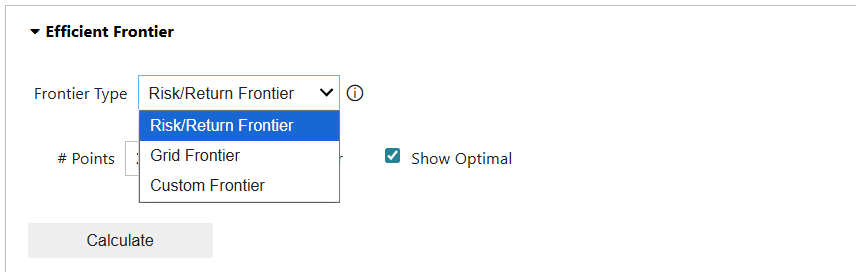](https://fpe.factset.com/docs/_images/fpo_widget_ef_type.png)

**Frontier Type** options:

-   **Risk/Return Frontier**: Classical frontier based on varying a single constraint risk and return.
    
-   **Grid Frontier**: Computes all possible combinations of the specified constraint values across their defined ranges.
    
-   **Custom Frontier**: Manually define values for multiple constraints across each frontier point.
    

**Risk/Return Frontier**

> This mode lets you define a number of points along lower bound on return constraint, optionally comparing portfolios against a benchmark.
> 
> [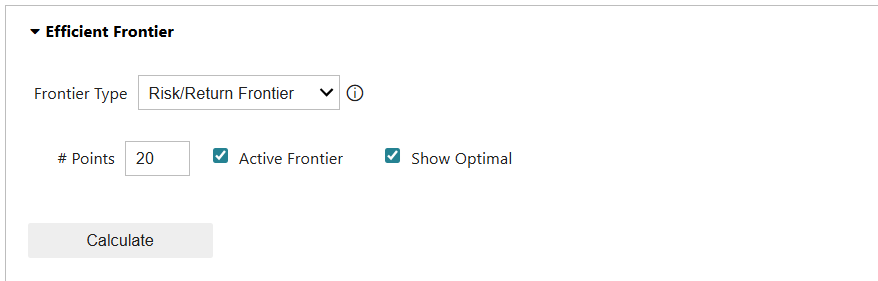](https://fpe.factset.com/docs/_images/fpo_widget_ef_rr.png)

**Grid Frontier**

> The **Constraint Grid** mode enables users to vary multiple constraints across specified value ranges, defining how each constraint evolves across the Efficient Frontier.
> 
> 
> 
> Each constraint can be selected from the **Name** dropdown, which is pre-populated with all constraints defined in the selected strategy. Depending on the constraint type:
> 
> **Level** can be:
> 
> -   `Portfolio` for portfolio-level constraints (e.g., turnover)
>     
> -   `Asset` for asset-level constraints (e.g., position size)
>     
> -   A **group name** if the constraint is group-based
>     
> -   A **factor name** in case of factor exposure constraints, etc.
>     
> 
> **Attribute** specifies which side of the constraint to adjust:
> 
> -   `min`, `max` depending on constraint type.
>     
> 
> After selecting a constraint, clicking the **Add** button will display that constraint in the editable grid below, with three fields:
> 
> **Start**: Initial value of the constraint (pre-filled from the strategy) **End**: Final value of the constraint (pre-filled) **Points**: Number of points to evaluate between Start and End (default is 1)
> 
> [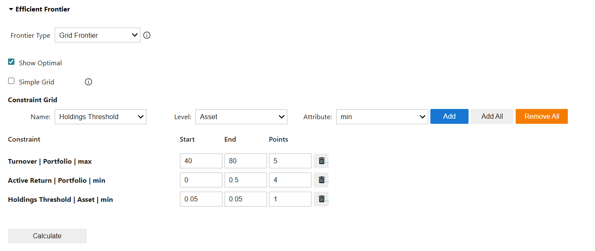](https://fpe.factset.com/docs/_images/fpo_widget_ef_grid.png)
> 
> If **Points > 1**, the system will create equally spaced values across the specified range.
> 
> Additional controls: **Add All**: Adds all strategy constraints to the grid **Remove All**: Clears all entries Multiple constraints may be defined, and the frontier will be computed using all possible combinations of the specified constraint values across their ranges.
> 
> **Simple Grid** mode defines a fixed number of values for each constraint and combines the corresponding entries from each list to produce one EF point per index.
> 
> [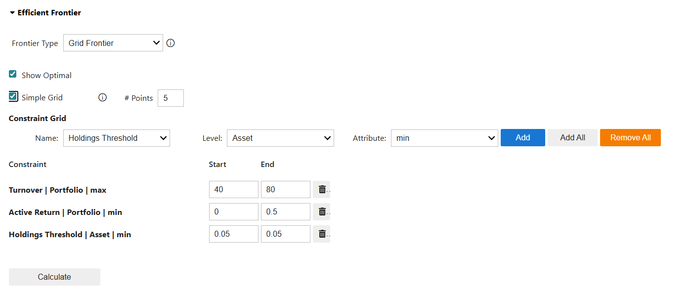](https://fpe.factset.com/docs/_images/fpo_widget_ef_grid_simple.png)

**Custom Frontier**

> In this mode, you define exact values for each constraint for each EF point, giving you full control over the constraint combinations.
> 
> [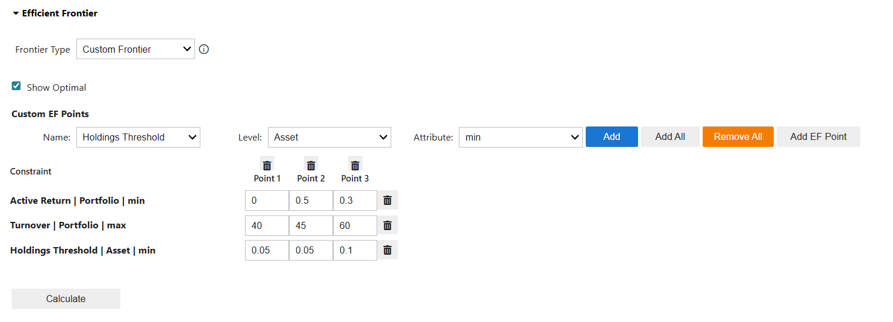](https://fpe.factset.com/docs/_images/fpo_widget_ef_custom.png)

**Reports**

Once calculated, the Efficient Frontier outputs a rich set of reports available under the **Reports** tab:

> **Frontier Result**
> 
> -   **Data**: Summarizes metrics for all EF points alongside the Initial and Optimal portfolios.
>     
> 
> [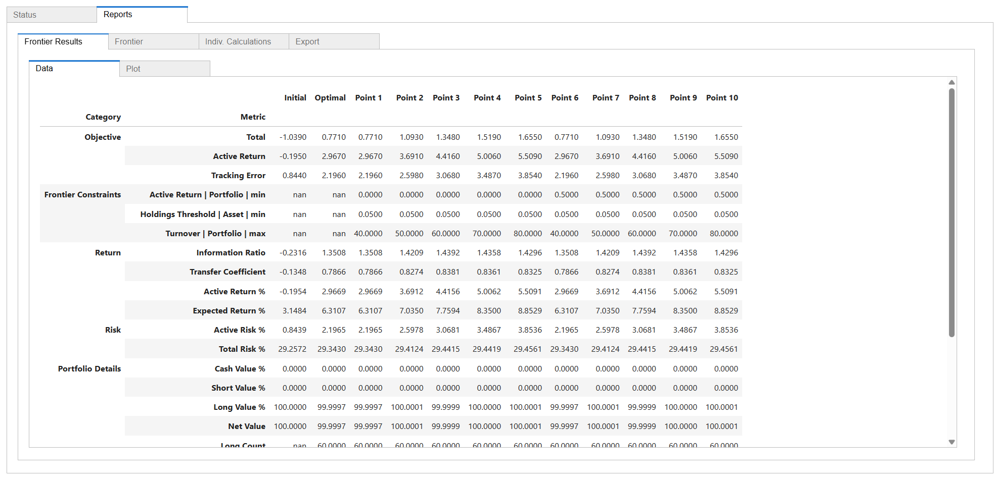](https://fpe.factset.com/docs/_images/fpo_widget_ef_frontier_result_report.png)
> 
> -   **Plot**: Visualizes the relationship between two selected metrics (e.g., Objective vs Turnover).
>     
> 
> [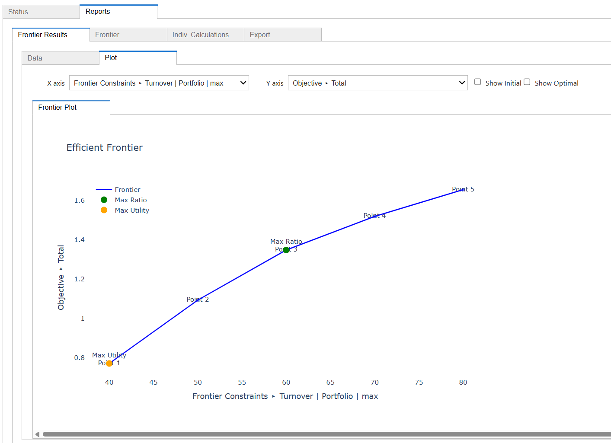](https://fpe.factset.com/docs/_images/fpo_widget_ef_fr_plot.png)
> 
> The axes can be changed to display metrics from Objective, Risk, Return, Portfolio Details, Constraints, etc.
> 
> [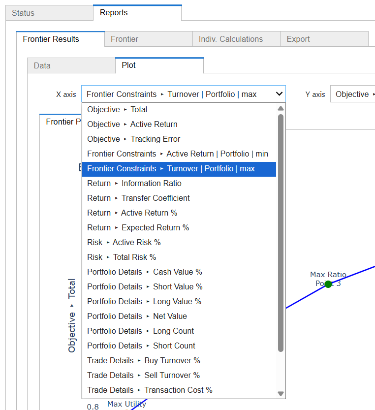](https://fpe.factset.com/docs/_images/fpo_widget_ef_fr_plot_dropdown_x.png)
> 
> **Frontier**
> 
> -   **Data**: Tabular view of the constraint values and objective values for each EF point.
>     
> 
> [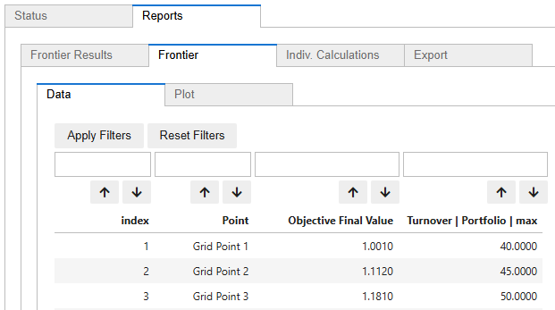](https://fpe.factset.com/docs/_images/fpo_widget_ef_fgrid_data.png)
> 
> -   **Plot**: In Grid Frontier mode, the plot panel includes sliders to view slices through the constraint space.
>     
> 
> [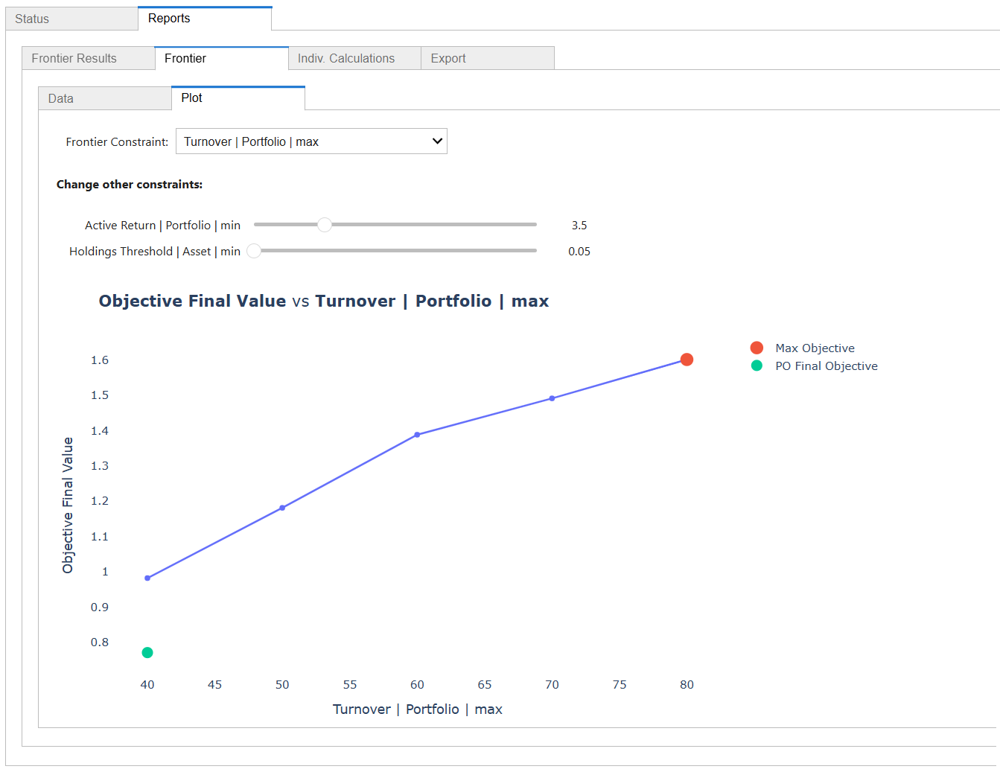](https://fpe.factset.com/docs/_images/fpo_widget_ef_fgrid_plot.png)
> 
> **Individual Calculations**: Click on any point to inspect portfolio composition, factor exposure, constraint satisfaction, etc.
> 
> [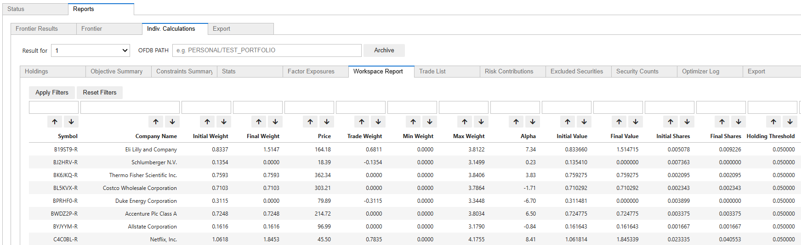](https://fpe.factset.com/docs/_images/fpo_widget_ef_ind_calc1.png)

**Show Optimal**

> The checkbox **Show Optimal** overlays the Portfolio Optimization result on the frontier chart for comparison.

## Portfolio Simulation[#](https://fpe.factset.com/docs/fpo_widget.html#portfolio-simulation "Link to this heading")

**Portfolio Simulation** will rebalance the portfolio at each interval based on the selected optimization strategy. You can run simulations in four different modes, allowing you to test various optimization parameters and alpha models over historical periods.

**Simulation Mode**

Portfolio Simulation supports four execution modes:

-   **Single Simulation**: Runs a single simulation with fixed parameters across the entire date range.
    
-   **Grid Multi-Sim**: Varies multiple strategy constraints across specified ranges, creating all possible combinations.
    
-   **Custom Grid Multi-Sim**: Manually define exact constraint values for each simulation point (similar to Custom Frontier).
    
-   **Strategies Grid**: Run the same simulation with different strategy files.
    

[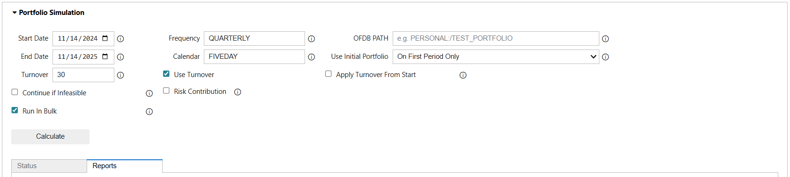](https://fpe.factset.com/docs/_images/fpo_widget_ps1.png)

**Single Simulation**

Runs a single simulation with fixed parameters. This is the default mode for standard portfolio backtesting.

> [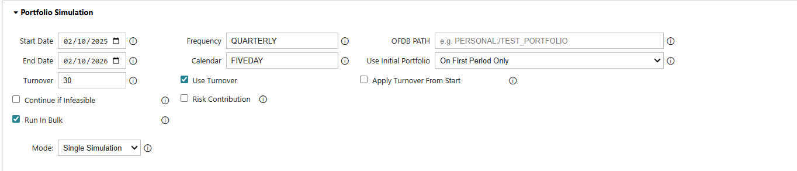](https://fpe.factset.com/docs/_images/fpo_widget_ps_mode_single.png)

**Grid Multi-Sim**

The **Constraint Grid** mode enables users to vary multiple constraints across specified value ranges during the simulation. Each constraint can be selected from the strategy, and you define Start, End, and number of Points for each constraint. The engine will compute the simulation using all possible combinations of constraint values across their ranges.

This mode works similarly to the Grid Frontier feature, but applies the constraint variations to each rebalancing period during the simulation.

> [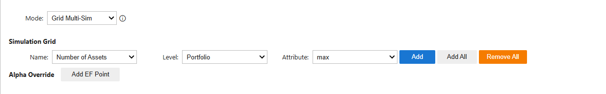](https://fpe.factset.com/docs/_images/fpo_widget_ps_mode_grid_multi_sim.png)

**Simulation Grid Configuration**

> Each constraint can be selected from the **Name** dropdown (pre-populated with strategy constraints). Depending on the constraint type:
> 
> **Level** can be:
> 
> -   `Portfolio` for portfolio-level constraints (e.g., turnover)
>     
> -   `Asset` for asset-level constraints (e.g., position size)
>     
> -   A **group name** if the constraint is group-based
>     
> -   A **factor name** for factor exposure constraints
>     
> 
> **Attribute** specifies which side of the constraint to adjust:
> 
> -   `min`, `max` depending on constraint type
>     
> 
> For each constraint, you can specify:
> 
> **Start**: Initial value of the constraint (pre-filled from strategy)
> 
> **End**: Final value of the constraint
> 
> **Points**: Number of points to evaluate between Start and End (default is 1)
> 
> If **Points > 1**, the system creates equally spaced values across the specified range. All combinations of constraints are evaluated, producing one simulation path per constraint combination.
> 
> [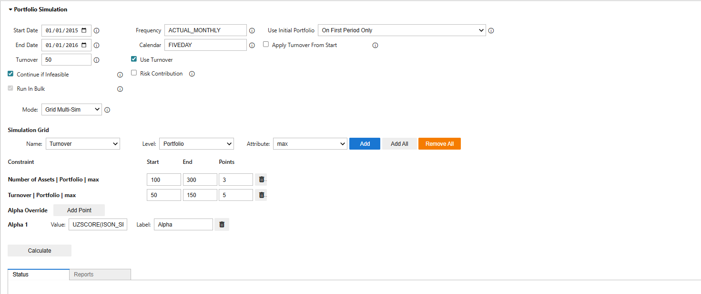](https://fpe.factset.com/docs/_images/fpo_widget_ps_grid_configuration.png)

**Custom Grid Multi-Sim**

In this mode, you manually define exact constraint values for each simulation, providing full control over the constraint combinations. This is useful when you want to test specific, non-uniform constraint combinations that wouldn’t be captured by the grid mode.

> [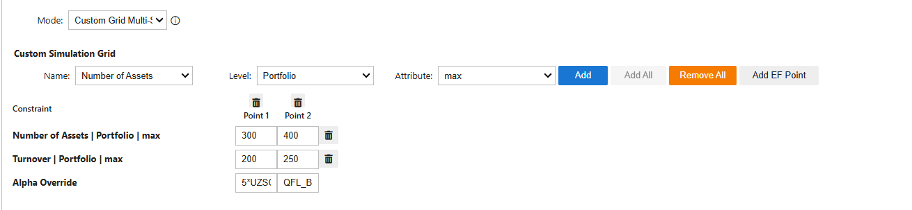](https://fpe.factset.com/docs/_images/fpo_widget_ps_mode_custom_grid.png)

**Strategies Grid**

Run the same simulation across multiple strategy files. Add strategy paths one by one using the **Add Strategy** button. The engine will execute the simulation for each strategy, allowing you to compare performance across different optimization configurations.

> 

**Alpha Override**

When using **Grid Multi-Sim** or **Custom Grid Multi-Sim** modes, the alpha override behavior varies based on the selected simulation mode:

-   **Grid Multi-Sim**: When grid mode is selected, each alpha value from the alpha override is systematically combined with each grid point, enabling comprehensive sensitivity analysis across both constraint variations and alpha forecasts.
    
-   **Custom Grid Multi-Sim**: When custom point mode is selected, each simulation point is executed with its corresponding alpha value. If an alpha value is not provided for a specific simulation point, the default alpha defined in the strategy is applied.
    

**Common Simulation Settings**

**Start Date**: Defines the start date for the portfolio simulation.

**End Date**: Defines the end date for the portfolio simulation.

**Turnover**: Sets the maximum portfolio turnover per rebalance.

**Use Turnover**: When ON, enforces the turnover limit (see Turnover field). When OFF, no turnover constraint is applied.

**Continue if Infeasible**: Enable this option to allow the simulation to continue even if an optimization is infeasible for a given period.

**Frequency**: Specifies how often the portfolio is rebalanced during the simulation. Options include DAILY, WEEKLY, MONTHLY, QUARTERLY, etc.

**Calendar**: Specifies the calendar to be used for simulation rebalancing periods.

**OFDB Path**: Specify the OFDB path where the simulated portfolio output will be saved.

**Use Initial Portfolio**: Controls how the initial portfolio is applied during simulation.

**Apply Turnover From Start**: If enabled, turnover constraint is applied from the first rebalancing period. Otherwise, the first period ignores turnover to allow full investment.

**Risk Contribution**: Enable this to include risk contribution analysis in the simulation reports.

**Run in Bulk**: When enabled (default), the engine runs the entire simulation in bulk mode, which is faster than optimizing period by period.

**Reports**

The **Reports** tab shows summary and per-period results. Available reports depend on the simulation mode:

> **Performance**
> 
> [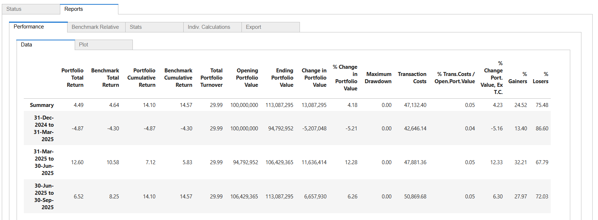](https://fpe.factset.com/docs/_images/fpo_widget_ps_perf1.png)
> 
> Displays cumulative returns, period returns, and other performance metrics for the simulated portfolio.
> 
> **Benchmark Relative**
> 
> [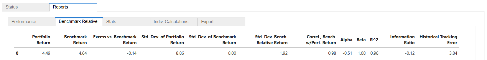](https://fpe.factset.com/docs/_images/fpo_widget_ps_br1.png)
> 
> Shows how the simulated portfolio performed relative to the benchmark, including active returns and tracking error.
> 
> **Individual Calculations**
> 
> [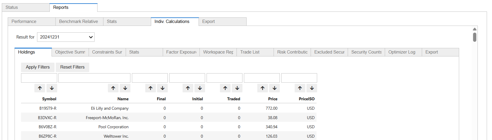](https://fpe.factset.com/docs/_images/fpo_widget_ps_ind_calcs1.png)
> 
> Provides detailed analytics for each rebalancing period, including portfolio composition, factor exposures, and constraint satisfaction. In grid modes, you can inspect results for specific constraint combinations or strategy choices.

## FPOWidget[#](https://fpe.factset.com/docs/fpo_widget.html#fpowidget "Link to this heading")

_class_ fds.fpe.quant.fpo.FPOWidget(_\*\*kwargs_)[#](https://fpe.factset.com/docs/fpo_widget.html#fds.fpe.quant.fpo.FPOWidget "Link to this definition")

A widget interface for the FactSet Portfolio Optimizer (FPO).

The widget can bе started by calling the launch() method of this class.

The widget has the following components:

-   Holdings: Specifies all key holdings parameters.
    
-   Strategy: Specifies the optimization strategy.
    
-   Store/Load: Allows loading from and storing preloaded optimization data and storing the state of all widget settings.
    
-   Portfolio Optimization: Allows calculating an optimal portfolio for a single date. Offers various portfolio reports and a trade adjustment tool.
    
-   Efficient Frontier: Allows calculating an efficient frontier for a given date and plotting a previously optimized portfolio on it.
    
-   Portfolio Simulation: Allows simulating a portfolio by conducting optimization for a selected set of past dates. Offers reports for the entire simulation as well as for individual dates.
    

launch()[#](https://fpe.factset.com/docs/fpo_widget.html#fds.fpe.quant.fpo.FPOWidget.launch "Link to this definition")

Launch the widget.

result(_calculation_)[#](https://fpe.factset.com/docs/fpo_widget.html#fds.fpe.quant.fpo.FPOWidget.result "Link to this definition")

Retrieves the last result of the specified calculation type.

Parameters:

**calculation** (_str_) – A string indicating the type of calculation for which the result is returned. Accepted values are ‘Portfolio Optimization’, ‘Efficient Frontier’, and ‘Portfolio Simulation’. The ‘po’, ‘ef’, and ‘ps’ aliases can also be used correspondingly.

get\_params()[#](https://fpe.factset.com/docs/fpo_widget.html#fds.fpe.quant.fpo.FPOWidget.get_params "Link to this definition")

Get a dictionary of all the widget parameters.

store\_params(_file_)[#](https://fpe.factset.com/docs/fpo_widget.html#fds.fpe.quant.fpo.FPOWidget.store_params "Link to this definition")

Store the widget parameters in a .json file.

Parameters:

**file** (_str_) – Path to the .json file where the parameters will be stored.

load\_params(_file_)[#](https://fpe.factset.com/docs/fpo_widget.html#fds.fpe.quant.fpo.FPOWidget.load_params "Link to this definition")

Load and set the widget parameters from a .json file.

If the file is a `.reports` archive (created by [`store_state()`](https://fpe.factset.com/docs/fpo_widget.html#fds.fpe.quant.fpo.FPOWidget.store_state "fds.fpe.quant.fpo.FPOWidget.store_state")), it is automatically handled by [`load_state()`](https://fpe.factset.com/docs/fpo_widget.html#fds.fpe.quant.fpo.FPOWidget.load_state "fds.fpe.quant.fpo.FPOWidget.load_state") instead.

Parameters:

**file** (_str_) – Path to the .json file (or .reports archive) to load.

store\_state(_file_)[#](https://fpe.factset.com/docs/fpo_widget.html#fds.fpe.quant.fpo.FPOWidget.store_state "Link to this definition")

Store the widget parameters and optimization results in a .reports archive.

The archive is a ZIP file containing:

-   `params.json` – same content as [`store_params()`](https://fpe.factset.com/docs/fpo_widget.html#fds.fpe.quant.fpo.FPOWidget.store_params "fds.fpe.quant.fpo.FPOWidget.store_params")
    
-   `po/`, `ef/`, `ps/` directories with result data: DataFrames are stored as Parquet files; scalars and dicts are stored in a `manifest.json` inside each directory.
    

If _file_ has no extension, `.reports` is appended automatically. If _file_ has no directory component, the archive is saved inside a `_fpo_files/` folder (created if necessary).

Parameters:

**file** (_str_) – Path to the `.reports` archive to create.

See also

[`load_state`](https://fpe.factset.com/docs/fpo_widget.html#fds.fpe.quant.fpo.FPOWidget.load_state "fds.fpe.quant.fpo.FPOWidget.load_state")

Restore parameters and results from a `.reports` archive.

[`store_params`](https://fpe.factset.com/docs/fpo_widget.html#fds.fpe.quant.fpo.FPOWidget.store_params "fds.fpe.quant.fpo.FPOWidget.store_params")

Store parameters only (JSON).

load\_state(_file_)[#](https://fpe.factset.com/docs/fpo_widget.html#fds.fpe.quant.fpo.FPOWidget.load_state "Link to this definition")

Load and restore widget parameters and optimization results from a `.reports` archive created by [`store_state()`](https://fpe.factset.com/docs/fpo_widget.html#fds.fpe.quant.fpo.FPOWidget.store_state "fds.fpe.quant.fpo.FPOWidget.store_state").

Parameters:

**file** (_str_) – Path to the `.reports` archive to load.

See also

[`store_state`](https://fpe.factset.com/docs/fpo_widget.html#fds.fpe.quant.fpo.FPOWidget.store_state "fds.fpe.quant.fpo.FPOWidget.store_state")

Create a `.reports` archive.

[`load_params`](https://fpe.factset.com/docs/fpo_widget.html#fds.fpe.quant.fpo.FPOWidget.load_params "fds.fpe.quant.fpo.FPOWidget.load_params")

Load parameters only (JSON).

set\_demo\_params()[#](https://fpe.factset.com/docs/fpo_widget.html#fds.fpe.quant.fpo.FPOWidget.set_demo_params "Link to this definition")

Set the widget parameters for demo runs.
