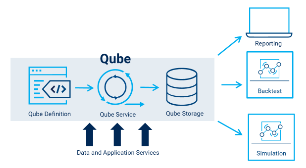

# Qube — FactSet Programmatic

> ## Excerpt
> Qube is a data management solution for the FactSet Programmatic Environment (FPE).  It combines data definitions, data generation and data storage into a single system which will over time expand to manage full data pipelines from sources to production signals.  Qube is designed to minimize the effort of creating, updating and maintaining the massive datasets that systematic investment research is based on.

---
Qube is a data management solution for the FactSet Programmatic Environment (FPE). It combines data definitions, data generation and data storage into a single system which will over time expand to manage full data pipelines from sources to production signals. Qube is designed to minimize the effort of creating, updating and maintaining the massive datasets that systematic investment research is based on.

[](https://fpe.factset.com/docs/_images/qube.png)

## Workflow Overview[#](https://fpe.factset.com/docs/qube.html#workflow-overview "Link to this heading")

A Qube represents a self-contained data unit defined by a Definition document and backed by Qube-managed storage for the generated dataset. The Definition specifies the universe of symbols, dates, and data items to include, so updating coverage or fields in one place lets you consistently regenerate the Qube with minimal effort.

To create a new Qube, first define the universe and fields in a Definition document, then call generate\_dataset() to compute and materialize the data into Qube-managed storage. Once generation completes, construct a Dataset object pointing at the Qube and use fetch\_data to retrieve the data into your analysis environment.

## Definition[#](https://fpe.factset.com/docs/qube.html#definition "Link to this heading")

A Qube definition consists of a universe, a time series, and one or more data items. You can use this definition to generate the desired dataset within Qube.

_class_ fds.fpe.qube.Definition(_universe\=None_, _time\_series\=None_, _category\='PERSONAL'_, _name\=None_, _data\_items\=None_, _description\=''_, _tags\=None_, _\*\*kwargs_)[#](https://fpe.factset.com/docs/qube.html#fds.fpe.qube.Definition "Link to this definition")

Qube Definition object with core properties.

Parameters:

-   **universe** ([_ScreeningExpressionUniverse_](https://fpe.factset.com/docs/qube.html#fds.fpe.qube.ScreeningExpressionUniverse "fds.fpe.qube.ScreeningExpressionUniverse") _|_ [_IdentifierUniverse_](https://fpe.factset.com/docs/qube.html#fds.fpe.qube.IdentifierUniverse "fds.fpe.qube.IdentifierUniverse") _|_ [_ScreeningDocumentUniverse_](https://fpe.factset.com/docs/qube.html#fds.fpe.qube.ScreeningDocumentUniverse "fds.fpe.qube.ScreeningDocumentUniverse")) – The universe of the Qube. By default, None.
    
-   **time\_series** ([_DateRange_](https://fpe.factset.com/docs/qube.html#fds.fpe.qube.DateRange "fds.fpe.qube.DateRange") _or_ [_DateList_](https://fpe.factset.com/docs/qube.html#fds.fpe.qube.DateList "fds.fpe.qube.DateList")) – The time series associated with the Qube. By default, None
    
-   **category** (_str_ _or_ _Category_) – The category of the Qube. Currently support ‘PERSONAL’ or ‘CLIENT’. By default, PERSONAL.
    
-   **name** (_str_) – The name of the Qube. By default, None
    
-   **data\_items** (_\[__List__\[_[_ScreeningExpression_](https://fpe.factset.com/docs/qube.html#fds.fpe.qube.ScreeningExpression "fds.fpe.qube.ScreeningExpression") _|_ [_FqlExpression_](https://fpe.factset.com/docs/qube.html#fds.fpe.qube.FqlExpression "fds.fpe.qube.FqlExpression") _|_ [_UniversalScreenParameter_](https://fpe.factset.com/docs/qube.html#fds.fpe.qube.UniversalScreenParameter "fds.fpe.qube.UniversalScreenParameter")_\]_ _|_ [_DataItems_](https://fpe.factset.com/docs/qube.html#fds.fpe.qube.DataItems "fds.fpe.qube.DataItems")) – The data items to be included in the Qube. By default, empty list.
    
-   **description** (_str_ _or_ _None_) – The description of the Qube. By default, empty string.
    
-   **tags** (_List__\[__str__\] or_ _None_) – The tags associated with the Qube. By default, empty list.
    

_property_ category_: str_[#](https://fpe.factset.com/docs/qube.html#fds.fpe.qube.Definition.category "Link to this definition")

Get the category of the Qube.

Returns:

The category of the Qube.

Return type:

str

_property_ client_: str | Any_[#](https://fpe.factset.com/docs/qube.html#fds.fpe.qube.Definition.client "Link to this definition")

Get the user name associated with the Qube Definition.

config()[#](https://fpe.factset.com/docs/qube.html#fds.fpe.qube.Definition.config "Link to this definition")

Convert the Qube definition to a configuration dictionary.

Returns:

A dictionary representation of the Qube definition, including its properties and associated objects.

Return type:

Dict\[str, Any\]

_property_ created_: str | Any_[#](https://fpe.factset.com/docs/qube.html#fds.fpe.qube.Definition.created "Link to this definition")

Get the creation timestamp (UTC) of the Qube Definition.

_property_ data\_items_: [DataItems](https://fpe.factset.com/docs/qube.html#fds.fpe.qube.DataItems "fds.fpe.qube.data_items._data_items.DataItems")_[#](https://fpe.factset.com/docs/qube.html#fds.fpe.qube.Definition.data_items "Link to this definition")

Get the data items of the Qube.

Returns:

The list of data items in the Qube or None if not set.

Return type:

[DataItems](https://fpe.factset.com/docs/qube.html#fds.fpe.qube.DataItems "fds.fpe.qube.DataItems") | None

_property_ description_: str_[#](https://fpe.factset.com/docs/qube.html#fds.fpe.qube.Definition.description "Link to this definition")

Get the description of the Qube.

Returns:

The description of the Qube.

Return type:

str

get\_data\_items\_by\_grouping(_group\_name_)[#](https://fpe.factset.com/docs/qube.html#fds.fpe.qube.Definition.get_data_items_by_grouping "Link to this definition")

Get all data items belonging to a specific grouping in this definition.

Parameters:

-   **group\_name** (_str_) – The name of the grouping to retrieve items from.
    
-   **Returns**
    
-   **\-------**
    
-   **List****\[****Union****\[****FqlExpression** – Data items in the specified grouping. Returns empty list if grouping doesn’t exist.
    
-   **ScreeningExpression** – Data items in the specified grouping. Returns empty list if grouping doesn’t exist.
    
-   **UniversalScreenParameter****\]****\]** – Data items in the specified grouping. Returns empty list if grouping doesn’t exist.
    
-   **Examples**
    
-   **\--------**
    
-   **Definition****(****name='my\_qube'** (_\>>> definition =_)
    
-   **data\_items=****\[****...****\]****)**
    
-   **definition.get\_data\_items\_by\_grouping****(****'valuation'****)** (_\>>> grouped\_items =_)
    

Return type:

`List`\[[`FqlExpression`](https://fpe.factset.com/docs/qube.html#fds.fpe.qube.FqlExpression "fds.fpe.qube.data_items._fql_expression.FqlExpression") | [`ScreeningExpression`](https://fpe.factset.com/docs/qube.html#fds.fpe.qube.ScreeningExpression "fds.fpe.qube.ScreeningExpression") | [`UniversalScreenParameter`](https://fpe.factset.com/docs/qube.html#fds.fpe.qube.UniversalScreenParameter "fds.fpe.qube.UniversalScreenParameter")\]

_property_ id_: str | Any_[#](https://fpe.factset.com/docs/qube.html#fds.fpe.qube.Definition.id "Link to this definition")

Get the unique identifier of the Qube definition.

Returns:

The ID of the Qube definition, or None if not yet created.

Return type:

str or None

_property_ modified_: str | Any_[#](https://fpe.factset.com/docs/qube.html#fds.fpe.qube.Definition.modified "Link to this definition")

Get the last modified timestamp (UTC) of the Qube Definition.

_property_ name_: str | None_[#](https://fpe.factset.com/docs/qube.html#fds.fpe.qube.Definition.name "Link to this definition")

Get the name of the Qube.

Returns:

The name of the Qube.

Return type:

str

_property_ serial_: str | Any_[#](https://fpe.factset.com/docs/qube.html#fds.fpe.qube.Definition.serial "Link to this definition")

Get the serial number associated with the Qube Definition.

_property_ tags_: List\[str\]_[#](https://fpe.factset.com/docs/qube.html#fds.fpe.qube.Definition.tags "Link to this definition")

Get the tags of the Qube.

Returns:

The list of tags associated with the Qube.

Return type:

List\[str\]

_property_ time\_series_: [DateList](https://fpe.factset.com/docs/qube.html#fds.fpe.qube.DateList "fds.fpe.qube.time_series._time_series.DateList") | [DateRange](https://fpe.factset.com/docs/qube.html#fds.fpe.qube.DateRange "fds.fpe.qube.time_series._time_series.DateRange") | None_[#](https://fpe.factset.com/docs/qube.html#fds.fpe.qube.Definition.time_series "Link to this definition")

Get the time series of the Qube or None.

Returns:

The time series of the Qube, which can be either a DateList or DateRange, or None if not set.

Return type:

[DateList](https://fpe.factset.com/docs/qube.html#fds.fpe.qube.DateList "fds.fpe.qube.DateList") | [DateRange](https://fpe.factset.com/docs/qube.html#fds.fpe.qube.DateRange "fds.fpe.qube.DateRange") | None

_property_ universe_: [ScreeningExpressionUniverse](https://fpe.factset.com/docs/qube.html#fds.fpe.qube.ScreeningExpressionUniverse "fds.fpe.qube.universe._screeninguniverse.ScreeningExpressionUniverse") | [IdentifierUniverse](https://fpe.factset.com/docs/qube.html#fds.fpe.qube.IdentifierUniverse "fds.fpe.qube.universe._identifieruniverse.IdentifierUniverse") | [ScreeningDocumentUniverse](https://fpe.factset.com/docs/qube.html#fds.fpe.qube.ScreeningDocumentUniverse "fds.fpe.qube.universe._screening_document_universe.ScreeningDocumentUniverse") | None_[#](https://fpe.factset.com/docs/qube.html#fds.fpe.qube.Definition.universe "Link to this definition")

Get the universe of the Qube.

Returns:

The universe of the Qube, which can be either a ScreeningExpressionUniverse or IdentifierUniverse, or None if not set.

Return type:

Union\[[ScreeningExpressionUniverse](https://fpe.factset.com/docs/qube.html#fds.fpe.qube.ScreeningExpressionUniverse "fds.fpe.qube.ScreeningExpressionUniverse"), [IdentifierUniverse](https://fpe.factset.com/docs/qube.html#fds.fpe.qube.IdentifierUniverse "fds.fpe.qube.IdentifierUniverse"), [ScreeningDocumentUniverse](https://fpe.factset.com/docs/qube.html#fds.fpe.qube.ScreeningDocumentUniverse "fds.fpe.qube.ScreeningDocumentUniverse"), None\]

fds.fpe.qube.create(_definition_)[#](https://fpe.factset.com/docs/qube.html#fds.fpe.qube.create "Link to this definition")

Create and store a Qube definition in the database.

The definition consists of a universe, time-series, and data-items and is used to generate a dataset.

Parameters:

**definition** ([_Definition_](https://fpe.factset.com/docs/qube.html#fds.fpe.qube.Definition "fds.fpe.qube.Definition")) – The Qube definition to be created.

Returns:

The created Qube definition.

Return type:

[Definition](https://fpe.factset.com/docs/qube.html#fds.fpe.qube.Definition "fds.fpe.qube.Definition")

fds.fpe.qube.read(_name_, _category\='PERSONAL'_)[#](https://fpe.factset.com/docs/qube.html#fds.fpe.qube.read "Link to this definition")

Read a Qube definition by its name.

Parameters:

-   **name** (_str_) – The name of the Qube definition to be read.
    
-   **category** (_str_ _or_ _Category__,_ _optional_) – The category of the Qube definition, By default, PERSONAL.
    

Returns:

The Qube definition.

Return type:

[Definition](https://fpe.factset.com/docs/qube.html#fds.fpe.qube.Definition "fds.fpe.qube.Definition")

Raises:

**QubeNameNotFoundError** – If no Qube definition with the specified name is found in the given category.

fds.fpe.qube.modify(_definition_)[#](https://fpe.factset.com/docs/qube.html#fds.fpe.qube.modify "Link to this definition")

Modify an existing Qube definition.

Parameters:

**definition** ([_Definition_](https://fpe.factset.com/docs/qube.html#fds.fpe.qube.Definition "fds.fpe.qube.Definition")) – The Qube definition to be updated.

Returns:

The updated Qube definition.

Return type:

[Definition](https://fpe.factset.com/docs/qube.html#fds.fpe.qube.Definition "fds.fpe.qube.Definition")

fds.fpe.qube.delete(_definition_)[#](https://fpe.factset.com/docs/qube.html#fds.fpe.qube.delete "Link to this definition")

Delete a Qube definition.

Parameters:

**definition** ([_Definition_](https://fpe.factset.com/docs/qube.html#fds.fpe.qube.Definition "fds.fpe.qube.Definition")) – The Qube definition to be deleted.

Return type:

`None`

fds.fpe.qube.delete\_by\_name(_name_, _category\='PERSONAL'_)[#](https://fpe.factset.com/docs/qube.html#fds.fpe.qube.delete_by_name "Link to this definition")

Delete a Qube definition by its name.

Parameters:

-   **name** (_str_) – The name of the Qube definition to be deleted.
    
-   **category** (_str_ _or_ _Category__,_ _optional_) – The category of the Qube definition. By default, PERSONAL.
    

Raises:

**QubeNameNotFoundError** – If no Qube definition with the specified name is found in the given category.

Return type:

`None`

fds.fpe.qube.list\_qubes(_mask\=None_, _search\=None_, _full\_detail\=False_, _progress\_bar\=True_)[#](https://fpe.factset.com/docs/qube.html#fds.fpe.qube.list_qubes "Link to this definition")

Get Qube definitions as a DataFrame.

Parameters:

-   **mask** (_str__,_ _default None_) – A filter string used to select specific column from the list of Qube definition DataFrame to display. If not provided or None, all columns will be displayed. For example: name, time\_series, data\_items.
    
-   **search** (_str__,_ _default None_) –
    
    Search expression to filter the list of Qube definitions. Available search attributes are name, category, description, tags, and asset-type. Comparison operators may also be used to compare attributes to values. Currently supported operators:
    
    1.  : Membership
        
    2.  \= Equality
        
    3.  ~ Case insensitive string match
        
    
    Also support:
    
    1.  OR
        
    2.  AND
        
    3.  NOT
        
-   **full\_detail** (_bool__,_ _optional_) – If True, returns detailed Qube definitions with all fields. By Default, False
    
-   **progress\_bar** (_bool__,_ _optional_) – If True, displays a progress bar during the operation. By Default, True
    

Returns:

DataFrame with Qube definitions

Return type:

pd.DataFrame

**List Qube definitions**

```
from fds.fpe.qube import list_qubes

list_qubes(search='category = CLIENT AND NOT asset-type = EQUITY')
list_qubes(mask='id,name')
```

## Universe[#](https://fpe.factset.com/docs/qube.html#universe "Link to this heading")

A universe in Qube defines the set of securities you want to analyze.

_class_ fds.fpe.qube.ScreeningExpressionUniverse(_univ\_type_, _expression\='FG\_CONSTITUENTS(SP50,0,CLOSE)'_, _exclude\_inactive\=False_, _exclude\_secondary\=False_, _exclude\_non\_equity\=False_)[#](https://fpe.factset.com/docs/qube.html#fds.fpe.qube.ScreeningExpressionUniverse "Link to this definition")

Universe of securities defined by a Screening expression.

A Screening expression is a way to allow the Qube to fetch the universe data from FactSet’s Screening Engine. It is an easy way to filter down to a specific set of securities to analyze.

Parameters:

-   **univ\_type** (_str_ _or_ [_fds.fpe.qube.UnivType_](https://fpe.factset.com/docs/qube.html#fds.fpe.qube.UnivType "fds.fpe.qube.UnivType")_,_ _optional_) – The type of the universe. For example ‘EQUITY’ or ‘DEBT’. By Default, UnivType.EQUITY.
    
-   **exclude\_inactive** (_bool__,_ _optional_) – Whether to exclude inactive securities By Default, False
    
-   **exclude\_secondary** (_bool__,_ _optional_) – Whether to exclude secondary listings By Default, False
    
-   **exclude\_non\_equity** (_bool__,_ _optional_) – Whether to exclude non-equity securities By Default, False
    

config()[#](https://fpe.factset.com/docs/qube.html#fds.fpe.qube.ScreeningExpressionUniverse.config "Link to this definition")

Returns a configuration dictionary for the Screening Expression Universe.

Returns:

A dictionary containing the properties of the screening expression universe.

Return type:

dict

_property_ exclude\_inactive_: bool_[#](https://fpe.factset.com/docs/qube.html#fds.fpe.qube.ScreeningExpressionUniverse.exclude_inactive "Link to this definition")

Get whether inactive securities are excluded.

Returns:

True if inactive securities are excluded, False otherwise.

Return type:

bool

_property_ exclude\_non\_equity_: bool_[#](https://fpe.factset.com/docs/qube.html#fds.fpe.qube.ScreeningExpressionUniverse.exclude_non_equity "Link to this definition")

Get whether non-equity securities are excluded.

Returns:

True if non-equity securities are excluded, False otherwise.

Return type:

bool

_property_ exclude\_secondary_: bool_[#](https://fpe.factset.com/docs/qube.html#fds.fpe.qube.ScreeningExpressionUniverse.exclude_secondary "Link to this definition")

Get whether secondary listings are excluded.

Returns:

True if secondary listings are excluded, False otherwise.

Return type:

bool

_property_ expression_: str_[#](https://fpe.factset.com/docs/qube.html#fds.fpe.qube.ScreeningExpressionUniverse.expression "Link to this definition")

Get the Screening expression used to define the universe.

Returns:

The Screening expression string.

Return type:

str

_property_ univ\_type_: str_[#](https://fpe.factset.com/docs/qube.html#fds.fpe.qube.ScreeningExpressionUniverse.univ_type "Link to this definition")

Returns the type of the universe.

Returns:

The type of the universe.

Return type:

str

**ScreeningExpressionUniverse example**

```
from fds.fpe.qube import ScreeningExpressionUniverse, UnivType

univ = ScreeningExpressionUniverse(
    expression='ISON_DOW(0,30,CLOSE)=1',
    univ_type=UnivType.EQUITY,
    exclude_inactive=True,
    exclude_secondary=True,
    exclude_non_equity=True,
)
```

_class_ fds.fpe.qube.IdentifierUniverse(_univ\_type\=UnivType.EQUITY_, _identifiers\=None_)[#](https://fpe.factset.com/docs/qube.html#fds.fpe.qube.IdentifierUniverse "Link to this definition")

Universe of securities defined by individual Identifiers.

Define the securities that you want to analyze by providing a list of identifiers.

Parameters:

-   **univ\_type** (_str_ _or_ [_fds.fpe.qube.UnivType_](https://fpe.factset.com/docs/qube.html#fds.fpe.qube.UnivType "fds.fpe.qube.UnivType")_,_ _optional_) – The type of the universe as a string. For example ‘EQUITY’ or ‘DEBT’. Alternatively, you can provide a UnivType. By default, UnivType.EQUITY.
    
-   **identifiers** (_list__\[__str__\]__,_ _default_ _\[__\]_) – A list of strings representing the identifiers for the securities in your universe. If None, an empty list is used.
    

config()[#](https://fpe.factset.com/docs/qube.html#fds.fpe.qube.IdentifierUniverse.config "Link to this definition")

Returns a configuration dictionary of the IdentifierUniverse.

Returns:

A dictionary containing the univ type and identifiers.

Return type:

dict

_property_ identifiers_: list\[str\] | None_[#](https://fpe.factset.com/docs/qube.html#fds.fpe.qube.IdentifierUniverse.identifiers "Link to this definition")

Returns the list of identifiers in the universe.

Returns:

The list of identifiers in the universe or None if not set.

Return type:

list\[str\] | None

_property_ univ\_type_: str_[#](https://fpe.factset.com/docs/qube.html#fds.fpe.qube.IdentifierUniverse.univ_type "Link to this definition")

Returns the type of the universe.

Returns:

The type of the universe.

Return type:

str

**IdentifierUniverse example**

```
from fds.fpe.qube import IdentifierUniverse, UnivType

univ = IdentifierUniverse(identifiers=['AAPL'], univ_type=UnivType.EQUITY)
```

_class_ fds.fpe.qube.ScreeningDocumentUniverse(_screen\_path_, _univ\_type\=UnivType.EQUITY_, _exclude\_inactive\=False_, _exclude\_secondary\=False_, _exclude\_non\_equity\=False_)[#](https://fpe.factset.com/docs/qube.html#fds.fpe.qube.ScreeningDocumentUniverse "Link to this definition")

Universe of securities defined by a Screening document.

Define the securities that you want to analyze by specifying a Screening document. The constituents for this universe will be constructed by evaluating the screening document provided.

Warning

This method of defining a universe can be slow.

Parameters:

-   **screen\_path** (_str_) – The path of the Screening document to use to construct the constituents of this universe. Note: Only USWEB extension is supported.
    
-   **univ\_type** (_str_ _or_ [_fds.fpe.qube.UnivType_](https://fpe.factset.com/docs/qube.html#fds.fpe.qube.UnivType "fds.fpe.qube.UnivType")_,_ _optional_) – The type of the universe. For example ‘EQUITY’ or ‘DEBT’. By Default, UnivType.EQUITY.
    
-   **exclude\_inactive** (_bool__,_ _optional_) – Whether to exclude inactive securities By Default, False
    
-   **exclude\_secondary** (_bool__,_ _optional_) – Whether to exclude secondary listings By Default, False
    
-   **exclude\_non\_equity** (_bool__,_ _optional_) – Whether to exclude non-equity securities By Default, False
    

config()[#](https://fpe.factset.com/docs/qube.html#fds.fpe.qube.ScreeningDocumentUniverse.config "Link to this definition")

Returns a configuration dictionary for the ScreeningDocumentUniverse.

Returns:

A dictionary containing the properties of the screening document universe.

Return type:

dict

_property_ exclude\_inactive_: bool_[#](https://fpe.factset.com/docs/qube.html#fds.fpe.qube.ScreeningDocumentUniverse.exclude_inactive "Link to this definition")

Get whether inactive securities are excluded.

Returns:

True if inactive securities are excluded, False otherwise.

Return type:

bool

_property_ exclude\_non\_equity_: bool_[#](https://fpe.factset.com/docs/qube.html#fds.fpe.qube.ScreeningDocumentUniverse.exclude_non_equity "Link to this definition")

Get whether non-equity securities are excluded.

Returns:

True if non-equity securities are excluded, False otherwise.

Return type:

bool

_property_ exclude\_secondary_: bool_[#](https://fpe.factset.com/docs/qube.html#fds.fpe.qube.ScreeningDocumentUniverse.exclude_secondary "Link to this definition")

Get whether secondary listings are excluded.

Returns:

True if secondary listings are excluded, False otherwise.

Return type:

bool

_property_ screen\_path_: str_[#](https://fpe.factset.com/docs/qube.html#fds.fpe.qube.ScreeningDocumentUniverse.screen_path "Link to this definition")

Get the path of the Screening document.

Returns:

The path of the Screening document.

Return type:

str

_property_ univ\_type_: str_[#](https://fpe.factset.com/docs/qube.html#fds.fpe.qube.ScreeningDocumentUniverse.univ_type "Link to this definition")

Returns the type of the universe.

Returns:

The type of the universe.

Return type:

str

**ScreeningDocumentUniverse example**

```
from fds.fpe.qube import ScreeningDocumentUniverse, UnivType

univ = ScreeningDocumentUniverse(
    screen_path='client:Qube_tests/SP500',
    univ_type=UnivType.EQUITY,
    exclude_inactive=True,
    exclude_secondary=True,
    exclude_non_equity=True,
)
```

## Time Series[#](https://fpe.factset.com/docs/qube.html#time-series "Link to this heading")

Define time series settings in Qube.

_class_ fds.fpe.qube.DateRange(_start_, _stop_, _freq_, _calendar_)[#](https://fpe.factset.com/docs/qube.html#fds.fpe.qube.DateRange "Link to this definition")

Settings for a time series defined by a start date, an end date, and a frequency.

Parameters:

-   **start** (_str_) – The start date of the time series in YYYYMMDD or relative date expression like (-5CY+1d) or MM/DD/YYYY format or pandas timestamp.
    
-   **stop** (_str_) – The stop date of the time series in YYYYMMDD or relative date expression like (-5CY+1d) or MM/DD/YYYY format or pandas timestamp.
    
-   **freq** (_str_ _or_ [_Frequency_](https://fpe.factset.com/docs/qube.html#fds.fpe.qube.Frequency "fds.fpe.qube.Frequency")) – The frequency of your time series. If a string is provided, any FactSet supported frequency. You can also use some of the Enums from qube.time\_series.Frequency.
    
-   **calendar** (`str` | [`Calendar`](https://fpe.factset.com/docs/dates.html#fds.fpe.dates.Calendar "fds.fpe.dates._calendar.Calendar")) – A string representing FactSet trading calendars. Choose the trading calendar of any supported calendar, You can also use Enums from qube.time\_series.Calendar.
    

See also

-   Relative Dates: [https://my.apps.factset.com/oa/pages/1964#rel](https://my.apps.factset.com/oa/pages/1964#rel)
    
-   Frequency: [https://my.apps.factset.com/oa/pages/1964#frequency](https://my.apps.factset.com/oa/pages/1964#frequency)
    
-   Calendar: [https://my.apps.factset.com/oa/pages/2012#Calendar](https://my.apps.factset.com/oa/pages/2012#Calendar)
    
-   Market Holidays: [https://my.apps.factset.com/oa/pages/10397](https://my.apps.factset.com/oa/pages/10397)
    

_property_ calendar_: str_[#](https://fpe.factset.com/docs/qube.html#fds.fpe.qube.DateRange.calendar "Link to this definition")

Returns the calendar of the time series.

Returns:

The calendar of the time series.

Return type:

str

config()[#](https://fpe.factset.com/docs/qube.html#fds.fpe.qube.DateRange.config "Link to this definition")

Returns a configuration dictionary for the DateRange.

Returns:

A dictionary representation of the DateRange.

Return type:

dict

_property_ freq_: str_[#](https://fpe.factset.com/docs/qube.html#fds.fpe.qube.DateRange.freq "Link to this definition")

Returns the frequency of the time series.

Returns:

The frequency of the time series.

Return type:

str

_property_ start_: str_[#](https://fpe.factset.com/docs/qube.html#fds.fpe.qube.DateRange.start "Link to this definition")

Returns the start date of the time series.

Returns:

The start date of the time series.

Return type:

str

_property_ stop_: str_[#](https://fpe.factset.com/docs/qube.html#fds.fpe.qube.DateRange.stop "Link to this definition")

Returns the stop date of the time series.

Returns:

The stop date of the time series.

Return type:

str

**DateRange example**

```
import pandas as pd
from fds.fpe.qube import DateRange

date_range = DateRange(
    start=pd.Timestamp('2023-01-01'),
    stop='20230601',
    freq='D',
    calendar='FIVEDAY',
)
```

_class_ fds.fpe.qube.DateList(_dates_, _calendar_, _freq\=Frequency.DAILY_)[#](https://fpe.factset.com/docs/qube.html#fds.fpe.qube.DateList "Link to this definition")

Define Date List Time Series settings using a specific list of dates.

Parameters:

-   **dates** (_list__\[__str__\]_) – The list of dates for the time series. You can specify the dates in a list of strings. YYYYMMDD or ISO 8601 formats are supported.
    
-   **calendar** (`str` | [`Calendar`](https://fpe.factset.com/docs/dates.html#fds.fpe.dates.Calendar "fds.fpe.dates._calendar.Calendar")) – A string representing FactSet trading calendars. Choose the trading calendar of any supported calendar, You can also use Enums from qube.time\_series.Calendar.
    
-   **freq** (_str_ _or_ [_Frequency_](https://fpe.factset.com/docs/qube.html#fds.fpe.qube.Frequency "fds.fpe.qube.Frequency")_,_ _optional_) – This frequency is for reference only and will not be used to generate date listed. This is pass through to other downstream functions. FactSet frequency such as ‘D’, ‘AD’,’AW’ are accepted. You can also use some of the Enums from qube.time\_series.Frequency. By default daily.
    

See also

-   Frequency: [https://my.apps.factset.com/oa/pages/1964#frequency](https://my.apps.factset.com/oa/pages/1964#frequency)
    
-   Calendar: [https://my.apps.factset.com/oa/pages/2012#Calendar](https://my.apps.factset.com/oa/pages/2012#Calendar)
    
-   Market Holidays: [https://my.apps.factset.com/oa/pages/10397](https://my.apps.factset.com/oa/pages/10397)
    

_property_ calendar_: str_[#](https://fpe.factset.com/docs/qube.html#fds.fpe.qube.DateList.calendar "Link to this definition")

Returns the calendar of the time series.

Returns:

The calendar of the time series.

Return type:

str

config()[#](https://fpe.factset.com/docs/qube.html#fds.fpe.qube.DateList.config "Link to this definition")

Returns a configuration dictionary for the DateList.

Returns:

A dictionary representation of the DateList.

Return type:

dict

_property_ dates_: list\[str\]_[#](https://fpe.factset.com/docs/qube.html#fds.fpe.qube.DateList.dates "Link to this definition")

Returns the list of dates in the time series.

Returns:

The list of dates in the time series.

Return type:

list\[str\]

_property_ freq_: str_[#](https://fpe.factset.com/docs/qube.html#fds.fpe.qube.DateList.freq "Link to this definition")

Returns the frequency of the time series.

Returns:

The frequency of the time series.

Return type:

str

**DateList example**

```
from fds.fpe.qube import DateList

date_list = DateList(
    dates=['20221231', '20231231', '20241231'],
    calendar='FIVEDAY',
)
```

## Data Items[#](https://fpe.factset.com/docs/qube.html#data-items "Link to this heading")

Define data items to include in Qube.

_class_ fds.fpe.qube.ScreeningExpression(_\*_, _expression_, _label_, _data\_type_, _description\=None_, _groupings\=None_)[#](https://fpe.factset.com/docs/qube.html#fds.fpe.qube.ScreeningExpression "Link to this definition")

Encapsulates an Screening expression data item used to create a Qube definition.

This class encapsulates screening expression associated with Qube definition. It stores the screening expression, a unique descriptive label, the data type of the expression, and optional grouping names for organizing related items.

Parameters:

-   **expression** (_str_) – The Screening expression used to create the Qube definition.
    
-   **label** (_str_) – A unique descriptive label that identifies this Screening expression.
    
-   **data\_type** (_str_ _or_ [_DataType_](https://fpe.factset.com/docs/qube.html#fds.fpe.qube.DataType "fds.fpe.qube.DataType")) – DataType or datatype string of the Screening expression. Options include: string, double, int
    
-   **description** (_str__|__None_) – An optional description for the data item.
    
-   **groupings** (`List`\[`str`\] | `None`) – (Optional\[List\[str\]\]): Optional list of grouping names this data item belongs to. Default is None (no groupings).
    

config()[#](https://fpe.factset.com/docs/qube.html#fds.fpe.qube.ScreeningExpression.config "Link to this definition")

Returns a configuration dictionary for the ScreeningExpression.

Returns:

A dictionary containing the properties of the qube screening expression.

Return type:

dict

_property_ data\_type_: [DataType](https://fpe.factset.com/docs/qube.html#fds.fpe.qube.DataType "fds.fpe.qube.data_items._data_type.DataType") | str_[#](https://fpe.factset.com/docs/qube.html#fds.fpe.qube.ScreeningExpression.data_type "Link to this definition")

Return the data type of this screening expression.

Returns:

The data type.

Return type:

[DataType](https://fpe.factset.com/docs/qube.html#fds.fpe.qube.DataType "fds.fpe.qube.DataType") | str

_property_ description_: str | None_[#](https://fpe.factset.com/docs/qube.html#fds.fpe.qube.ScreeningExpression.description "Link to this definition")

Return the description of this screening expression.

Returns:

The description.

Return type:

[DataType](https://fpe.factset.com/docs/qube.html#fds.fpe.qube.DataType "fds.fpe.qube.DataType") | str

_property_ expression_: str_[#](https://fpe.factset.com/docs/qube.html#fds.fpe.qube.ScreeningExpression.expression "Link to this definition")

Return the screening expression string.

Returns:

The screening expression.

Return type:

str

_property_ label_: str_[#](https://fpe.factset.com/docs/qube.html#fds.fpe.qube.ScreeningExpression.label "Link to this definition")

Return the label for this screening expression.

Returns:

The unique descriptive label.

Return type:

str

**ScreeningExpression example**

```
from fds.fpe.qube import ScreeningExpression

screen_expr = ScreeningExpression(
    expression='FF_PRICE_CLOSE_CP(MON,0)',
    label='price',
    data_type='double',
)
```

_class_ fds.fpe.qube.FqlExpression(_expression_, _label_, _data\_type_, _description\=None_, _groupings\=None_)[#](https://fpe.factset.com/docs/qube.html#fds.fpe.qube.FqlExpression "Link to this definition")

Encapsulates an FQL expression data item used to create a Qube definition.

This class represents FQL expression associated with a Qube definition. It stores the FQL expression, a unique descriptive label, the data type of the expression, and optional grouping names for organizing related items.

Parameters:

-   **expression** (_str_) – The FQL expression used to create the Qube definition.
    
-   **label** (_str_) – A unique descriptive label that identifies this FQL expression.
    
-   **data\_type** (_str__|_[_DataType_](https://fpe.factset.com/docs/qube.html#fds.fpe.qube.DataType "fds.fpe.qube.DataType")) – DataType or datatype string of the FQL expression. Options include: string, double, int
    
-   **description** (_str__|__None_) – An optional description for the data item.
    
-   **groupings** (`List`\[`str`\] | `None`) – (Optional\[List\[str\]\]): Optional list of grouping names this data item belongs to. Default is None (no groupings).
    

config()[#](https://fpe.factset.com/docs/qube.html#fds.fpe.qube.FqlExpression.config "Link to this definition")

Returns a configuration dictionary for the FqlExpression.

Returns:

A dictionary containing the properties of the qube FQL expression.

Return type:

dict

_property_ data\_type_: [DataType](https://fpe.factset.com/docs/qube.html#fds.fpe.qube.DataType "fds.fpe.qube.data_items._data_type.DataType") | str_[#](https://fpe.factset.com/docs/qube.html#fds.fpe.qube.FqlExpression.data_type "Link to this definition")

Return the data type of this FQL expression.

Returns:

The data type.

Return type:

[DataType](https://fpe.factset.com/docs/qube.html#fds.fpe.qube.DataType "fds.fpe.qube.DataType") | str

_property_ description_: str | None_[#](https://fpe.factset.com/docs/qube.html#fds.fpe.qube.FqlExpression.description "Link to this definition")

Return the description of this FQL expression.

Returns:

The description.

Return type:

[DataType](https://fpe.factset.com/docs/qube.html#fds.fpe.qube.DataType "fds.fpe.qube.DataType") | str

_property_ expression_: str_[#](https://fpe.factset.com/docs/qube.html#fds.fpe.qube.FqlExpression.expression "Link to this definition")

Return the FQL expression string.

Returns:

The FQL expression.

Return type:

str

_property_ label_: str_[#](https://fpe.factset.com/docs/qube.html#fds.fpe.qube.FqlExpression.label "Link to this definition")

Return the label for this FQL expression.

Returns:

The unique descriptive label.

Return type:

str

**FqlExpression example**

```
from fds.fpe.qube import FqlExpression

fql_expr = FqlExpression(
    expression='P_PRICE(0)',
    label='Latest Price',
    data_type='double',
)
```

_class_ fds.fpe.qube.UniversalScreenParameter(_label_, _data\_type_, _reference\_name_, _description\=None_, _groupings\=None_)[#](https://fpe.factset.com/docs/qube.html#fds.fpe.qube.UniversalScreenParameter "Link to this definition")

Encapsulates a universal screen parameter data item used to create a Qube definition.

A universal screen parameter is only used for unversial screen document. It extracts parameters from the screening document using its reference name to be stored in a Qube definition to be used for dataset generation. In order to correctly identify the parameter, the Qube definition requires a unique descriptive label, data type, and reference name.

Parameters:

-   **label** (_str_) – A unique descriptive label that identifies this universal screen parameter.
    
-   **data\_type** (_str_ _|_ [_DataType_](https://fpe.factset.com/docs/qube.html#fds.fpe.qube.DataType "fds.fpe.qube.DataType")) – DataType or datatype string of the universal screen parameter. Options include: string, double, int
    
-   **reference\_name** (_str_) – The reference name to identify the specific parameter within the screening document.
    
-   **description** (_str__|__None_) – An optional description for the data item.
    
-   **groupings** (`List`\[`str`\] | `None`) – (Optional\[List\[str\]\]): Optional list of grouping names this data item belongs to. Default is None (no groupings).
    

config()[#](https://fpe.factset.com/docs/qube.html#fds.fpe.qube.UniversalScreenParameter.config "Link to this definition")

Returns a configuration dictionary for the UniversalScreenParameter.

Returns:

A dictionary containing the properties of the universal screen parameter.

Return type:

dict

_property_ data\_type_: [DataType](https://fpe.factset.com/docs/qube.html#fds.fpe.qube.DataType "fds.fpe.qube.data_items._data_type.DataType") | str_[#](https://fpe.factset.com/docs/qube.html#fds.fpe.qube.UniversalScreenParameter.data_type "Link to this definition")

Return the data type of this universal screen parameter.

Returns:

The data type.

Return type:

[DataType](https://fpe.factset.com/docs/qube.html#fds.fpe.qube.DataType "fds.fpe.qube.DataType") | str

_property_ description_: str | None_[#](https://fpe.factset.com/docs/qube.html#fds.fpe.qube.UniversalScreenParameter.description "Link to this definition")

Return the description for this universal screen parameter.

Returns:

The description.

Return type:

str

_property_ label_: str_[#](https://fpe.factset.com/docs/qube.html#fds.fpe.qube.UniversalScreenParameter.label "Link to this definition")

Return the label for this universal screen parameter.

Returns:

The unique descriptive label.

Return type:

str

_property_ reference\_name_: str_[#](https://fpe.factset.com/docs/qube.html#fds.fpe.qube.UniversalScreenParameter.reference_name "Link to this definition")

Return the reference name for this universal screen parameter.

Returns:

The reference name.

Return type:

str

**UniversalScreenParameter example**

```
from fds.fpe.qube import UniversalScreenParameter

parameter = UniversalScreenParameter(
    label='Close Price',
    reference_name='P3',
    data_type='double',
)
```

_class_ fds.fpe.qube.DataItems(_items\=None_)[#](https://fpe.factset.com/docs/qube.html#fds.fpe.qube.DataItems "Link to this definition")

Manages a collection of data item.

This class encapsulates a list of data items, which can be instances of FQL expression, Screening expression or Universal Screen Parameter. It provides methods to safely add, retrieve, delete, and extend multiple data items while enforcing label uniqueness to avoid duplication conflicts.

Parameters:

**items** (_List__\[_[_FqlExpression_](https://fpe.factset.com/docs/qube.html#fds.fpe.qube.FqlExpression "fds.fpe.qube.FqlExpression") _|_ [_ScreeningExpression_](https://fpe.factset.com/docs/qube.html#fds.fpe.qube.ScreeningExpression "fds.fpe.qube.ScreeningExpression") _|_ [_UniversalScreenParameter_](https://fpe.factset.com/docs/qube.html#fds.fpe.qube.UniversalScreenParameter "fds.fpe.qube.UniversalScreenParameter")_\]__,_ _optional_) – The list of data items managed by this object. By Default, empty list.

append(_item_)[#](https://fpe.factset.com/docs/qube.html#fds.fpe.qube.DataItems.append "Link to this definition")

Append a new data item to the collection if its label is unique.

Parameters:

**item** (_Union__\[_[_FqlExpression_](https://fpe.factset.com/docs/qube.html#fds.fpe.qube.FqlExpression "fds.fpe.qube.FqlExpression")_,_ [_ScreeningExpression_](https://fpe.factset.com/docs/qube.html#fds.fpe.qube.ScreeningExpression "fds.fpe.qube.ScreeningExpression")_,_ [_UniversalScreenParameter_](https://fpe.factset.com/docs/qube.html#fds.fpe.qube.UniversalScreenParameter "fds.fpe.qube.UniversalScreenParameter")_\]_) – The item to append to the list.

Raises:

**TypeError** – If the item is not one of the allowed types.

Return type:

`None`

delete(_label_)[#](https://fpe.factset.com/docs/qube.html#fds.fpe.qube.DataItems.delete "Link to this definition")

Removes a data item identified by its label.

Parameters:

**label** (_str_) – The label of the expression to delete.

Return type:

`None`

extend(_iterable_)[#](https://fpe.factset.com/docs/qube.html#fds.fpe.qube.DataItems.extend "Link to this definition")

Extends the collection with multiple new data items.

Parameters:

**iterable** (_Iterable_) – Items to extend the DataItems list.

Raises:

**TypeError** – If any item in the iterable is not one of the allowed types.

Return type:

`None`

get(_label_)[#](https://fpe.factset.com/docs/qube.html#fds.fpe.qube.DataItems.get "Link to this definition")

Retrieves a data item by its unique label.

Parameters:

**label** (_str_) – The label of the expression to retrieve.

Return type:

[`FqlExpression`](https://fpe.factset.com/docs/qube.html#fds.fpe.qube.FqlExpression "fds.fpe.qube.data_items._fql_expression.FqlExpression") | [`ScreeningExpression`](https://fpe.factset.com/docs/qube.html#fds.fpe.qube.ScreeningExpression "fds.fpe.qube.ScreeningExpression") | [`UniversalScreenParameter`](https://fpe.factset.com/docs/qube.html#fds.fpe.qube.UniversalScreenParameter "fds.fpe.qube.UniversalScreenParameter") | `None`

Returns:

Union\[FqlExpression, ScreeningExpression, UniversalScreenParameter, None\]

get\_by\_group(_group\_name_)[#](https://fpe.factset.com/docs/qube.html#fds.fpe.qube.DataItems.get_by_group "Link to this definition")

Retrieve all data items belonging to a specific group.

Parameters:

**group\_name** (_str_) – The name of the group to retrieve items from.

Return type:

`List`\[[`FqlExpression`](https://fpe.factset.com/docs/qube.html#fds.fpe.qube.FqlExpression "fds.fpe.qube.data_items._fql_expression.FqlExpression") | [`ScreeningExpression`](https://fpe.factset.com/docs/qube.html#fds.fpe.qube.ScreeningExpression "fds.fpe.qube.ScreeningExpression") | [`UniversalScreenParameter`](https://fpe.factset.com/docs/qube.html#fds.fpe.qube.UniversalScreenParameter "fds.fpe.qube.UniversalScreenParameter")\]

Returns:

List\[Union\[FqlExpression, ScreeningExpression, UniversalScreenParameter\]\]

get\_groupings()[#](https://fpe.factset.com/docs/qube.html#fds.fpe.qube.DataItems.get_groupings "Link to this definition")

Get all unique grouping names across all data items.

Returns:

Sorted list of unique grouping names present in the collection.

Return type:

List\[str\]

_property_ items_: List\[[FqlExpression](https://fpe.factset.com/docs/qube.html#fds.fpe.qube.FqlExpression "fds.fpe.qube.data_items._fql_expression.FqlExpression") | [ScreeningExpression](https://fpe.factset.com/docs/qube.html#fds.fpe.qube.ScreeningExpression "fds.fpe.qube.ScreeningExpression") | [UniversalScreenParameter](https://fpe.factset.com/docs/qube.html#fds.fpe.qube.UniversalScreenParameter "fds.fpe.qube.UniversalScreenParameter")\]_[#](https://fpe.factset.com/docs/qube.html#fds.fpe.qube.DataItems.items "Link to this definition")

Return the list of data items.

Returns:

The list of data items.

Return type:

List\[Union\[[FqlExpression](https://fpe.factset.com/docs/qube.html#fds.fpe.qube.FqlExpression "fds.fpe.qube.FqlExpression"), [ScreeningExpression](https://fpe.factset.com/docs/qube.html#fds.fpe.qube.ScreeningExpression "fds.fpe.qube.ScreeningExpression"), [UniversalScreenParameter](https://fpe.factset.com/docs/qube.html#fds.fpe.qube.UniversalScreenParameter "fds.fpe.qube.UniversalScreenParameter")\]\]

## Task[#](https://fpe.factset.com/docs/qube.html#task "Link to this heading")

Trigger and manage Qube tasks operating in the background. The process of generating a dataset is an example of a Qube task. A task can be in one of these six states: queued, executing, finished, failed, canceled, and unknown.

fds.fpe.qube.generate\_dataset(_name_, _category_, _wait\=True_, _progress\_bar\=True_)[#](https://fpe.factset.com/docs/qube.html#fds.fpe.qube.generate_dataset "Link to this definition")

Generate a dataset for a given Qube definition Name and Category.

If wait is True, the function will wait for the dataset generation to complete and return the task object. If wait is False, the function will return immediately with the task object. If progress\_bar is True, a progress bar will be displayed during the polling process.

**Note:** Once the dataset generation is complete, the data can be fetched using the Dataset class.

Parameters:

-   **name** (_str_) – The name of the Qube defintion.
    
-   **category** (_str_ _|_ _Category_) – The category of the Qube definition. For example, “PERSONAL” or “CLIENT”
    
-   **wait** (_bool__,_ _optional_) – Whether to wait for the dataset generation to complete. By Default, True.
    
-   **progress\_bar** (_bool__,_ _optional_) – Whether to display a progress bar. By Default, True.
    

Returns:

The task object containing details about the dataset generation task. None: If the dataset generation is interrupted by the user.

Return type:

[Task](https://fpe.factset.com/docs/qube.html#fds.fpe.qube.Task "fds.fpe.qube.Task")

_class_ fds.fpe.qube.Task(_task\_id_, _operation_, _operation\_data_, _username_, _serial_, _status_, _error\=''_, _warnings\=None_, _completed\=0_, _total\=0_, _created\=''_, _started\=''_, _ended\=''_)[#](https://fpe.factset.com/docs/qube.html#fds.fpe.qube.Task "Link to this definition")

JSON object representing a task for data generation.

task\_id[#](https://fpe.factset.com/docs/qube.html#fds.fpe.qube.Task.task_id "Link to this definition")

The task identifier.

Type:

str

operation[#](https://fpe.factset.com/docs/qube.html#fds.fpe.qube.Task.operation "Link to this definition")

The operation type.

Type:

str

operation\_data[#](https://fpe.factset.com/docs/qube.html#fds.fpe.qube.Task.operation_data "Link to this definition")

Operation parameters.

Type:

dict

username[#](https://fpe.factset.com/docs/qube.html#fds.fpe.qube.Task.username "Link to this definition")

The username that created the task.

Type:

str

serial[#](https://fpe.factset.com/docs/qube.html#fds.fpe.qube.Task.serial "Link to this definition")

The user serial number.

Type:

str

status[#](https://fpe.factset.com/docs/qube.html#fds.fpe.qube.Task.status "Link to this definition")

The task status.

Type:

str

error[#](https://fpe.factset.com/docs/qube.html#fds.fpe.qube.Task.error "Link to this definition")

Error message, if any.

Type:

str

warnings[#](https://fpe.factset.com/docs/qube.html#fds.fpe.qube.Task.warnings "Link to this definition")

Warning messages, if any.

Type:

list\[str\]

completed[#](https://fpe.factset.com/docs/qube.html#fds.fpe.qube.Task.completed "Link to this definition")

Number of completed items.

Type:

int

total[#](https://fpe.factset.com/docs/qube.html#fds.fpe.qube.Task.total "Link to this definition")

Total number of items.

Type:

int

created[#](https://fpe.factset.com/docs/qube.html#fds.fpe.qube.Task.created "Link to this definition")

When the task was created.

Type:

datetime

started[#](https://fpe.factset.com/docs/qube.html#fds.fpe.qube.Task.started "Link to this definition")

When the task started.

Type:

datetime

ended[#](https://fpe.factset.com/docs/qube.html#fds.fpe.qube.Task.ended "Link to this definition")

When the task ended.

Type:

datetime

refresh()[#](https://fpe.factset.com/docs/qube.html#fds.fpe.qube.Task.refresh "Link to this definition")

Refresh the task details of dataset operation. And returns the updated task details as a dictionary.

Return type:

`Dict`\[`str`, `Any`\]

stop()[#](https://fpe.factset.com/docs/qube.html#fds.fpe.qube.Task.stop "Link to this definition")

Stop the task process in the Qube.

Returns:

True if the task was successfully stopped, False otherwise.

Return type:

bool

to\_dict()[#](https://fpe.factset.com/docs/qube.html#fds.fpe.qube.Task.to_dict "Link to this definition")

Convert the DataItem to a dictionary representation.

Returns:

A dictionary representation of the DataItem.

Return type:

dict

fds.fpe.qube.list\_tasks(_statuses_, _display\=None_)[#](https://fpe.factset.com/docs/qube.html#fds.fpe.qube.list_tasks "Link to this definition")

Returns a list of all tasks in the Qube base on status.

Parameters:

-   **statuses** (_list__\[__str__\]_) – The status(es) of the tasks to filter by. At least one status must be provided. Possible values are ‘queued’, ‘executing’, ‘finished’, ‘failed’, ‘canceled’, and ‘unknown’.
    
-   **display** (_list__\[_[_Task_](https://fpe.factset.com/docs/qube.html#fds.fpe.qube.Task "fds.fpe.qube.Task")_\]__,_ _optional_) – An existing list of tasks to update and display. By default None.
    

Returns:

A list of Task objects representing the task filtered by status provided.

Return type:

list\[[Task](https://fpe.factset.com/docs/qube.html#fds.fpe.qube.Task "fds.fpe.qube.Task")\]

fds.fpe.qube.stop\_task(_task\_id_)[#](https://fpe.factset.com/docs/qube.html#fds.fpe.qube.stop_task "Link to this definition")

Stop a running Qube task by its task ID.

Returns:

True if the task was successfully stopped, False otherwise.

Return type:

bool

fds.fpe.qube.get\_task\_status(_task\_id_)[#](https://fpe.factset.com/docs/qube.html#fds.fpe.qube.get_task_status "Link to this definition")

Get the status of a task by its task ID.

Returns:

The status of the task.

Return type:

dict\[str, Any\]

## Dataset[#](https://fpe.factset.com/docs/qube.html#dataset "Link to this heading")

Represents the output of a data generation process, providing methods for data access and other useful data statistics.

_class_ fds.fpe.qube.Dataset(_name_, _category_)[#](https://fpe.factset.com/docs/qube.html#fds.fpe.qube.Dataset "Link to this definition")

Class representing a dataset.

**Note**: Use fetch\_data method to fetch the data of the dataset. It stores the data after fetching. For further usage you can access it using the data property.

Parameters:

-   **name** (_str_) – The name of the Qube definiton the dataset belongs to.
    
-   **category** (_str_ _|_ _Category_) – The category of the Qube definition, it can be either “PERSONAL” or “CLIENT”.
    

_property_ category_: str_[#](https://fpe.factset.com/docs/qube.html#fds.fpe.qube.Dataset.category "Link to this definition")

Get the category of the dataset’s qube definition.

Returns:

The category of the Qube definition.

Return type:

str

_property_ data_: DataFrame | None_[#](https://fpe.factset.com/docs/qube.html#fds.fpe.qube.Dataset.data "Link to this definition")

Get the data of the dataset. It stores the data after fetching.

fetch\_data(_dataitem\_labels\=None_, _start\_date\=None_, _stop\_date\=None_, _dates\=None_, _groupings\=None_)[#](https://fpe.factset.com/docs/qube.html#fds.fpe.qube.Dataset.fetch_data "Link to this definition")

Fetch and return the data of the dataset.

Parameters:

-   **dataitem\_labels** (_Optional__\[__List__\[__str__\]__\]__,_ _optional_) – List of data item labels to include in the fetched data. data item not listed will be excluded. If None, all data items are returned. By Default, None
    
-   **start\_date** (_Optional__\[__str__\]__,_ _optional_) – Start date for the data fetch, supported format are ‘YYYY-MM-DD’ | ‘YYYYMMDD’. Data before this date will be excluded. By Default, None.
    
-   **stop\_date** (_Optional__\[__str__\]__,_ _optional_) – Stop date for the data fetch, supported format are ‘YYYY-MM-DD’ | ‘YYYYMMDD’. Data after this date will be excluded. By Default, None
    
-   **dates** (_Optional__\[__List__\[__str__\]__\]__,_ _optional_) – Specific list of dates to fetch data for, supported format are ‘YYYY-MM-DD’ | ‘YYYYMMDD’. By Default, None.
    
-   **groupings** (_Optional__\[__List__\[__str__\]__\]__,_ _optional_) – Specific list of groups to fetch data for.
    

Return type:

`DataFrame`

get\_dataset\_statistics(_full\_detail\=False_)[#](https://fpe.factset.com/docs/qube.html#fds.fpe.qube.Dataset.get_dataset_statistics "Link to this definition")

Fetch and return the statistics of the dataset.

Return type:

`Dict`\[`str`, `Any`\]

_property_ name_: str_[#](https://fpe.factset.com/docs/qube.html#fds.fpe.qube.Dataset.name "Link to this definition")

Get the name of the dataset’s qube definition.

**Dataset.fetch\_data example**

```
from fds.fpe.qube import Dataset

dataset = Dataset(name='my_qube', category='PERSONAL')
dataset.fetch_data(
    dataitem_labels=['Close Price 2024 USD'],
    start_date='2023-01-10',
    stop_date='2023-03-01',
)
```

## Enum[#](https://fpe.factset.com/docs/qube.html#enum "Link to this heading")

_enum_ fds.fpe.qube.UnivType(_value_)[#](https://fpe.factset.com/docs/qube.html#fds.fpe.qube.UnivType "Link to this definition")

Enum for asset types used in Qube universes.

Member Type:

`str`

Valid values are as follows:

EQUITY _\= <UnivType.EQUITY: 'EQUITY'>_[#](https://fpe.factset.com/docs/qube.html#fds.fpe.qube.UnivType.EQUITY "Link to this definition")

DEBT _\= <UnivType.DEBT: 'DEBT'>_[#](https://fpe.factset.com/docs/qube.html#fds.fpe.qube.UnivType.DEBT "Link to this definition")

FUND _\= <UnivType.FUND: 'FUND'>_[#](https://fpe.factset.com/docs/qube.html#fds.fpe.qube.UnivType.FUND "Link to this definition")

_enum_ fds.fpe.qube.Calendar(_value_)

An Enum representing FactSet trading calendars.

Choose the trading calendar of any exchange around the world.

Parameters:

**enum** (_enum.Enum_) – The desired enum value.

See also

-   Calendar: [https://my.apps.factset.com/oa/pages/2012#Calendar](https://my.apps.factset.com/oa/pages/2012#Calendar)
    
-   Market Holidays: [https://my.apps.factset.com/oa/pages/10397](https://my.apps.factset.com/oa/pages/10397)
    

Valid values are as follows:

FIVEDAY _\= <Calendar.FIVEDAY: 'FIVEDAY'>_

SEVENDAY _\= <Calendar.SEVENDAY: 'SEVENDAY'>_

LOCAL _\= <Calendar.LOCAL: 'LOCAL'>_

ABU\_DHABI _\= <Calendar.ABU\_DHABI: 'FUA'>_

ARGENTINA _\= <Calendar.ARGENTINA: 'LAB'>_

ARMENIA _\= <Calendar.ARMENIA: 'DDY'>_

AUSTRALIA _\= <Calendar.AUSTRALIA: 'AAS'>_

AUSTRALIA\_NSW _\= <Calendar.AUSTRALIA\_NSW: 'BY9'>_

AUSTRALIA\_VICTORIA _\= <Calendar.AUSTRALIA\_VICTORIA: 'BZ3'>_

AUSTRIA _\= <Calendar.AUSTRIA: 'EAV'>_

BAHRAIN _\= <Calendar.BAHRAIN: 'FDB'>_

BALTIC\_EXCHANGES _\= <Calendar.BALTIC\_EXCHANGES: 'BY3'>_

BANGLADESH _\= <Calendar.BANGLADESH: 'FBD'>_

BELGIUM _\= <Calendar.BELGIUM: 'EBA'>_

BERMUDA _\= <Calendar.BERMUDA: 'NBH'>_

BOSNIA _\= <Calendar.BOSNIA: 'CBA'>_

BOTSWANA _\= <Calendar.BOTSWANA: 'KBG'>_

BRAZIL _\= <Calendar.BRAZIL: 'LBR'>_

BULGARIA _\= <Calendar.BULGARIA: 'DBS'>_

CANADA\_MONTREAL _\= <Calendar.CANADA\_MONTREAL: 'NCM'>_

CANADA\_TORONTO _\= <Calendar.CANADA\_TORONTO: 'NCT'>_

CAYMAN\_ISLANDS _\= <Calendar.CAYMAN\_ISLANDS: 'LFC'>_

CHANNEL\_ISLANDS _\= <Calendar.CHANNEL\_ISLANDS: 'DYC'>_

CHILE _\= <Calendar.CHILE: 'LCS'>_

CHINA _\= <Calendar.CHINA: 'FCS'>_

COLOMBIA _\= <Calendar.COLOMBIA: 'LLB'>_

CROATIA _\= <Calendar.CROATIA: 'DCZ'>_

CYPRUS _\= <Calendar.CYPRUS: 'EON'>_

CZECH\_REPUBLIC _\= <Calendar.CZECH\_REPUBLIC: 'ECP'>_

DENMARK _\= <Calendar.DENMARK: 'SDC'>_

DUBAI _\= <Calendar.DUBAI: 'FUB'>_

ECUADOR _\= <Calendar.ECUADOR: 'LKQ'>_

EGYPT _\= <Calendar.EGYPT: 'KEC'>_

EUROPEAN\_ENERGY _\= <Calendar.EUROPEAN\_ENERGY: 'BY4'>_

ESTONIA _\= <Calendar.ESTONIA: 'DET'>_

FINLAND _\= <Calendar.FINLAND: 'SFH'>_

FRANCE _\= <Calendar.FRANCE: 'EFB'>_

GERMANY _\= <Calendar.GERMANY: 'EDA'>_

GERMANY\_BAVARIA _\= <Calendar.GERMANY\_BAVARIA: 'BY1'>_

GERMANY\_BAVARIA\_SPECIAL _\= <Calendar.GERMANY\_BAVARIA\_SPECIAL: 'BZ1'>_

GHANA _\= <Calendar.GHANA: 'KJA'>_

GREECE _\= <Calendar.GREECE: 'EHA'>_

HONG\_KONG _\= <Calendar.HONG\_KONG: 'FHH'>_

HUNGARY _\= <Calendar.HUNGARY: 'EMB'>_

ICELAND _\= <Calendar.ICELAND: 'SIR'>_

INDIA _\= <Calendar.INDIA: 'FIB'>_

INDONESIA _\= <Calendar.INDONESIA: 'FLJ'>_

IRAQ _\= <Calendar.IRAQ: 'FV9'>_

IRELAND _\= <Calendar.IRELAND: 'EZI'>_

ISRAEL _\= <Calendar.ISRAEL: 'FZT'>_

ITALY _\= <Calendar.ITALY: 'EIB'>_

IVORY\_COAST _\= <Calendar.IVORY\_COAST: 'KIA'>_

JAMAICA _\= <Calendar.JAMAICA: 'LJK'>_

JAPAN _\= <Calendar.JAPAN: 'FJH'>_

JORDAN _\= <Calendar.JORDAN: 'FRA'>_

KAZAKHSTAN _\= <Calendar.KAZAKHSTAN: 'DOA'>_

KENYA _\= <Calendar.KENYA: 'KKN'>_

KUWAIT _\= <Calendar.KUWAIT: 'FOK'>_

KYRGYZSTAN _\= <Calendar.KYRGYZSTAN: 'DPB'>_

LATVIA _\= <Calendar.LATVIA: 'DKR'>_

LEBANON _\= <Calendar.LEBANON: 'FXB'>_

LITHUANIA _\= <Calendar.LITHUANIA: 'DLV'>_

LUXEMBOURG _\= <Calendar.LUXEMBOURG: 'ELL'>_

MACEDONIA _\= <Calendar.MACEDONIA: 'DXS'>_

MALAYSIA _\= <Calendar.MALAYSIA: 'FNK'>_

MALTA _\= <Calendar.MALTA: 'EQV'>_

MAURITIUS _\= <Calendar.MAURITIUS: 'KPP'>_

MEXICO _\= <Calendar.MEXICO: 'LMM'>_

MONGOLIA _\= <Calendar.MONGOLIA: 'GPU'>_

MONTENEGRO _\= <Calendar.MONTENEGRO: 'CMA'>_

MOROCCO _\= <Calendar.MOROCCO: 'KMC'>_

NAMIBIA _\= <Calendar.NAMIBIA: 'JXW'>_

NETHERLANDS _\= <Calendar.NETHERLANDS: 'ENA'>_

NEW\_ZEALAND _\= <Calendar.NEW\_ZEALAND: 'ANA'>_

NIGERIA _\= <Calendar.NIGERIA: 'KNL'>_

NORWAY _\= <Calendar.NORWAY: 'SNO'>_

OMAN _\= <Calendar.OMAN: 'GOM'>_

PAKISTAN _\= <Calendar.PAKISTAN: 'FQK'>_

PALESTINE _\= <Calendar.PALESTINE: 'GEN'>_

PERU _\= <Calendar.PERU: 'LPL'>_

PHILIPPINES _\= <Calendar.PHILIPPINES: 'FPA'>_

POLAND _\= <Calendar.POLAND: 'EGW'>_

PORTUGAL _\= <Calendar.PORTUGAL: 'EPL'>_

QATAR _\= <Calendar.QATAR: 'GQD'>_

ROMANIA _\= <Calendar.ROMANIA: 'EKR'>_

RUSSIA _\= <Calendar.RUSSIA: 'ERM'>_

SAUDI\_ARABIA _\= <Calendar.SAUDI\_ARABIA: 'FWR'>_

SERBIA _\= <Calendar.SERBIA: 'EJB'>_

SINGAPORE _\= <Calendar.SINGAPORE: 'FMS'>_

SLOVAK\_REPUBLIC _\= <Calendar.SLOVAK\_REPUBLIC: 'DRB'>_

SLOVENIA _\= <Calendar.SLOVENIA: 'DVL'>_

SOUTH\_AFRICA _\= <Calendar.SOUTH\_AFRICA: 'KSJ'>_

SOUTH\_KOREA _\= <Calendar.SOUTH\_KOREA: 'FKS'>_

SOUTH\_KOREA\_AMAK _\= <Calendar.SOUTH\_KOREA\_AMAK: 'BY5'>_

SPAIN _\= <Calendar.SPAIN: 'EEA'>_

SRI\_LANKA _\= <Calendar.SRI\_LANKA: 'FSC'>_

SWEDEN _\= <Calendar.SWEDEN: 'SSS'>_

SWITZERLAND _\= <Calendar.SWITZERLAND: 'ESN'>_

TAIWAN _\= <Calendar.TAIWAN: 'FAT'>_

THAILAND _\= <Calendar.THAILAND: 'FTA'>_

TRINIDAD _\= <Calendar.TRINIDAD: 'LTP'>_

TUNISIA _\= <Calendar.TUNISIA: 'KVT'>_

TURKEY _\= <Calendar.TURKEY: 'ETI'>_

UKRAINE _\= <Calendar.UKRAINE: 'DUK'>_

UK\_LME _\= <Calendar.UK\_LME: 'EXM'>_

UNITED\_KINGDOM _\= <Calendar.UNITED\_KINGDOM: 'EXL'>_

UNITED\_STATES _\= <Calendar.UNITED\_STATES: 'NAY'>_

UNITED\_STATES\_BONDS _\= <Calendar.UNITED\_STATES\_BONDS: 'US\_BOND'>_

URUGUAY _\= <Calendar.URUGUAY: 'LUM'>_

UZBEKISTAN _\= <Calendar.UZBEKISTAN: 'DZT'>_

VENEZUELA _\= <Calendar.VENEZUELA: 'LVC'>_

VIETNAM _\= <Calendar.VIETNAM: 'GVH'>_

ZAMBIA _\= <Calendar.ZAMBIA: 'KZL'>_

ZIMBABWE _\= <Calendar.ZIMBABWE: 'KRS'>_

NYSE\_IRISH\_UCITS _\= <Calendar.NYSE\_IRISH\_UCITS: 'BY6'>_

UCITSONLY _\= <Calendar.UCITSONLY: 'BY8'>_

EUREX _\= <Calendar.EUREX: 'ESF'>_

EURONEXT _\= <Calendar.EURONEXT: 'EURONEXT'>_

STOXX _\= <Calendar.STOXX: 'STOXX'>_

GLOBAL\_BUSINESS\_DAY _\= <Calendar.GLOBAL\_BUSINESS\_DAY: 'GB1'>_

GLOBAL\_BUSINESS\_SPECIAL _\= <Calendar.GLOBAL\_BUSINESS\_SPECIAL: 'BY2'>_

FIVEDAY\_EXCLUDING\_JAN\_1 _\= <Calendar.FIVEDAY\_EXCLUDING\_JAN\_1: 'BZ4'>_

NBL _\= <Calendar.NBL: 'N1BL'>_

NBLGREP\_GEIP _\= <Calendar.NBLGREP\_GEIP: 'BZ2'>_

BRAZIL\_FI _\= <Calendar.BRAZIL\_FI: '1AA'>_

_enum_ fds.fpe.qube.Frequency(_value_)[#](https://fpe.factset.com/docs/qube.html#fds.fpe.qube.Frequency "Link to this definition")

A string Enum representing the frequencies.

Can be used for DateList and DateRange.

Member Type:

`str`

Valid values are as follows:

DAILY _\= <Frequency.DAILY: 'D'>_[#](https://fpe.factset.com/docs/qube.html#fds.fpe.qube.Frequency.DAILY "Link to this definition")

ACTUAL\_DAILY _\= <Frequency.ACTUAL\_DAILY: 'AD'>_[#](https://fpe.factset.com/docs/qube.html#fds.fpe.qube.Frequency.ACTUAL_DAILY "Link to this definition")

WEEKLY _\= <Frequency.WEEKLY: 'W'>_[#](https://fpe.factset.com/docs/qube.html#fds.fpe.qube.Frequency.WEEKLY "Link to this definition")

ACTUAL\_WEEKLY _\= <Frequency.ACTUAL\_WEEKLY: 'AW'>_[#](https://fpe.factset.com/docs/qube.html#fds.fpe.qube.Frequency.ACTUAL_WEEKLY "Link to this definition")

MONTHLY _\= <Frequency.MONTHLY: 'M'>_[#](https://fpe.factset.com/docs/qube.html#fds.fpe.qube.Frequency.MONTHLY "Link to this definition")

CALENDAR\_MONTH _\= <Frequency.CALENDAR\_MONTH: 'CM'>_[#](https://fpe.factset.com/docs/qube.html#fds.fpe.qube.Frequency.CALENDAR_MONTH "Link to this definition")

ACTUAL\_MONTHLY _\= <Frequency.ACTUAL\_MONTHLY: 'AM'>_[#](https://fpe.factset.com/docs/qube.html#fds.fpe.qube.Frequency.ACTUAL_MONTHLY "Link to this definition")

QUARTERLY _\= <Frequency.QUARTERLY: 'Q'>_[#](https://fpe.factset.com/docs/qube.html#fds.fpe.qube.Frequency.QUARTERLY "Link to this definition")

ACTUAL\_QUARTERLY _\= <Frequency.ACTUAL\_QUARTERLY: 'AQ'>_[#](https://fpe.factset.com/docs/qube.html#fds.fpe.qube.Frequency.ACTUAL_QUARTERLY "Link to this definition")

FISCAL\_QUARTERLY _\= <Frequency.FISCAL\_QUARTERLY: 'FQ'>_[#](https://fpe.factset.com/docs/qube.html#fds.fpe.qube.Frequency.FISCAL_QUARTERLY "Link to this definition")

CALENDAR\_QUARTERLY _\= <Frequency.CALENDAR\_QUARTERLY: 'CQ'>_[#](https://fpe.factset.com/docs/qube.html#fds.fpe.qube.Frequency.CALENDAR_QUARTERLY "Link to this definition")

ACTUAL\_SEMI\_ANNUAL _\= <Frequency.ACTUAL\_SEMI\_ANNUAL: 'ASA'>_[#](https://fpe.factset.com/docs/qube.html#fds.fpe.qube.Frequency.ACTUAL_SEMI_ANNUAL "Link to this definition")

FISCAL\_SEMI\_ANNUAL _\= <Frequency.FISCAL\_SEMI\_ANNUAL: 'FSA'>_[#](https://fpe.factset.com/docs/qube.html#fds.fpe.qube.Frequency.FISCAL_SEMI_ANNUAL "Link to this definition")

YEARLY _\= <Frequency.YEARLY: 'Y'>_[#](https://fpe.factset.com/docs/qube.html#fds.fpe.qube.Frequency.YEARLY "Link to this definition")

ACTUAL\_YEARLY _\= <Frequency.ACTUAL\_YEARLY: 'AY'>_[#](https://fpe.factset.com/docs/qube.html#fds.fpe.qube.Frequency.ACTUAL_YEARLY "Link to this definition")

CALENDAR\_YEARLY _\= <Frequency.CALENDAR\_YEARLY: 'CY'>_[#](https://fpe.factset.com/docs/qube.html#fds.fpe.qube.Frequency.CALENDAR_YEARLY "Link to this definition")

FISCAL\_YEARLY _\= <Frequency.FISCAL\_YEARLY: 'FY'>_[#](https://fpe.factset.com/docs/qube.html#fds.fpe.qube.Frequency.FISCAL_YEARLY "Link to this definition")

_enum_ fds.fpe.qube.DataType(_value_)[#](https://fpe.factset.com/docs/qube.html#fds.fpe.qube.DataType "Link to this definition")

Enum for data types used in expressions.

Member Type:

`str`

Valid values are as follows:

INT _\= <DataType.INT: 'int'>_[#](https://fpe.factset.com/docs/qube.html#fds.fpe.qube.DataType.INT "Link to this definition")

DOUBLE _\= <DataType.DOUBLE: 'double'>_[#](https://fpe.factset.com/docs/qube.html#fds.fpe.qube.DataType.DOUBLE "Link to this definition")

STRING _\= <DataType.STRING: 'string'>_[#](https://fpe.factset.com/docs/qube.html#fds.fpe.qube.DataType.STRING "Link to this definition")
