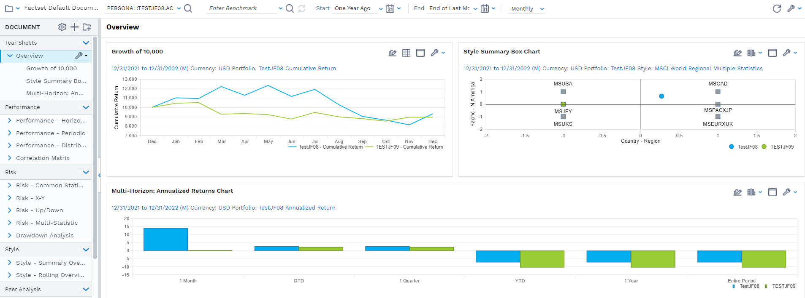

# SPAR — FactSet Programmatic

> ## Excerpt
> The fds.fpe._spar module allows you to retrieve performance metrics from an existing SPAR3 document (report/tile).

---
The _fds.fpe.\_spar_ module allows you to retrieve performance metrics from an existing [SPAR3](https://my.apps.factset.com/oa/pages/20779) document (report/tile).

Style, Performance, and Risk (SPAR), is a returns-based portfolio analysis application that provides tables and charts that you can use to identify and monitor style, measure risk and performance, and conduct peer universe analysis of selected portfolios, benchmarks, and competitor funds.

[](https://fpe.factset.com/docs/_images/spar_overview.png)

## SparDoc[#](https://fpe.factset.com/docs/spar.html#spardoc "Link to this heading")

_class_ fds.fpe.\_spar.SparDoc(_path_, _progress\_bar\=False_, _desc\=None_, _\*\*kwargs_)[#](https://fpe.factset.com/docs/spar.html#fds.fpe._spar.SparDoc "Link to this definition")

SparDoc fetches the document provided in the path and can perform calculations.

Displays the results generated by spar calculation service in dataframe by using stach\_v3 response.

path[#](https://fpe.factset.com/docs/spar.html#fds.fpe._spar.SparDoc.path "Link to this definition")

The SPAR document path.

Type:

str

tile[#](https://fpe.factset.com/docs/spar.html#fds.fpe._spar.SparDoc.tile "Link to this definition")

The SparTile instance containing the calculated data and metadata of latest calculation.

Type:

[SparTile](https://fpe.factset.com/docs/spar.html#fds.fpe._spar.SparTile "fds.fpe._spar.SparTile")

get\_tile\_data(_report\=''_, _tile\=''_, _ports\=None_, _bench\=None_, _time\_series\=None_, _currency\='USD'_, _return\_type\='NTR'_)[#](https://fpe.factset.com/docs/spar.html#fds.fpe._spar.SparDoc.get_tile_data "Link to this definition")

Get the calculated data in dataframe for the given parameters, for the given portfolios and benchmark.

For now we are supporting comparison only with one benchmark. If needed to compare with multiple portfolios, please provide it along with portfolios. If benchmark is not provided it does the calculation against default benchmark in tile. Once the calculation is done, it updates the tile attribute of the SparDoc object with the SparTile instance which contains the calculated data and metadata.

Parameters:

-   **report** (_str_) – The report name.
    
-   **tile** (_str_) – The tile name.
    
-   **ports** (_List__\[_[_Portfolio_](https://fpe.factset.com/docs/spar.html#fds.fpe._spar.Portfolio "fds.fpe._spar.Portfolio")_\]_) – A list of portfolio objects containing identifier, prefix and returntype
    
-   **bench** (_Optional__\[_[_Portfolio_](https://fpe.factset.com/docs/spar.html#fds.fpe._spar.Portfolio "fds.fpe._spar.Portfolio")_\]_) – A Potfolio object containing identifier, prefix and returntype.
    
-   **time\_series** (_Optional__\[_[_TimeSeries_](https://fpe.factset.com/docs/dates.html#fds.fpe.dates.TimeSeries "fds.fpe.dates.TimeSeries")_\]_) – The time series parameters for the calculation.
    
-   **currency** (_str__,_ _default 'USD'_) – The currency ISO code.
    
-   **return\_type** (_str__,_ _default 'NTR'_) – The return type.
    

Returns:

Dataframe from the calculated SparTile object containing the data frame, table metadata, and views metadata.

Return type:

DataFrame

Raises:

-   **KeyError** – If report or tile is not found
    
-   **Exception** – For other errors during calculation
    

_property_ report\_tiles_: DataFrame_[#](https://fpe.factset.com/docs/spar.html#fds.fpe._spar.SparDoc.report_tiles "Link to this definition")

Returns a DataFrame of available reports and tiles in the SPAR document.

## SparTile[#](https://fpe.factset.com/docs/spar.html#spartile "Link to this heading")

_class_ fds.fpe.\_spar.SparTile(_report_, _tile_, _ports_, _bench_, _time\_series_, _currency\='USD'_, _return\_type\='NTR'_, _progress\_bar\=False_, _desc\=None_, _\*\*kwargs_)[#](https://fpe.factset.com/docs/spar.html#fds.fpe._spar.SparTile "Link to this definition")

SparTile fetches and contains the calculated tile data for the given report and tile names.

Uses the SPAR calculation service and returns the data in a dataframe along with table and views metadata.

report[#](https://fpe.factset.com/docs/spar.html#fds.fpe._spar.SparTile.report "Link to this definition")

name of the report

Type:

str

tile[#](https://fpe.factset.com/docs/spar.html#fds.fpe._spar.SparTile.tile "Link to this definition")

name of the tile

Type:

str

ports[#](https://fpe.factset.com/docs/spar.html#fds.fpe._spar.SparTile.ports "Link to this definition")

list of portfolio objects

Type:

list\[[Portfolio](https://fpe.factset.com/docs/spar.html#fds.fpe._spar.Portfolio "fds.fpe._spar.Portfolio")\]

bench[#](https://fpe.factset.com/docs/spar.html#fds.fpe._spar.SparTile.bench "Link to this definition")

benchmark portfolio object

Type:

[Portfolio](https://fpe.factset.com/docs/spar.html#fds.fpe._spar.Portfolio "fds.fpe._spar.Portfolio")

time\_series[#](https://fpe.factset.com/docs/spar.html#fds.fpe._spar.SparTile.time_series "Link to this definition")

time series parameters

Type:

[TimeSeries](https://fpe.factset.com/docs/dates.html#fds.fpe.dates.TimeSeries "fds.fpe.dates.TimeSeries")

currency[#](https://fpe.factset.com/docs/spar.html#fds.fpe._spar.SparTile.currency "Link to this definition")

default “USD”

Type:

str

return\_type[#](https://fpe.factset.com/docs/spar.html#fds.fpe._spar.SparTile.return_type "Link to this definition")

default “NTR”

Type:

str

_property_ data_: DataFrame_[#](https://fpe.factset.com/docs/spar.html#fds.fpe._spar.SparTile.data "Link to this definition")

Returns the calculated tile data as a pandas DataFrame.

_property_ metadata_: Dict\[str, Any\]_[#](https://fpe.factset.com/docs/spar.html#fds.fpe._spar.SparTile.metadata "Link to this definition")

Returns the metadata for the calculated tile.

## Portfolio[#](https://fpe.factset.com/docs/spar.html#portfolio "Link to this heading")

_class_ fds.fpe.\_spar.Portfolio(_identifier_, _prefix\=''_, _return\_type\=''_)[#](https://fpe.factset.com/docs/spar.html#fds.fpe._spar.Portfolio "Link to this definition")

Portfolio class to represent a portfolio.

These values are to be filled with the help of spar-identity-widget.

Parameters:

-   **identifier** (_str_) – The portfolio identifier.
    
-   **prefix** (_str__,_ _default empty string_) – The portfolio prefix.
    
-   **return\_type** (_optional__\[__str__\]__,_ _default empty string_) – The portfolio return type.
    

## Getting Started[#](https://fpe.factset.com/docs/spar.html#getting-started "Link to this heading")

A simple example of using the SparDoc:

```
from fds.fpe._spar import SparDoc, Portfolio
from fds.fpe.dates import TimeSeries


doc_name = "CLIENT:SPAR_Test"

comp_name = 'Cumulative Returns Table'
comp_cat = 'Raw Data / Returns'

ret_type = 'NTR' #net total return
curr = 'USD'
doc = SparDoc(doc_name, progress_bar=True)

# get all the available reports and tiles in the document
doc.report_tiles

ports = [Portfolio('R.1000','RUSSELL_P', 'P'), Portfolio('R.1000','RUSSELL', 'GTR')]

benchmark = Portfolio('R.3000','RUSSELL_P', 'P')

time_series = TimeSeries('20240525', '20250531', 'M', 'FIVEDAY')

report = 'Universe - Multi-Statistic'
tile = 'Universe Summary X-Y Chart'

# get the tile data as a dataframe for the given time series, report, tile, portfolios, benchmark, currency and return type
df = doc.get_tile_data(time_series, report, tile, ports ,benchmark, curr, return_type = 'NTR')

# you can view the fetched tile metadata inside SparTile object as below
spar_tile = df.tile
```
