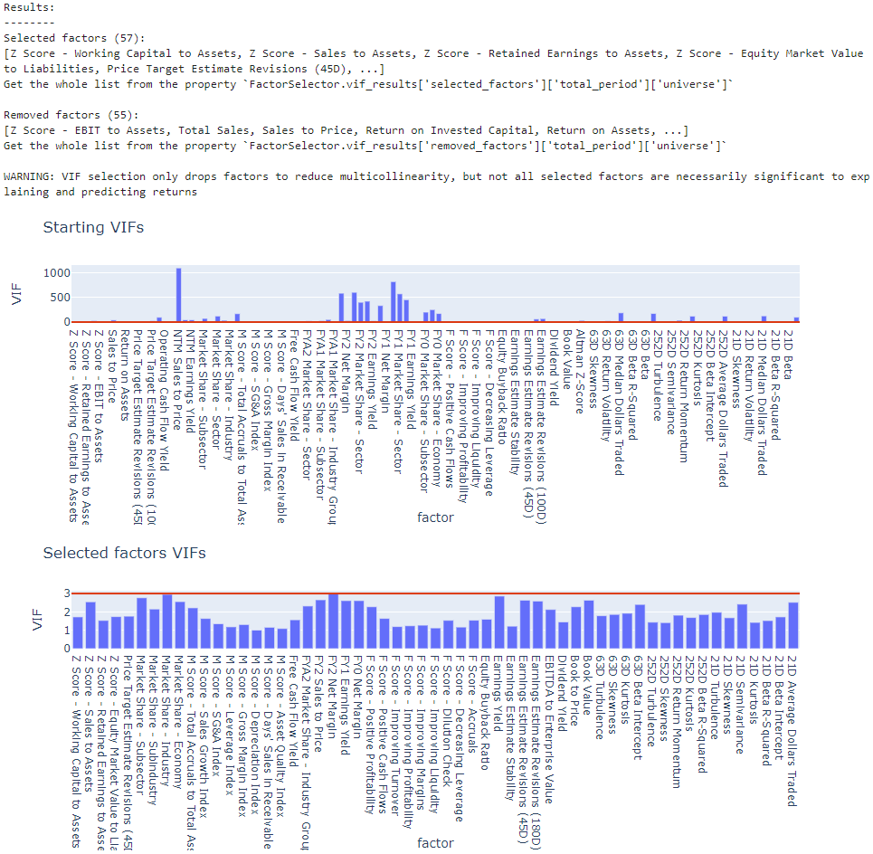
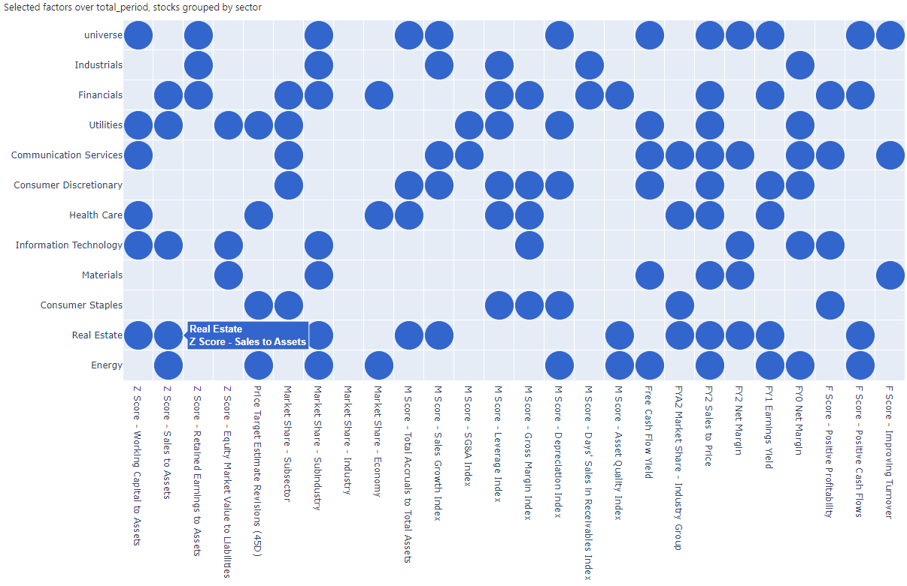

# Signal Selector — FactSet

> ## Excerpt
> The SignalSelector class provides statistical analysis methods for suitability selection of
signals. A large number of signals can be reduced to more manageable subset by utilising
the following techniques:

---
The _SignalSelector_ class provides statistical analysis methods for suitability selection of signals. A large number of signals can be reduced to more manageable subset by utilising the following techniques:

1.Detecting signals carrying duplicate information using singular value decomposition: e.g. a composite signal and its component signals.

2.Reducing multicollinearity by and iteratively dropping signals based on their Variance Inflation Factors (VIF), i.e. dropping signals that carry mostly duplicate information and are closely described by a linear combination of the others.

[](https://fpe.factset.com/docs/_images/FactorSelector_VIF.png)

3.Selecting a subset of signals that best explain stock returns, as gauged by an information criterion (BIC, AIC, AICc), achieved by performing stepwise regressions. A Monte Carlo implementation available for exploring multiple potential ‘local’ solutions and finding the best global solution with higher confidence.

[](https://fpe.factset.com/docs/_images/FactorSelector_circles.png)

## SignalSelector[#](https://fpe.factset.com/docs/signal_selector.html#signalselector "Link to this heading")

**Correlation matrix of signals**

```
from fds.fpe.quant.signal_selector import SignalSelector

ss = SignalSelector(bt)  # bt is the Backtest object (see relevant docs)
corr_matrix = ss.correlation_matrix(
    signal_ids=['Value-- Book Yield', 'Value-- Earnings Yield'],
    signal_data='scores',  # can also be 'returns'
    lag=0,  # shifts scores
    risk_adjust_scores=True,
    adjust_by_groups=False,
    grouping=None,
    custom_grouping_series=None,
    eval_date=None,  # will default to the latest available date
    time_window=None,  # will default to the longest available time window (bt.start)
    group='universe',  # can specify only a single asset group if grouping is used
)
```

**Correlation heatmap of signals**

```
from fds.fpe.quant.signal_selector import SignalSelector

ss = SignalSelector(bt)  # bt is the Backtest object (see relevant docs)
ss.correlation_plot(
    signal_ids=['Value-- Book Yield', 'Value-- Earnings Yield'],
    signal_data='scores',  # can also be 'returns'
    lag=0,  # only relevant when using 'returns'
    risk_adjust_scores=True,
    adjust_by_groups=False,
    grouping=None,
    custom_grouping_series=None,
    eval_date=None,  # will default to the latest available date
    time_window=None,  # will default to the longest available time window (bt.start)
    group='universe',  # can specify only a single asset group if grouping is used
)
```

**Detect exact multicollinearity using SVD**

```
from fds.fpe.quant.signal_selector import SignalSelector

ss = SignalSelector(bt)  # bt is the Backtest object (see relevant docs)
svd_result = ss.svd_detect_exact_multicollinearity(
    signal_ids=None,  # uses all signals
    signal_data='scores',  # can also be 'returns'
    lag=0,
    print_report=False,
    risk_adjust_scores=False,
    adjust_by_groups=False,
    grouping=None,
    custom_grouping_series=None,
    eval_date=None,  # will default to the latest available date
    time_window=None,  # will default to the longest available time window (bt.start)
    group='universe',  # can specify only a single asset group if grouping is used
)
```

_class_ fds.fpe.quant.signal\_selector.SignalSelector(_backtest_)[#](https://fpe.factset.com/docs/signal_selector.html#fds.fpe.quant.signal_selector.SignalSelector "Link to this definition")

A class containing various methods for analysis of collinearities and predictive power of signals and signal selection based on these.

Parameters:

**backtest** ([`Backtest`](https://fpe.factset.com/docs/backtest.html#fds.fpe.quant.backtest.Backtest "fds.fpe.quant.backtest._backtest.Backtest")) – an instance of Backtest containing the signals and universe date for the analyses

correlation\_matrix(_signal\_ids\=None_, _signal\_data\='scores'_, _lag\=0_, _risk\_adjust\_scores\=False_, _adjust\_by\_groups\=False_, _grouping\=None_, _custom\_grouping\_series\=None_, _eval\_date\=None_, _time\_window\=None_, _group\='universe'_, _\*\*kwargs_)[#](https://fpe.factset.com/docs/signal_selector.html#fds.fpe.quant.signal_selector.SignalSelector.correlation_matrix "Link to this definition")

Calculate and return a correlation matrix of a set of signals’ scores/returns/signal portfolio weights.

Parameters:

-   **signal\_ids** (`List` | `None`) – List of signal ids for which to calculate correlations. When `None`, will use all available signals.
    
-   **signal\_data** (`Literal`\[`'scores'`, `'returns'`, `'signal_portfolio_weights'`\]) – Specify whether to calculate correlations of signal scores, signal returns, or signal portfolio weights.
    
-   **lag** (`int`) – When using `signal_data` in one of `['returns', 'signal_portfolio_weights']`, will use signal returns/portfolio weights calculated with the corresponding lag. For signal scores this will actually look at the lag+1 shifter time window (corresponding to the lagged scores matched to forward returns without lookahead bias)
    
-   **risk\_adjust\_scores** (`bool`) – When `True`, and signal scores are used, the scores will be adjusted by using the residuals of the original signal scores regressed by their associated risk factors. This effectively runs a regression on the signal against its associated risk factors and subtracts the explained variation. This only affects signals with regression based modes that have associated risk factors: `['light_multivariate', 'custom']`; signals with other modes are unaffected by this option and their original scores are used.
    
-   **adjust\_by\_groups** (`bool`) – When `True`, and risk adjusted scores are used, the adjustment is instead performed on the group level, meaning separate/more granular regressions are performed for each asset group rather than over the whole universe, and then the adjusted scores for the groups are re-concatenated into a complete universe-covering score. Requires `grouping` to be specified.
    
-   **grouping** (`Literal`\[`'sector'`, `'backtest_grouping'`\] | `None`) – Required if `adjust_by_groups` is `True` or if you want to look at correlation acrosss only a specific group of assets (e.g. a sector) - then specify the `group`
    
-   **custom\_grouping\_series** (`Series` | `str` | `None`) – If `grouping == 'backtest_grouping'` this can be used to set `Backtest.grouping` if it’s not already set; will raise an error if is already set and this is different. If `str` - must match the name of a categorical datafield in `Backtest.data`. If `pd.Series` must be categorical series assigning groups to assets with index matching `Backtest`’s universe - (date, symbol) multiindex.
    
-   **eval\_date** (`str` | `datetime` | `Timestamp` | `None`) – The end of the time-window for which to calculate correlations across. If `None` will use the last available date of the `Backtest` object.
    
-   **time\_window** (`int` | `None`) – the time window in number of periods over which to calculate correlations. If `None` will use the maximum available time window in `Backtest`
    
-   **group** (`str`) – name of the group for which to calculate correltions if `grouping` is provided. `'universe'` uses the whole universe anyway.
    

Return type:

The correlation matrix with signal ids along both rows and columns.

correlation\_plot(_signal\_ids\=None_, _signal\_data\='scores'_, _lag\=0_, _risk\_adjust\_scores\=False_, _adjust\_by\_groups\=False_, _grouping\=None_, _custom\_grouping\_series\=None_, _eval\_date\=None_, _time\_window\=None_, _group\='universe'_, _\*\*kwargs_)[#](https://fpe.factset.com/docs/signal_selector.html#fds.fpe.quant.signal_selector.SignalSelector.correlation_plot "Link to this definition")

Display a correlation plot of a set of signals’ scores/returns/signal\_portfolios.

Parameters:

-   **signal\_ids** (`List` | `None`) – List of signal ids for which to plot correlations. When `None`, will use all available signals.
    
-   **signal\_data** (`Literal`\[`'scores'`, `'returns'`, `'signal_portfolio_weights'`\]) – Specify whether to calculate correlations of signal scores, signal returns, or signal portfolio weights.
    
-   **lag** (`int`) – When using `signal_data` in one of `['returns', 'signal_portfolio_weights']`, will use signal returns/portfolio weights calculated with the corresponding lag. For signal scores this will actually look at the lag+1 shifter time window (corresponding to the lagged scores matched to forward returns without lookahead bias)
    
-   **risk\_adjust\_scores** (`bool`) – When `True`, and signal scores are used, the scores will be adjusted by using the residuals of the original signal scores regressed by their associated risk factors. This effectively runs a regression on the signal against its associated risk factors and subtracts the explained variation. This only affects signals with regression based modes that have associated risk factors: `['light_multivariate', 'custom']`; signals with other modes are unaffected by this option and their original scores are used.
    
-   **adjust\_by\_groups** (`bool`) – When `True`, and risk adjusted scores are used, the adjustment is instead performed on the group level, meaning separate/more granular regressions are performed for each asset group rather than over the whole universe, and then the adjusted scores for the groups are re-concatenated into a complete universe-covering score. Requires `grouping` to be specified.
    
-   **grouping** (`Literal`\[`'sector'`, `'backtest_grouping'`\] | `None`) – Required if `adjust_by_groups` is `True` or if you want to look at correlation acrosss only a specific group of assets (e.g. a sector) - then specify the `group`
    
-   **custom\_grouping\_series** (`Series` | `str` | `None`) – If `grouping == 'backtest_grouping'` this can be used to set `Backtest.grouping` if it’s not already set; will raise an error if is already set and this is different. If `str` - must match the name of a categorical datafield in `Backtest.data`. If `pd.Series` must be categorical series assigning groups to assets with index matching `Backtest`’s universe - (date, symbol) multiindex.
    
-   **eval\_date** (`str` | `datetime` | `Timestamp` | `None`) – The end of the time-window for which to calculate correlations across. If `None` will use the last available date of the `Backtest` object.
    
-   **time\_window** (`int` | `None`) – the time window in number of periods over which to calculate correlations. If `None` will use the maximum available time window in `Backtest`
    
-   **group** (`str`) – name of the group for which to calculate correltions if `grouping` is provided. `'universe'` uses the whole universe anyway.
    

Return type:

`None`

svd\_detect\_exact\_multicollinearity(_signal\_ids\=None_, _signal\_data\='scores'_, _lag\=0_, _print\_report\=False_, _risk\_adjust\_scores\=False_, _adjust\_by\_groups\=False_, _grouping\=None_, _custom\_grouping\_series\=None_, _eval\_date\=None_, _time\_window\=None_, _group\='universe'_, _\*\*kwargs_)[#](https://fpe.factset.com/docs/signal_selector.html#fds.fpe.quant.signal_selector.SignalSelector.svd_detect_exact_multicollinearity "Link to this definition")

Perform singular value decomposition analysis to find exact linear dependencies between signals - these will cause errors in regressions if not removed. Groups of linearly dependent signals are identified as well as the linear dependence equations and how many signals in each such group are redundant.

Parameters:

-   **signal\_ids** (`List` | `None`) – The list of signals included in the procedure. When `None` or empty, all signals from the `Backtest` object are included.
    
-   **signal\_data** (`Literal`\[`'scores'`, `'returns'`, `'signal_portfolio_weights'`\]) – Specify whether to look for exact linear relations in signal scores, signal returns, or signal portfolio weights.
    
-   **lag** (`int`) – Required when using signal returns or signal portfolio weights. Will use signal returns/portfolio weights, calculated with the corresponding lag. For signal scores this will actually look at the lag+1 shifter time window (corresponding to the lagged scores matched to forward returns without lookahead bias)
    
-   **print\_report** (`bool`) – When `True`, prints a report by calling `SignalSelectorOutput.report()`.
    
-   **risk\_adjust\_scores** (`bool`) – When `True`, and signal scores are used, the scores will be adjusted by using the residuals of the original signal scores regressed by their associated risk factors. This effectively runs a regression on the signal against its associated risk factors and subtracts the explained variation. This only affects signals with regression based modes that have associated risk factors: `['light_multivariate', 'custom']`; signals with other modes are unaffected by this option and their original scores are used.
    
-   **adjust\_by\_groups** (`bool`) – When `True`, and risk adjusted scores are used, the adjustment is instead performed on the group level, meaning separate/more granular regressions are performed for each asset group rather than over the whole universe, and then the adjusted scores for the groups are re-concatenated into a complete universe-covering score. Requires `grouping` to be specified.
    
-   **grouping** (`Literal`\[`'sector'`, `'backtest_grouping'`\] | `None`) – Required if `adjust_by_groups` is `True` or if you want to look at correlation across only a specific group of assets (e.g. a sector) - then specify the `group`
    
-   **custom\_grouping\_series** (`Series` | `str` | `None`) – If `grouping == 'backtest_grouping'` this can be used to set `Backtest.grouping` if it’s not already set; will raise an error if is already set and this is different. If `str` - must match the name of a categorical datafield in `Backtest.data`. If `pd.Series` must be categorical series assigning groups to assets with index matching `Backtest`’s universe - (date, symbol) multiindex.
    
-   **eval\_date** (`str` | `datetime` | `Timestamp` | `None`) – The end of the time-window for which to calculate correlations across. If `None` will use the last available date of the `Backtest` object.
    
-   **time\_window** (`int` | `None`) – the time window in number of periods over which to calculate correlations. If `None` will use the maximum available time window in `Backtest`
    
-   **group** (`str`) – name of the group for which to calculate correltions if `grouping` is provided. `'universe'` uses the whole universe anyway.
    

Return type:

[`SignalSelectorOutput`](https://fpe.factset.com/docs/signal_selector.html#fds.fpe.quant.signal_selector.SignalSelectorOutput "fds.fpe.quant.signal_selector._signal_selector_output.SignalSelectorOutput")

Returns:

-   _Object containing the results and parameters of the analysis. It also has methods for_
    
-   _generating and displaying reports._
    

vif\_select(_signal\_ids\=None_, _threshold\=5_, _protected\_signals\=None_, _signal\_data\='scores'_, _lag\=0_, _eval\_date\=None_, _time\_window\=None_, _rolling\_calc\=False_, _rolling\_every\=1_, _grouping\=None_, _custom\_grouping\_series\=None_, _keep\_universe\=True_, _print\_report\=False_, _risk\_adjust\_scores\=False_, _adjust\_by\_groups\=False_, _rolling\_start\_date\=None_, _expanding\_window\=False_, _specific\_groups\_only\=None_)[#](https://fpe.factset.com/docs/signal_selector.html#fds.fpe.quant.signal_selector.SignalSelector.vif_select "Link to this definition")

Variance Inflation Factors method reduces the set of signals such that multicollinearity among them is reduced, by removing signals that carry redundant information. This is achieved by iteratively removing signals with the highest VIF until all remaining signals have VIF below the specified threshold. Supports defining multiple evaluation dates and/or stock grouping and performing the analysis on these levels as well as on the whole universe. VIF of a signal is a measure of how strongly the signal is related to a linear combination of the rest of the signals. It is calculated by performing the following multivariate regression:

and finding . Typical VIF threshold values used are 3-5, and VIF values above 8-10 indicate a strong multicollineariy ()

Parameters:

-   **signal\_ids** (`List` | `Dict` | [`SignalSelectorOutput`](https://fpe.factset.com/docs/signal_selector.html#fds.fpe.quant.signal_selector.SignalSelectorOutput "fds.fpe.quant.signal_selector._signal_selector_output.SignalSelectorOutput") | `None`) –
    
    When `None`, all signals from the `Backtest` instance are considered in the procedure. When list-like (not dict), it’s a list of signals to be considered for the procedure for all defined eval dates and groups. A dict input is accepted for more customizable runs with a separate list of signals to be considered for each date and/or group to be analysed, the dict must follow the structure:
    
    ```
    signal_ids={
        <date>: {  # datetime.datetime, pandas.Timestamp, or str in 'YYYY-MM-DD' format
            <group>: [<list of signal ids>],
            ...  # more groups
        },
        ...  # more dates
    }
    ```
    
    First layer of keys is for dates, the second for groupings of assets. It can also accept a dict with only one of the layers-assumed to be the same across the other. Dates must be `datetime.datetime` parsable: e.g. `'YYYY-MM-DD'` format. When calculatfion is performed on an evaluation date not explicitly in the dict it takes the entry from most recent preceeding date, or the chronologically first one if all dates in the dict are after the eval date.
    
    Groups other than `'universe'` must match names of groups coming from grouping parameters (grouping, custom\_grouping\_series). When `SignalSelectorOutput` is used, it must be from a method that explicitly selects signals (e.g. `vif_select(), lasso_select()`) and the selected signals (dict) will be used as the `signal_ids`. The following list of parameters are overridden with the same equivalents used in the SS:
    
    ```
    [signal_ids, lag, eval_date, time_window, rolling_calc, rolling_every, grouping,
    custom_grouping_series, keep_universe, risk_adjust_scores, adjust_by_groups,
    rolling_start_date, expanding_window]
    ```
    
    With the exception that if the SS selection is performed for one date but multiple dates are defined with the input parameters (e.g. `rolling_calculation=True`) this ‘extention’ will be allowed. Similarly, if SS calculation is not grouped, but grouping parameters are passed, this ‘extention’ will also not be overridden. If the method of SignalSelectorOutput\` supports `protected_signals` these will also be inherited but ONLY IF the `protected_signals` parameter is left as `None` - otherwise the manual input takes precendence
    
-   **threshold** (`float`) – Highest allowed VIF. Protected signals’ VIFs are ignored and can remain above `threshold`
    
-   **protected\_signals** (`List` | `Dict` | `None`) – A list of signals that constrain the procedure so that they will always remain selected. A dict input for more customizability can be used, follows same structure and rules as the `signal_ids` dict input. If you want to inherit `protected_signals` from a previously used method (`signal_ids=<SignalSelectorOutput>`) leave this as `None`.
    
-   **signal\_data** (`Literal`\[`'scores'`, `'returns'`, `'signal_portfolio_weights'`\]) – Run the procedure using either signal scores, signal returns, or signal portfolio weights.
    
-   **risk\_adjust\_scores** (`bool`) – Only valid when signal\_data is `'scores'`. If True the signal scores will be risk adjusted (residualised) in a regression with the signal’s risk factors. See `Backtest.risk_adjusted_signal_scores()`. This only affects signals with regression based modes that have associated risk factors: `{'light_multivariate', 'custom'}`; Signals with other modes are unaffected by this option and their original signal scores are used.
    
-   **adjust\_by\_groups** (`bool`) – Only valid when signal\_data is `scores` and `risk_adjust_scores` is `True`. If True the risk adjustment of scores will be performed on the grouping level. See `Backtest.risk_adjusted_signal_scores()`. This requires passing valid grouping arguments (`grouping, custom_grouping_series`).
    
-   **lag** (`int`) – If using signal scores, they are shifted by `(1+lag)` - similar to how they are aligned to asset returns when signal portfolios and signal returns of the corresponding lag are calculated.
    
-   **eval\_date** (`str` | `datetime` | `Timestamp` | `List` | `None`) – The evaluation date or a list of them. When `None` will take the latest available date in Backtest. `str` must be `'YYYY-MM-DD'` format. For rolling calculations, this is the last date and `rolling_start_date` is also required. A list of dates disables rolling calculation options and applies the fixed time\_window to each date.
    
-   **time\_window** (`int` | `None`) – time window in number of periods (`Backtest`’s frequency). If `None`, use the maximum available time window - from `bt.start` to (first) evaluation date. For expanding rolling window calculations this is the starting window (on first eval date) and expands from there
    
-   **rolling\_calc** (`bool`) – If True will perform a rolling calculation - starging at `rolling_start_date` (required) and ending at `eval_date`. Use `rolling_every, expanding_window` for further customisation.
    
-   **rolling\_start\_date** (`str` | `datetime` | `Timestamp` | `None`) – Required if `rolling_calc` is `True`. This will be the first evaluation date, rolling up to `eval_date` (may not be included depending on aligning of `rolling_every`)
    
-   **rolling\_every** (`int`) –
    
    When performing a rilling calculation (`rolling_calc=True`), this can be specified to calculate on every n-th date (`rolling_every=n`) only. Example: Say you have 10 years of monthly data (2010-2020) and want to analyse a rolling 5-year time-window once a year, say December, then specify:
    
    ```
    eval_date=None  # Goes as far as possible (Dec 2020)
    time_window=60,
    rolling_calc=True,
    rolling_start_date=datetime.datetime(2015, 12, 31),
    rolling_every=12,
    ```
    
-   **expanding\_window** (`bool`) – Only for rolling calculations. If `True` use an expanding time-window, starting with `time_window` at `rolling_start_date`.
    
-   **grouping** (`Literal`\[`'sector'`, `'backtest_grouping'`, `'custom'`\] | `None`) – If not `None`, determines the asset grouping criteria. `'sector'`: use `Backtest.sectors` grouping and `Backtest`’s sector level signal calculations. `'backtest_grouping'` : use `Backtest.grouping` grouping and `Backtest`’s group level signal calculations. If `Backtest.grouping` is not pre-defined it can be supplied and set with the `custom_grouping_series` parameter. (same as doing `bt.grouping = custom_grouping_series` separately) `'custom'`: same as `'backtest_grouping'`, deprecated, currently available for backwards compatibility
    
-   **custom\_grouping\_series** (`Series` | `str` | `None`) – If `grouping == 'backtest_grouping'` (or `'custom'`) this can be used to set `Backtest.grouping` if it’s not already set; will raise an error if is already set and this is different. If `str` - must match the name of a categorical datafield in `Backtest.data`. If `pd.Series` must be categorical series assigning groups to assets with index matching `Backtest`’s universe - (date, symbol) multiindex.
    
-   **keep\_universe** (`bool`) – Only valid if `grouping` is not `None`. If False the ‘universe’ group will be dropped and analysis will only be performed on the grouping level (e.g. sectors).
    
-   **print\_report** (`bool`) – When `True`, prints a report by calling `SignalSelectorOutput.report()`.
    
-   **specific\_groups\_only** (`List`\[`str`\] | `None`) – specify a sublist of groups to analyse. E.g. if you don’t want to analyse all s ectors but just a subset
    

Return type:

[`SignalSelectorOutput`](https://fpe.factset.com/docs/signal_selector.html#fds.fpe.quant.signal_selector.SignalSelectorOutput "fds.fpe.quant.signal_selector._signal_selector_output.SignalSelectorOutput")

Returns:

-   _Object containing the results and parameters of the analysis. It also has methods for_
    
-   _generating and displaying reports._
    

stepwise\_regression\_select(_signal\_ids\=None_, _information\_criterion\='AIC'_, _starting\_signals\=None_, _protected\_signals\=None_, _lag\=0_, _eval\_date\=None_, _time\_window\=None_, _rolling\_calc\=False_, _rolling\_every\=1_, _grouping\=None_, _custom\_grouping\_series\=None_, _keep\_universe\=True_, _log\_steps\=True_, _print\_report\=False_, _risk\_adjust\_scores\=False_, _adjust\_by\_groups\=False_, _rolling\_start\_date\=None_, _expanding\_window\=False_, _specific\_groups\_only\=None_)[#](https://fpe.factset.com/docs/signal_selector.html#fds.fpe.quant.signal_selector.SignalSelector.stepwise_regression_select "Link to this definition")

Bidirectional stepwise regression that finds the subset of signals that best explain the (lagged) stock returns as gauged by an information criterion (BIC, AIC, AICc). Supports defining multiple evaluation dates and/or stock grouping and performing the analysis on these levels as well as on the whole universe. Signals are added or removed to the model iteratively until the optimal information criterion is reached in the stock returns multivariate regression:

Parameters:

-   **signal\_ids** (`List` | `Dict` | [`SignalSelectorOutput`](https://fpe.factset.com/docs/signal_selector.html#fds.fpe.quant.signal_selector.SignalSelectorOutput "fds.fpe.quant.signal_selector._signal_selector_output.SignalSelectorOutput") | `None`) –
    
    When `None`, all signals from the `Backtest` instance are considered in the procedure. When list-like (not dict), it’s a list of signals to be considered for the procedure for all defined eval dates and groups. A dict input is accepted for more customizable runs with a separate list of signals to be considered for each date and/or group to be analysed, the dict must follow the structure:
    
    ```
    signal_ids={
        <date>: {  # datetime.datetime, pandas.Timestamp, or str in 'YYYY-MM-DD' format
            <group>: [<list of signal ids>],
            ...  # more groups
        },
        ...  # more dates
    }
    ```
    
    First layer of keys is for dates, the second for groupings of assets. It can also accept a dict with only one of the layers-assumed to be the same across the other. Dates must be `datetime.datetime` parsable: e.g. `'YYYY-MM-DD'` format. When calculation is performed on an evaluation date not explicitly in the dict it takes the entry from most recent preceeding date, or the chronologically first one if all dates in the dict are after the eval date.
    
    Groups other than `'universe'` must match names of groups coming from grouping parameters (grouping, custom\_grouping\_series). When `SignalSelectorOutput` is used, it must be from a method that explicitly selects signals (e.g. `vif_select(), lasso_select()`) and the selected signals (dict) will be used as the `signal_ids`. The following list of parameters are overridden with the same equivalents used in the SS:
    
    ```
    [signal_ids, lag, eval_date, time_window, rolling_calc, rolling_every, grouping,
    custom_grouping_series, keep_universe, risk_adjust_scores, adjust_by_groups,
    rolling_start_date, expanding_window]
    ```
    
    With the exception that if the SS selection is performed for one date but multiple dates are defined with the input parameters (e.g. `rolling_calculation=True`) this ‘extention’ will be allowed. Similarly, if SS calculation is not grouped, but grouping parameters are passed, this ‘extention’ will also not be overridden. If the method of SignalSelectorOutput\` supports `protected_signals` these will also be inherited but ONLY IF the `protected_signals` parameter is left as `None` - otherwise the manual input takes precendence
    
-   **information\_criterion** (`Literal`\[`'AIC'`, `'AICc'`, `'BIC'`\]) – Information Criterion to be optimised for signal selection. `'AIC'` : Akaike Information Criterion `'AICc'` : Akaike Information Criterion with quadratic correction for small sample sizes `'BIC'` : Bayesian Information Criterion
    
-   **starting\_signals** (`List` | `Dict` | `None`) – A list of signals used as starting point (starting subset of signals) for the stepwise procedure. A dict input for more customizability can be used, follows same structure and rules as the `signal_ids` dict input.
    
-   **protected\_signals** (`List` | `Dict` | `None`) – A list of signals that constrain the procedure so that they will always remain selected. A dict input for more customizability can be used, follows same structure and rules as the `signal_ids` dict input. If you want to inherit `protected_signals` from a previously used method (`signal_ids=<SignalSelectorOutput>`) leave this as `None`.
    
-   **risk\_adjust\_scores** (`bool`) – If True the signal scores will be risk adjusted (residualised) in a regression with the signal’s risk factors. See `Backtest.risk_adjusted_signal_scores()`. This only affects signals with regression based modes that have associated risk factors: `{'light_multivariate', 'custom'}`; Signals with other modes are unaffected by this option and their original signal scores are used.
    
-   **adjust\_by\_groups** (`bool`) – Only valid `risk_adjust_scores` is `True`. If True the risk adjustment of scores will be performed on the grouping level. See `Backtest.risk_adjusted_signal_scores()`. This requires passing valid grouping arguments (`grouping, custom_grouping_series`).
    
-   **lag** (`int`) – Signal scores are shifted by `(1+lag)` when aligning the with associated forward asset returns in the regression model.
    
-   **eval\_date** (`str` | `datetime` | `Timestamp` | `List` | `None`) – The evaluation date or a list of them. When `None` will take the latest available date in Backtest. `str` must be `'YYYY-MM-DD'` format. For rolling calculations, this is the last date and `rolling_start_date` is also required. A list of dates disables rolling calculation options and applies the fixed time\_window to each date.
    
-   **time\_window** (`int` | `None`) – time window in number of periods (`Backtest`’s frequency). If `None`, use the maximum available time window - from `bt.start` to (first) evaluation date. For expanding rolling window calculations this is the starting window (on first eval date) and expands from there
    
-   **rolling\_calc** (`bool`) – If True will perform a rolling calculation - starging at `rolling_start_date` (required) and ending at `eval_date`. Use `rolling_every, expanding_window` for further customisation.
    
-   **rolling\_start\_date** (`str` | `datetime` | `Timestamp` | `None`) – Required if `rolling_calc` is `True`. This will be the first evaluation date, rolling up to `eval_date` (may not be included depending on aligning of `rolling_every`)
    
-   **rolling\_every** (`int`) –
    
    When performing a rilling calculation (`rolling_calc=True`), this can be specified to calculate on every n-th date (`rolling_every=n`) only. Example: Say you have 10 years of monthly data (2010-2020) and want to analyse a rolling 5-year time-window once a year, say December, then specify:
    
    ```
    eval_date=None  # Goes as far as possible (Dec 2020)
    time_window=60,
    rolling_calc=True,
    rolling_start_date=datetime.datetime(2015, 12, 31),
    rolling_every=12,
    ```
    
-   **expanding\_window** (`bool`) – Only for rolling calculations. If `True` use an expanding time-window, starting with `time_window` at `rolling_start_date`.
    
-   **grouping** (`Literal`\[`'sector'`, `'backtest_grouping'`, `'custom'`\] | `None`) – If not `None`, determines the asset grouping criteria. `'sector'`: use `Backtest.sectors` grouping and `Backtest`’s sector level signal calculations. `'backtest_grouping'` : use `Backtest.grouping` grouping and `Backtest`’s group level signal calculations. If `Backtest.grouping` is not pre-defined it can be supplied and set with the `custom_grouping_series` parameter. (same as doing `bt.grouping = custom_grouping_series` separately) `'custom'`: same as `'backtest_grouping'`, deprecated, currently available for backwards compatibility
    
-   **custom\_grouping\_series** (`Series` | `str` | `None`) – If `grouping == 'backtest_grouping'` (or `'custom'`) this can be used to set `Backtest.grouping` if it’s not already set; will raise an error if is already set and this is different. If `str` - must match the name of a categorical datafield in `Backtest.data`. If `pd.Series` must be categorical series assigning groups to assets with index matching `Backtest`’s universe - (date, symbol) multiindex.
    
-   **keep\_universe** (`bool`) – Only valid if `grouping` is not `None`. If False the ‘universe’ group will be dropped and analysis will only be performed on the grouping level (e.g. sectors).
    
-   **log\_steps** (`bool`) – When `True`, a log of the steps of the stepwise process is saved and returned as a pandas dataframe in the result dict, under the key `'steps_log'`
    
-   **print\_report** (`bool`) – When `True`, prints a report by calling `SignalSelectorOutput.report()`.
    
-   **specific\_groups\_only** (`List`\[`str`\] | `None`) – specify a sublist of groups to analyse. E.g. if you don’t want to analyse all s ectors but just a subset
    

Return type:

[`SignalSelectorOutput`](https://fpe.factset.com/docs/signal_selector.html#fds.fpe.quant.signal_selector.SignalSelectorOutput "fds.fpe.quant.signal_selector._signal_selector_output.SignalSelectorOutput")

Returns:

-   _Object containing the results and parameters of the analysis. It also has methods for_
    
-   _generating and displaying reports._
    

mc\_stepwise\_regression\_select(_signal\_ids\=None_, _information\_criterion\='AIC'_, _n\_iter\=50_, _protected\_signals\=None_, _lag\=0_, _eval\_date\=None_, _time\_window\=None_, _rolling\_calc\=False_, _rolling\_every\=1_, _grouping\=None_, _custom\_grouping\_series\=None_, _keep\_universe\=True_, _mc\_progress\_bars\=True_, _print\_report\=False_, _rng\_seed\=None_, _risk\_adjust\_scores\=False_, _adjust\_by\_groups\=False_, _rolling\_start\_date\=None_, _expanding\_window\=False_, _specific\_groups\_only\=None_, _\*\*kwargs_)[#](https://fpe.factset.com/docs/signal_selector.html#fds.fpe.quant.signal_selector.SignalSelector.mc_stepwise_regression_select "Link to this definition")

Multiple bidirectional stepwise regressions (see `stepwise_regression_select()`) with randomized starting points (starting signal lists) that finds the subset of signals that best explain the (lagged) stock returns - optimising for an information criterion (BIC, AIC, AICc). More iterations increase the likelihood of avoiding a ‘local optimum’ solution in exchange for longer calculation times. Supports defining multiple evaluation dates and/or stock grouping and performing the analysis on these levels as well as on the whole universe.

Parameters:

-   **signal\_ids** (`List` | `Dict` | [`SignalSelectorOutput`](https://fpe.factset.com/docs/signal_selector.html#fds.fpe.quant.signal_selector.SignalSelectorOutput "fds.fpe.quant.signal_selector._signal_selector_output.SignalSelectorOutput") | `None`) –
    
    When `None`, all signals from the `Backtest` instance are considered in the procedure. When list-like (not dict), it’s a list of signals to be considered for the procedure for all defined eval dates and groups. A dict input is accepted for more customizable runs with a separate list of signals to be considered for each date and/or group to be analysed, the dict must follow the structure:
    
    ```
    signal_ids={
        <date>: {  # datetime.datetime, pandas.Timestamp, or str in 'YYYY-MM-DD' format
            <group>: [<list of signal ids>],
            ...  # more groups
        },
        ...  # more dates
    }
    ```
    
    First layer of keys is for dates, the second for groupings of assets. It can also accept a dict with only one of the layers-assumed to be the same across the other. Dates must be `datetime.datetime` parsable: e.g. `'YYYY-MM-DD'` format. When calculation is performed on an evaluation date not explicitly in the dict it takes the entry from most recent preceeding date, or the chronologically first one if all dates in the dict are after the eval date.
    
    Groups other than `'universe'` must match names of groups coming from grouping parameters (grouping, custom\_grouping\_series). When `SignalSelectorOutput` is used, it must be from a method that explicitly selects signals (e.g. `vif_select(), lasso_select()`) and the selected signals (dict) will be used as the `signal_ids`. The following list of parameters are overridden with the same equivalents used in the SS:
    
    ```
    [signal_ids, lag, eval_date, time_window, rolling_calc, rolling_every, grouping,
    custom_grouping_series, keep_universe, risk_adjust_scores, adjust_by_groups,
    rolling_start_date, expanding_window]
    ```
    
    With the exception that if the SS selection is performed for one date but multiple dates are defined with the input parameters (e.g. `rolling_calculation=True`) this ‘extention’ will be allowed. Similarly, if SS calculation is not grouped, but grouping parameters are passed, this ‘extention’ will also not be overridden. If the method of SignalSelectorOutput\` supports `protected_signals` these will also be inherited but ONLY IF the `protected_signals` parameter is left as `None` - otherwise the manual input takes precendence
    
-   **information\_criterion** (`Literal`\[`'AIC'`, `'AICc'`, `'BIC'`\]) – Information Criterion to be optimised for signal selection. `'AIC'` : Akaike Information Criterion `'AICc'` : Akaike Information Criterion with quadratic correction for small sample sizes `'BIC'` : Bayesian Information Criterion
    
-   **n\_iter** (`int`) – number of Monte Carlo iterations to be performed (for each date and/or group if applicable)
    
-   **protected\_signals** (`List` | `Dict` | `None`) – A list of signals that constrain the procedure so that they will always remain selected. A dict input for more customizability can be used, follows same structure and rules as the `signal_ids` dict input. If you want to inherit `protected_signals` from a previously used method (`signal_ids=<SignalSelectorOutput>`) leave this as `None`.
    
-   **risk\_adjust\_scores** (`bool`) – If True the signal scores will be risk adjusted (residualised) in a regression with the signal’s risk factors. See `Backtest.risk_adjusted_signal_scores()`. This only affects signals with regression based modes that have associated risk factors: `{'light_multivariate', 'custom'}`; Signals with other modes are unaffected by this option and their original signal scores are used.
    
-   **adjust\_by\_groups** (`bool`) – Only valid `risk_adjust_scores` is `True`. If True the risk adjustment of scores will be performed on the grouping level. See `Backtest.risk_adjusted_signal_scores()`. This requires passing valid grouping arguments (`grouping, custom_grouping_series`).
    
-   **lag** (`int`) – Signal scores are shifted by `(1+lag)` when aligning the with associated forward asset returns in the regression model.
    
-   **eval\_date** (`str` | `datetime` | `Timestamp` | `List` | `None`) – The evaluation date or a list of them. When `None` will take the latest available date in Backtest. `str` must be `'YYYY-MM-DD'` format. For rolling calculations, this is the last date and `rolling_start_date` is also required. A list of dates disables rolling calculation options and applies the fixed time\_window to each date.
    
-   **time\_window** (`int` | `None`) – time window in number of periods (`Backtest`’s frequency). If `None`, use the maximum available time window - from `bt.start` to (first) evaluation date. For expanding rolling window calculations this is the starting window (on first eval date) and expands from there
    
-   **rolling\_calc** (`bool`) – If True will perform a rolling calculation - starging at `rolling_start_date` (required) and ending at `eval_date`. Use `rolling_every, expanding_window` for further customisation.
    
-   **rolling\_start\_date** (`str` | `datetime` | `Timestamp` | `None`) – Required if `rolling_calc` is `True`. This will be the first evaluation date, rolling up to `eval_date` (may not be included depending on aligning of `rolling_every`)
    
-   **rolling\_every** (`int`) –
    
    When performing a rilling calculation (`rolling_calc=True`), this can be specified to calculate on every n-th date (`rolling_every=n`) only. Example: Say you have 10 years of monthly data (2010-2020) and want to analyse a rolling 5-year time-window once a year, say December, then specify:
    
    ```
    eval_date=None  # Goes as far as possible (Dec 2020)
    time_window=60,
    rolling_calc=True,
    rolling_start_date=datetime.datetime(2015, 12, 31),
    rolling_every=12,
    ```
    
-   **expanding\_window** (`bool`) – Only for rolling calculations. If `True` use an expanding time-window, starting with `time_window` at `rolling_start_date`.
    
-   **grouping** (`Literal`\[`'sector'`, `'backtest_grouping'`, `'custom'`\] | `None`) – If not `None`, determines the asset grouping criteria. `'sector'`: use `Backtest.sectors` grouping and `Backtest`’s sector level signal calculations. `'backtest_grouping'` : use `Backtest.grouping` grouping and `Backtest`’s group level signal calculations. If `Backtest.grouping` is not pre-defined it can be supplied and set with the `custom_grouping_series` parameter. (same as doing `bt.grouping = custom_grouping_series` separately) `'custom'`: same as `'backtest_grouping'`, deprecated, currently available for backwards compatibility
    
-   **custom\_grouping\_series** (`Series` | `str` | `None`) – If `grouping == 'backtest_grouping'` (or `'custom'`) this can be used to set `Backtest.grouping` if it’s not already set; will raise an error if is already set and this is different. If `str` - must match the name of a categorical datafield in `Backtest.data`. If `pd.Series` must be categorical series assigning groups to assets with index matching `Backtest`’s universe - (date, symbol) multiindex.
    
-   **keep\_universe** (`bool`) – Only valid if `grouping` is not `None`. If False the ‘universe’ group will be dropped and analysis will only be performed on the grouping level (e.g. sectors).
    
-   **mc\_progress\_bars** (`bool`) – When `True`, show a progress bar for Monte Carlo iterations for each date/group. Can create visual clutter when there are many dates/groups.
    
-   **print\_report** (`bool`) – When `True`, prints a report by calling `SignalSelectorOutput.report()`.
    
-   **rng\_seed** (`int` | `None`) – the random seed used for generating the starting points for the Monte Carlo iterations either an integer or a tuple in the format returned by numpy.random.get\_state() when None, a ‘random’ seed-state is used (recorded in the output if need to be reproduced later) when int, a fixed seed-state is generated, the full tuple (`numpy.random.get_state()`) describing the state is saved in the output when tuple, must match the tuple format of (`numpy.random.get_state()`)
    
-   **specific\_groups\_only** (`List`\[`str`\] | `None`) – specify a sublist of groups to analyse. E.g. if you don’t want to analyse all s ectors but just a subset
    

Return type:

[`SignalSelectorOutput`](https://fpe.factset.com/docs/signal_selector.html#fds.fpe.quant.signal_selector.SignalSelectorOutput "fds.fpe.quant.signal_selector._signal_selector_output.SignalSelectorOutput")

Returns:

-   _Object containing the results and parameters of the analysis. It also has methods for_
    
-   _generating and displaying reports._
    

lasso\_select(_signal\_ids\=None_, _k\=None_, _fixed\_lambda\=None_, _lag\=0_, _eval\_date\=None_, _time\_window\=None_, _rolling\_calc\=False_, _rolling\_every\=1_, _grouping\=None_, _custom\_grouping\_series\=None_, _keep\_universe\=True_, _print\_report\=False_, _risk\_adjust\_scores\=False_, _adjust\_by\_groups\=False_, _rolling\_start\_date\=None_, _expanding\_window\=False_, _specific\_groups\_only\=None_)[#](https://fpe.factset.com/docs/signal_selector.html#fds.fpe.quant.signal_selector.SignalSelector.lasso_select "Link to this definition")

Lasso regression that finds a subset of signals that best predict returns without overfitting by introducing an L1 penalty in the regression objective:

Larger `lambda` () means bigger penalty, hence more signals will be cut off (their regression coefficient, , set to 0). This method supports either selecting a fixed value or a specific number of singals to be selected (by finding the appropriate that achieves that first) Supports defining multiple evaluation dates and/or stock grouping and performing the analysis on these levels as well as on the whole universe.

Parameters:

-   **signal\_ids** (`List` | `Dict` | [`SignalSelectorOutput`](https://fpe.factset.com/docs/signal_selector.html#fds.fpe.quant.signal_selector.SignalSelectorOutput "fds.fpe.quant.signal_selector._signal_selector_output.SignalSelectorOutput") | `None`) –
    
    When `None`, all signals from the `Backtest` instance are considered in the procedure. When list-like (not dict), it’s a list of signals to be considered for the procedure for all defined eval dates and groups. A dict input is accepted for more customizable runs with a separate list of signals to be considered for each date and/or group to be analysed, the dict must follow the structure:
    
    ```
    signal_ids={
        <date>: {  # datetime.datetime, pandas.Timestamp, or str in 'YYYY-MM-DD' format
            <group>: [<list of signal ids>],
            ...  # more groups
        },
        ...  # more dates
    }
    ```
    
    First layer of keys is for dates, the second for groupings of assets. It can also accept a dict with only one of the layers-assumed to be the same across the other. Dates must be `datetime.datetime` parsable: e.g. `'YYYY-MM-DD'` format. When calculation is performed on an evaluation date not explicitly in the dict it takes the entry from most recent preceeding date, or the chronologically first one if all dates in the dict are after the eval date.
    
    Groups other than `'universe'` must match names of groups coming from grouping parameters (grouping, custom\_grouping\_series). When `SignalSelectorOutput` is used, it must be from a method that explicitly selects signals (e.g. `vif_select(), lasso_select()`) and the selected signals (dict) will be used as the `signal_ids`. The following list of parameters are overridden with the same equivalents used in the SS:
    
    ```
    [signal_ids, lag, eval_date, time_window, rolling_calc, rolling_every, grouping,
    custom_grouping_series, keep_universe, risk_adjust_scores, adjust_by_groups,
    rolling_start_date, expanding_window]
    ```
    
    With the exception that if the SS selection is performed for one date but multiple dates are defined with the input parameters (e.g. `rolling_calculation=True`) this ‘extention’ will be allowed. Similarly, if SS calculation is not grouped, but grouping parameters are passed, this ‘extention’ will also not be overridden.
    
-   **k** (`int` | `None`) – Desired number of signals to select (for each date/group)- by finding a lambda that produces that number (multiple lasso regressions performed). When `None`, half (rounded down) of the provided signals will be selected.
    
-   **fixed\_lambda** (`float` | `None`) – a fixed value to be used in the lasso regression. Takes precedence over `k`, if specified.
    
-   **risk\_adjust\_scores** (`bool`) – If True the signal scores will be risk adjusted (residualised) in a regression with the signal’s risk factors. See `Backtest.risk_adjusted_signal_scores()`. This only affects signals with regression based modes that have associated risk factors: `{'light_multivariate', 'custom'}`; Signals with other modes are unaffected by this option and their original signal scores are used.
    
-   **adjust\_by\_groups** (`bool`) – Only valid `risk_adjust_scores` is `True`. If True the risk adjustment of scores will be performed on the grouping level. See `Backtest.risk_adjusted_signal_scores()`. This requires passing valid grouping arguments (`grouping, custom_grouping_series`).
    
-   **lag** (`int`) – Signal scores are shifted by `(1+lag)` when aligning the with associated forward asset returns in the regression model.
    
-   **eval\_date** (`str` | `datetime` | `Timestamp` | `List` | `None`) – The evaluation date or a list of them. When `None` will take the latest available date in Backtest. `str` must be `'YYYY-MM-DD'` format. For rolling calculations, this is the last date and `rolling_start_date` is also required. A list of dates disables rolling calculation options and applies the fixed time\_window to each date.
    
-   **time\_window** (`int` | `None`) – time window in number of periods (`Backtest`’s frequency). If `None`, use the maximum available time window - from `bt.start` to (first) evaluation date. For expanding rolling window calculations this is the starting window (on first eval date) and expands from there
    
-   **rolling\_calc** (`bool`) – If True will perform a rolling calculation - starging at `rolling_start_date` (required) and ending at `eval_date`. Use `rolling_every, expanding_window` for further customisation.
    
-   **rolling\_start\_date** (`str` | `datetime` | `Timestamp` | `None`) – Required if `rolling_calc` is `True`. This will be the first evaluation date, rolling up to `eval_date` (may not be included depending on aligning of `rolling_every`)
    
-   **rolling\_every** (`int`) –
    
    When performing a rilling calculation (`rolling_calc=True`), this can be specified to calculate on every n-th date (`rolling_every=n`) only. Example: Say you have 10 years of monthly data (2010-2020) and want to analyse a rolling 5-year time-window once a year, say December, then specify:
    
    ```
    eval_date=None  # Goes as far as possible (Dec 2020)
    time_window=60,
    rolling_calc=True,
    rolling_start_date=datetime.datetime(2015, 12, 31),
    rolling_every=12,
    ```
    
-   **expanding\_window** (`bool`) – Only for rolling calculations. If `True` use an expanding time-window, starting with `time_window` at `rolling_start_date`.
    
-   **grouping** (`Literal`\[`'sector'`, `'backtest_grouping'`, `'custom'`\] | `None`) – If not `None`, determines the asset grouping criteria. `'sector'`: use `Backtest.sectors` grouping and `Backtest`’s sector level signal calculations. `'backtest_grouping'` : use `Backtest.grouping` grouping and `Backtest`’s group level signal calculations. If `Backtest.grouping` is not pre-defined it can be supplied and set with the `custom_grouping_series` parameter. (same as doing `bt.grouping = custom_grouping_series` separately) `'custom'`: same as `'backtest_grouping'`, deprecated, currently available for backwards compatibility
    
-   **custom\_grouping\_series** (`Series` | `str` | `None`) – If `grouping == 'backtest_grouping'` (or `'custom'`) this can be used to set `Backtest.grouping` if it’s not already set; will raise an error if is already set and this is different. If `str` - must match the name of a categorical datafield in `Backtest.data`. If `pd.Series` must be categorical series assigning groups to assets with index matching `Backtest`’s universe - (date, symbol) multiindex.
    
-   **keep\_universe** (`bool`) – Only valid if `grouping` is not `None`. If False the ‘universe’ group will be dropped and analysis will only be performed on the grouping level (e.g. sectors).
    
-   **print\_report** (`bool`) – When `True`, prints a report by calling `SignalSelectorOutput.report()`.
    
-   **specific\_groups\_only** (`List`\[`str`\] | `None`) – specify a sublist of groups to analyse. E.g. if you don’t want to analyse all s ectors but just a subset
    

Return type:

[`SignalSelectorOutput`](https://fpe.factset.com/docs/signal_selector.html#fds.fpe.quant.signal_selector.SignalSelectorOutput "fds.fpe.quant.signal_selector._signal_selector_output.SignalSelectorOutput")

Returns:

-   _Object containing the results and parameters of the analysis. It also has methods for_
    
-   _generating and displaying reports._
    

lasso\_regularization\_path(_signal\_ids\=None_, _lag\=0_, _eval\_date\=None_, _time\_window\=None_, _risk\_adjust\_scores\=False_, _adjust\_by\_groups\=False_, _grouping\=None_, _custom\_grouping\_series\=None_, _group\='universe'_, _\*\*kwargs_)[#](https://fpe.factset.com/docs/signal_selector.html#fds.fpe.quant.signal_selector.SignalSelector.lasso_regularization_path "Link to this definition")

Plots the regularization path of lasso regression of signal scores vs asset returns. It illustrates how a subset of signals can be selected, using lasso regression, by varying the penalty parameter lambdas ():

Regression coefficients gradually drop to 0 (one by one) as increases

Parameters:

-   **signal\_ids** (`List` | `None`) – The list of signals included in the procedure. When `None` or empty, all signals from the `Backtest` object are included.
    
-   **lag** (`int`) – Signal scores are shifted by `(1+lag)` when aligning the with associated forward asset returns in the regression model.
    
-   **eval\_date** (`str` | `datetime` | `Timestamp` | `None`) – The end of the time-window for which to take data. If `None` will use the last available date of the `Backtest` object.
    
-   **time\_window** (`int` | `None`) – The time window in number of periods of data to use. If `None` will use the maximum available time window in `Backtest`
    
-   **risk\_adjust\_scores** (`bool`) – When `True`, and signal scores are used, the scores will be adjusted by using the residuals of the original signal scores regressed by their associated risk factors. This effectively runs a regression on the signal against its associated risk factors and subtracts the explained variation. This only affects signals with regression based modes that have associated risk factors: `['light_multivariate', 'custom']`; signals with other modes are unaffected by this option and their original scores are used.
    
-   **adjust\_by\_groups** (`bool`) – When `True`, and risk adjusted scores are used, the adjustment is instead performed on the group level, meaning separate/more granular regressions are performed for each asset group rather than over the whole universe, and then the adjusted scores for the groups are re-concatenated into a complete universe-covering score. Requires `grouping` to be specified.
    
-   **grouping** (`Literal`\[`'sector'`, `'backtest_grouping'`\] | `None`) – Required if `adjust_by_groups` is `True` or if you want to look at regularization path only in specific group of assets (e.g. a sector) - then specify the `group`
    
-   **custom\_grouping\_series** (`Series` | `str` | `None`) – If `grouping == 'backtest_grouping'` this can be used to set `Backtest.grouping` if it’s not already set; will raise an error if is already set and this is different. If `str` - must match the name of a categorical datafield in `Backtest.data`. If `pd.Series` must be categorical series assigning groups to assets with index matching `Backtest`’s universe - (date, symbol) multiindex.
    
-   **group** (`str`) – name of the group for which to find regularization path when `grouping` is provided. `'universe'` uses the whole universe anyway.
    

Return type:

`None`

widget()[#](https://fpe.factset.com/docs/signal_selector.html#fds.fpe.quant.signal_selector.SignalSelector.widget "Link to this definition")

Launches a widget for selecting signals based on user inputs. Provides low code access to most SignalSelector functionalities.

The user has access to the `svd_detect_exact_multicollinearity`, `vif_select`, `stepwise_regression_select`, `mc_stepwise_regression_select` methods and most of their parameters in a separate tab for each. Only advanced functionalities like analysing multiple dates and subgroups of stocks are not yet exposed in the widget.

Output tabs in each method tab contain the results, reports, and additional tools for smoothing the workflow.

Return type:

`None`

widget\_result()[#](https://fpe.factset.com/docs/signal_selector.html#fds.fpe.quant.signal_selector.SignalSelector.widget_result "Link to this definition")

Returns the result from the last SignalSelector method used inside the widget

Return type:

the result of the last method used in the widget

_property_ asset\_returns_: Series_[#](https://fpe.factset.com/docs/signal_selector.html#fds.fpe.quant.signal_selector.SignalSelector.asset_returns "Link to this definition")

Get the Series of asset returns (from `Backtest`)

Return type:

Series of asset returns

_property_ dates_: List\[datetime\]_[#](https://fpe.factset.com/docs/signal_selector.html#fds.fpe.quant.signal_selector.SignalSelector.dates "Link to this definition")

Get a list of dates with available data from the `Backtest` object (`Backtest.time_series.dates`). Includes backperiods.

Return type:

The full list of dates in Backtest, including backperiods

_property_ ison\_screen_: Series_[#](https://fpe.factset.com/docs/signal_selector.html#fds.fpe.quant.signal_selector.SignalSelector.ison_screen "Link to this definition")

Get the universe screen boolean series. Multiindexed by (date, symbol).

Return type:

A boolean series, multiindexed by (date, symbol) showing universe belonging of assets

risk\_adjusted\_signal\_scores(_signal\_ids\=None_, _adjust\_by\_groups\=False_, _group\_data\=None_)[#](https://fpe.factset.com/docs/signal_selector.html#fds.fpe.quant.signal_selector.SignalSelector.risk_adjusted_signal_scores "Link to this definition")

Get the risk adjusted signal scores for the selected signal\_ids - regress out variation explained by the risk factors associated with each signal.

Parameters:

-   **signal\_ids** (`str` | `List`\[`str`\] | `None`) – List of valid signal\_ids (i.e. that are in `SignalSelector.signals.keys()`). When not specified or empty, all available signals will be returned, optional
    
-   **adjust\_by\_groups** (`bool`) – When `True`, the adjustment is instead performed on the group level, meaning separate/more granular regressions are performed for each asset group rather than over the whole universe, and then the adjusted scores for the groups are re-concatenated into a complete universe-covering score. `group_data` must be provided when using this option, default False
    
-   **group\_data** (`Series` | `None`) – Required when `adjust_by_group=True`. Series of categorical data separating the assets of the universe into groups (e.g. sectors). Index must match the dates-assets index of the universe, optional, default None
    

Return type:

Dataframe of risk-adjusted signal scores indexed by date and symbol with signal IDs as columns

_property_ signal\_ids_: List\[str\]_[#](https://fpe.factset.com/docs/signal_selector.html#fds.fpe.quant.signal_selector.SignalSelector.signal_ids "Link to this definition")

Get a list of available signal ids (from the `Backtest` object)

Return type:

A list of the available signal ids from the `Backtest` object

signal\_portfolio\_weights(_signal\_ids\=None_, _lag\=0_)[#](https://fpe.factset.com/docs/signal_selector.html#fds.fpe.quant.signal_selector.SignalSelector.signal_portfolio_weights "Link to this definition")

Get a dataframe of asset weights for characteristic signal portfolios for specified lag. Multiindexed by (date, symbol)

Parameters:

-   **signal\_ids** (`List`\[`str`\] | `None`) – List of signal ids, optional
    
-   **lag** (`int`) – Number of periods of lag used for signal portfolios
    

Return type:

Dataframe with (date, symbol) multiindex, containing the asset weights of signal portfolios

signal\_returns(_signal\_ids\=None_, _lag\=0_)[#](https://fpe.factset.com/docs/signal_selector.html#fds.fpe.quant.signal_selector.SignalSelector.signal_returns "Link to this definition")

Get a dataframe of signal returns (time-series for each signal) with specified lag.

Parameters:

-   **signal\_ids** (`List`\[`str`\] | `None`) – List of signal ids, optional
    
-   **lag** (`int`) – Number of periods of lag used for signal returns
    

Return type:

Dataframe with time-series index, containing the signal returns

signal\_scores(_signal\_ids\=None_)[#](https://fpe.factset.com/docs/signal_selector.html#fds.fpe.quant.signal_selector.SignalSelector.signal_scores "Link to this definition")

Get a dataframe of signal scores. Multiindexed by (date, symbol)

Parameters:

**signal\_ids** (`str` | `List`\[`str`\] | `None`) – List of signal ids, optional

Return type:

Dataframe of signal scores, multiindexed by (date, symbol)

_property_ signals_: Dict_[#](https://fpe.factset.com/docs/signal_selector.html#fds.fpe.quant.signal_selector.SignalSelector.signals "Link to this definition")

Get the `signals` dictionary (`Backtest.signals`), containing all signal parameters and signal data

Return type:

The dictionary with all signal data form the `Backtest` object

## SignalSelectorOutput[#](https://fpe.factset.com/docs/signal_selector.html#signalselectoroutput "Link to this heading")

**Retrieve selected signals**

```
ss = SignalSelector(bt)
mcsw_result = ss.mc_stepwise_regression_select(**kwargs)

# All dates and groups
mcsw_result.selected_signals()

# For a specific date
mcsw_result.selected_signals(date='2023-12-29')

# For a specific group
mcsw_result.selected_signals(group='universe')

# For a specific date and group
mcsw_result.selected_signals(date='2023-12-29', group='universe')
```

**Display analysis report**

```
mcsw_result.report(
    date=None,
    group=None,
    interactive=False,
)
```

**Get composite score from selected signals**

```
mcsw_selected_composite = mcsw_result.composite_score(
    aggregate_dates=True,
    aggregate_groups=True,
    date=None,
    group=None,
    extend_to_all_dates=False,
    extend_to_universe=False,
    fill_index=False,
)
# Returns a pandas Series indexed by (date, symbol)
```

_class_ fds.fpe.quant.signal\_selector.SignalSelectorOutput(_params_, _results_, _method_, _backtest_)[#](https://fpe.factset.com/docs/signal_selector.html#fds.fpe.quant.signal_selector.SignalSelectorOutput "Link to this definition")

An automatically generated object containing the output of the `SignalSelector` Class analysis and selection methods. Possesses methods for generating reports and properties for accessing parameters and results of the respective analysis/selection method used.

Parameters:

-   **params** (`Dict`) – a dict containing the parameters of the Signal Selector method used
    
-   **results** (`Dict`) – a dict containing the results of the Signal Selector method used
    
-   **method** (`Literal`\[`'svd'`, `'vif'`, `'stepwise_regression'`, `'mc_stepwise_regression'`, `'lasso'`\]) – a key specifying the method used
    

_property_ analysis\_method_: str_[#](https://fpe.factset.com/docs/signal_selector.html#fds.fpe.quant.signal_selector.SignalSelectorOutput.analysis_method "Link to this definition")

Name of the analysis/selection method used

Return type:

Name of the method used in this Signal Selector Output object

_property_ params_: Dict_[#](https://fpe.factset.com/docs/signal_selector.html#fds.fpe.quant.signal_selector.SignalSelectorOutput.params "Link to this definition")

Get a dictionary of parameters of the selection analysis.

Return type:

dict of parameters of the analysis

_property_ dates_: List_[#](https://fpe.factset.com/docs/signal_selector.html#fds.fpe.quant.signal_selector.SignalSelectorOutput.dates "Link to this definition")

Get a list of the dates analysed, if applicable.

Return type:

dates at which analysis was performed

_property_ time\_window_: int_[#](https://fpe.factset.com/docs/signal_selector.html#fds.fpe.quant.signal_selector.SignalSelectorOutput.time_window "Link to this definition")

Get the time window used for analysis.

_property_ groups_: List_[#](https://fpe.factset.com/docs/signal_selector.html#fds.fpe.quant.signal_selector.SignalSelectorOutput.groups "Link to this definition")

Get a list of the groups of stocks analysed, if applicable.

Return type:

groups of assets for which analysis was performed (on each date)

_property_ results_: Dict_[#](https://fpe.factset.com/docs/signal_selector.html#fds.fpe.quant.signal_selector.SignalSelectorOutput.results "Link to this definition")

Get a dictionary of results of the selection analysis.

Return type:

dict of results of the analysis

selected\_signals(_date\=None_, _group\=None_)[#](https://fpe.factset.com/docs/signal_selector.html#fds.fpe.quant.signal_selector.SignalSelectorOutput.selected_signals "Link to this definition")

Returns the list(s) of signals selected by the analysis method. Can return full dict with two layers of keys for all dates and groups, a simple dict with a single layer of keys corresponding to groups/dates by specifying a date/group respectively, or a single list of signals selected for the specified date and group analysed.

Parameters:

-   **date** (`str` | `None`) – Specify the date for which selected signals to be returned. Will collapse that layer of keys of the returned dictionary.
    
-   **group** (`str` | `None`) – Specify the group of stocks for which the selected signals to be returned. Will collapse that layer of keys of the returned dictionary.
    

Return type:

`Dict` | `List`

Returns:

-   _A dictionary with a layer of keys for the unspecified dates and/or groups. If both are_
    
-   _specified it’s a simple list of signals selected for these particular date and group._
    

report(_date\=None_, _group\=None_, _interactive\=False_)[#](https://fpe.factset.com/docs/signal_selector.html#fds.fpe.quant.signal_selector.SignalSelectorOutput.report "Link to this definition")

Generate and display a report of the SignalSelector method used. In the case of selection methods that can analyse multiple dates/stock groupings, parameters are available to specify ‘a slice’ report with more details:

-   Single date and group reports are most detailed.
    
-   Single date-multiple groups reports are less detailed, but include visualisation of selected signals across the different groups.
    
-   Multiple dates-single group reports are less detailed, but include visualisation of selected signals across the different dates.
    
-   Reports including both multiple dates and multiple groups provide the least detailed summaries of number of signals selected across all dates and groups.
    

Parameters:

-   **date** (`str` | `None`) – If selection was performed for multiple dates, this parameter allows displaying a more detailed report for a particular date. (including all groups if applicable and `group=None`)
    
-   **group** (`str` | `None`) – If selection was performed for groups of stocks (e.g. sectors) this parameter allows displaying a more detailed report for a particular group. (including all dates if applicable and `date=None`)
    
-   **interactive** (`bool`) – When `True`, an interactive version of the report will be displayed where the date and group parameters can be selected from dropdown menus instead of being statically specified when calling this method.
    

Return type:

`None`

composite\_score(_aggregate\_dates\=True_, _aggregate\_groups\=True_, _date\=None_, _group\=None_, _extend\_to\_all\_dates\=False_, _extend\_to\_universe\=False_, _fill\_index\=False_)[#](https://fpe.factset.com/docs/signal_selector.html#fds.fpe.quant.signal_selector.SignalSelectorOutput.composite_score "Link to this definition")

Return an equal weighted composite score from the selected signals. Supports multiple evaluation dates by applying the selection for each eval date to all dates following and including it but before the next one and concatenating. Supports selection by asset groups by applying selected signals to assets of each group and concatenating. Supports applying selection from a single evaluation date and/or asset group to whole period (including the ‘in-sample’ time-window of the calculation) and/or whole universe respectively.

Parameters:

-   **aggregate\_dates** (`bool`) – When `True`, apply selection form each eval\_date to all dates the follow it but before the next eval\_date. When False, `date` must be specified and will apply the selection and return scores for all dates following it, optionally extend to dates before by using `extend_to_all_dates=True`.
    
-   **aggregate\_groups** (`bool`) – When `True`, apply selection to each group of assets (excluding ‘universe’) and then concatenate composite scores into the original universe; If only `'universe'` group available the value of this argument makes no difference and will just use the `'universe'` group. When False, `group` must be specified and will only return scores for assets belonging for that group, optionally extend to whole universe by using `extend_to_all_dates=True`.
    
-   **date** (`str` | `None`) – `'YYYY-MM-DD'` format date, must be one of the evaluation dates. Only has effect when `aggregate_dates=False`.
    
-   **group** (`str` | `None`) – Must be one of the analysed asset groups. Only has effect when `aggregate_groups=False`.
    
-   **extend\_to\_all\_dates** (`bool`) – Only has effect when `aggregate_dates=False` and date is specified or there is only one evaluation date. When True, return composite score using the selection on the specified date for all dates in the original `Backtest` object’s `.time_series`
    
-   **extend\_to\_universe** (`bool`) – Only has effect when `aggregate_groups=False`, apply the selection for the specified asset group to get composite scores for the whole universe
    
-   **fill\_index** (`bool`) – When `False`, only the relevant dates/assets will be present in the returned composite score index. When `True`, the index of the returned series will be filled to match the full index of dates-assets in the original `Backtest` object, using NaN’s for dates/assets that are not covered
    

Return type:

The composite signal score
